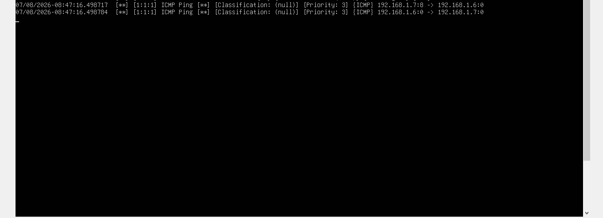
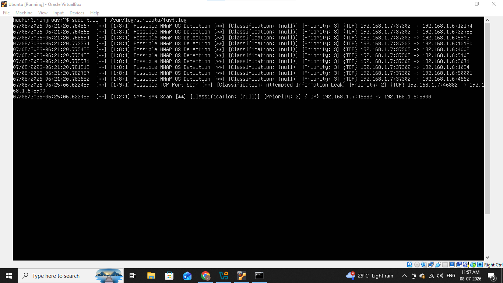
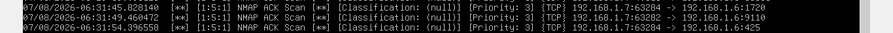
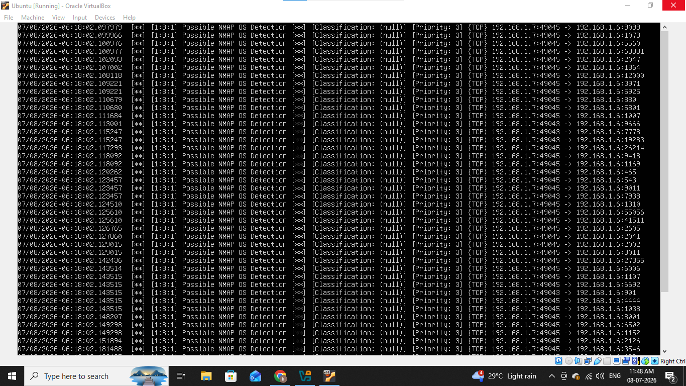
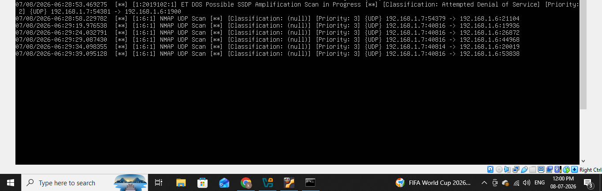
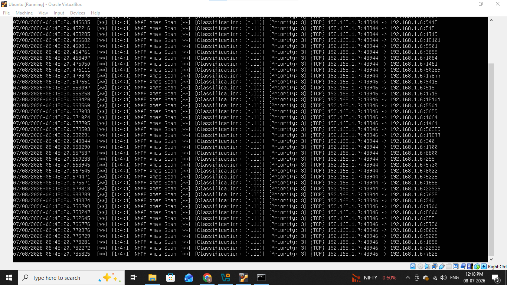

# 🔒 Nmap Scans Detection

--------------------------------

## In this lab we will see how attacker collects information using Nmap it is popular network scanning tool used to find open ports, services and other information.

## We will see different scanning techniques used by the attacker and how to detect it.

---------------------------------

## Lab Architecture & Prerequisites

- Attacker Machine:- kali linux (ip:- 192.168.1.7)

- Victim machine:- Ubuntu Server (ip:- 192.168.1.6)

- IDS:- Suricata

------------------------------

## 1. Configure Suricata

Suricata is an open source network threat detection and analysis tool it functions as IDS (Intrusion detection system) and IPS (Intrusion Prevention System).

First configure suricata.yaml file to change the interface and rule files according to the system and update it and start the suricata service.

Now suricata is ready for detection

--------------------------------

## 2. Scanning with Nmap

first we will send ICMP Ping packets to our victim machine let see what suricata generates

I send some ICMP packets from kali machine we can see ICMP echo packet from ip 192.168.1.7 and server respond with reply packet to kali machine it means both VM can communicating with each other.

Nmap also performs host discovery before scanning (unless `-Pn` is used). Excessive ICMP Echo Requests may indicate reconnaissance activity.

Let's try some scanning with Nmap.

### 1). Nmap SYN Scan (-sS)

In this scanning technique Nmap sends only SYN packets and wait for a response if target replies with SYN/ACK the port is open and just after Nmap immediately send an RST packet to abort the connection before it fully completes.

#### nmap -sS 192.168.1.6

We can see from above screenshot SYN packets coming from our kali machine's ip and also suricata rule triggered.

### 2). Nmap ACK Scan (-sA)

In this scanning technique Nmap maps firewall rulesets and identifies if ports are filtered. instead of checking if ports are open or closed it sends a TCP packet with only the ACK flag set.

#### nmap -sA 192.168.1.6

This will send ACK packets to our ubuntu machine.

We can see suricata generated an alert with NMAP Ack Scan also we can see source ip and destination ip.

### 3). OS Detection (-O)

In this technique Nmap identifies remote operating systems using TCP/IP stack fingerprinting. it sends crafted TCP,UDP and ICMP packets to a target and then analyze response details like TTL, window size. these responses are matched against the internal database of OS fingerprints.

#### nmap -O 192.168.1.6

We can see suricata generated lots of alerts for Os detection.

### 4). UDP Scan (-sU)

In this technique in target system requires connectionless protocols like DNS,SNMP and DHCP because UDP is stateless, Nmap sends empty payloads and determines port states based on ICMP port unreachable messages.

#### nmap -sU 192.168.1.6

We can see suricata alert triggered for UDP scan as always from same ip.

### 5). Xmas Scan (-sX)

This is active reconnaissance technique that sends a TCP packet with the FIN,PSH and URG flags set.

#### nmap -sX 192.168.1.6

We can see lots of alerts for xmas scanning.

### 6). Version Detection (-sV)

In this technique Nmap connects to open ports, sends protocol-specific probes and analyzes the responses to identify the exact application name, version number and associated details.

#### nmap -sV 192.168.1.6

### 7). Aggressive Scan (-A)

An Nmap aggressive scan is a comprehensive network reconnaissance technique activated with the -A flag it can retrieve details like Os fingerprints, service versions and running scripts but it is also easily detected by firewalls.

#### nmap -A 192.168.1.6

#### ⚠ Default rules did not generate an alert for this scan type. Custom signatures were required.

-------------------------------------------

## IOC (Indicators of Compromise)

|     Indicator        |   Value                            |
|----------------------|------------------------------------|
|  Attacker's Ip       |  192.168.1.7                       |
|  Victim's Ip         |  192.168.1.6                       |
|  Tools & Techniques  |  Nmap                              |
|  Scan Types          |  SYN, ACK, UDP, Xmas, OS Detection |
|  IDS                 |  Suricata                          |

--------------------------------------------

## MITRE ATT&CK Mapping

|     Technique             |    Id    |
|---------------------------|----------|
| Network Service Discovery |  T1046   |

--------------------------------------------

## Recommendations

### 1. Firewall Configurations
- Keep open only required ports over the internet.
- Configure firewall properly.

### 2. Intrusion Detection / Prevention
- Deploy suricata, snort or zeek.
- Enable port scan detection rules.
- Malicious scans can be also blocked by using IPS mode.

### 3. Rate Limiting
- Set limit for thousands of attempts from one source.
- Firewall rate limiting rules can be also set in windows and linux systems.

### 4. Access Control
- Restrict administrative services like RDP,SMB,SSH to only trusted ip addresses.
- Enable MFA (multi-factor authentication).

### 5. Logging & Alerting
- Forward windows security logs, sysmon and suricata logs to central SIEM.
- Enable port scan alerts in dashboard.
