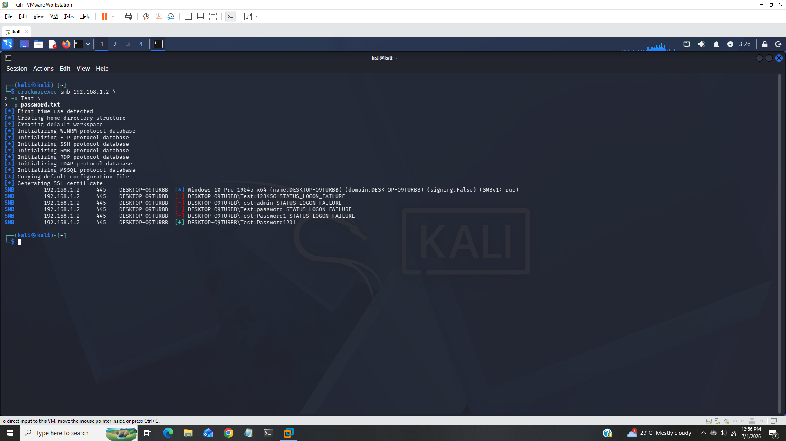
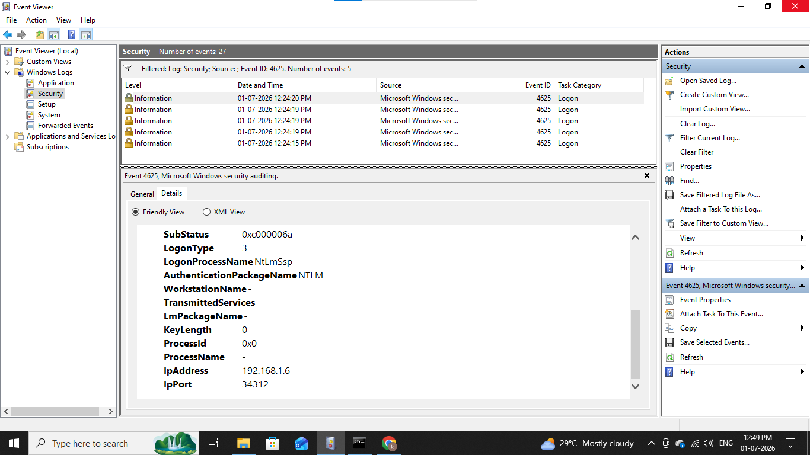
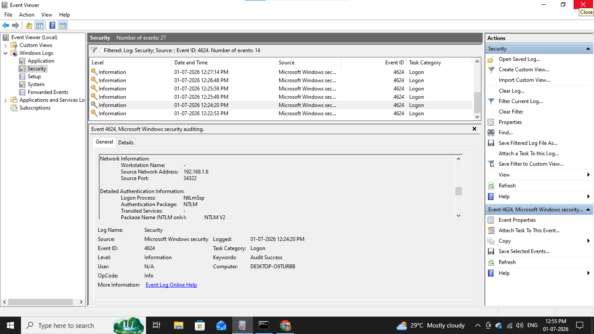
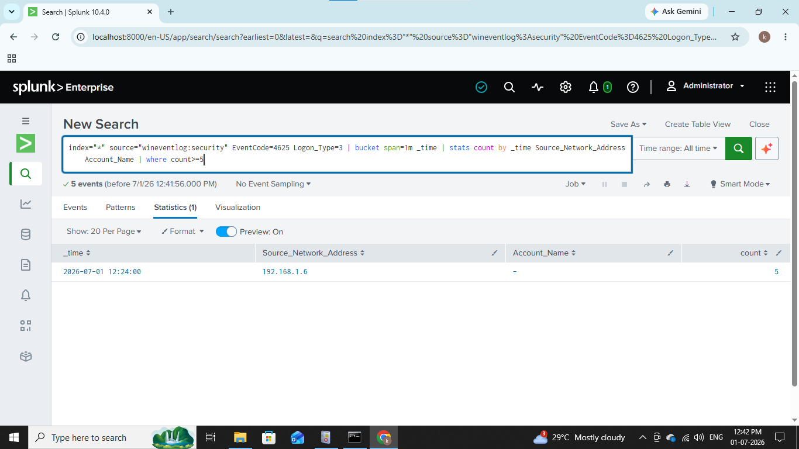

# &#x1F512; SMB Bruteforce

--------------------------------------------------------

### In this lab we will see how attacker performs bruteforce attack on SMB.

### SMB is an application layer protocol primarily used for sharing files, printers and serial ports between a nodes and local network it allows attackers to steal data and execute code or move laterally across a windows network.

---------------------------------------------------------

## Lab Architecture & Prerequisites

- Attacker Machine: Kali Linux (IP: 192.168.1.6)

- Target Machine: Windows 10 (IP: 192.168.1.2)

- SIEM: Splunk

- Logs: Sysmon + Windows Security Logs

--------------------------------------------------------

## 1). Environment Setup

First we will enable windows logging so that we can get auhtentication logs

Open secpol.msc and go Local Policies -> Audit Policy and set Audit Logon Events and Audit Account Events to both success and failure.

Open command prompt as an administratror and run "gpupdate /force" to verify the changes we made.

## 2). SMB Enable

We will enable file sharing in control panel make sure in private network both file and printer sharing options are enabled.

## 3). Create Test User

Now we will create a new user where we can perform bruteforce attack 

Open cmd as an administrator and run following command,

#### net user Test Password123! /add

This will create new user named Test in our machine.

## 4). Share Folder

This is very important step where we create a share folder inside C: drive

Create new folder inside C: and right click on folder and go to properties -> sharing -> advanced sharing and add read permission save and close it.

Ok all is done now let's move on our attacking machine.

## 5). Install CrackMapExec

For bruteforce we will use crackmapexec which is widely used python based post-exploitation framework also used for credential testings, network enumeration, lateral movement.

Now generate small password list which also contains original password.

## 6). SMB Brute Force Simulation

Run following command in kali terminal

#### crackmapexec smb 192.168.1.2 \
#### -u testuser \
#### -p pass.txt

We can see from above screenshot crackmapexec tried some passwords and finally found original password which we created so this is simple bruteforce attack on SMB service to understand how attacker compromises SMB shares now let see how we detect it.

## 7). Windows Log Analysis

Let's open security logs inside the event viewer

We will focus on event id's,

#### 4624 (for successful login)
#### 4625 (for failed login attempts)
#### 4776 (NTLM authentication)

We can see multiple failed events with id 4625 during same time of period.

Now let's check what attacker succesfully loged in or not?

Filter event id 4624

We can see attacker successfuly loged in from ip 192.168.1.6 around same period.

Now let's analyze this logs in splunk 

## 8). Splunk

Filter for basic query

#### index=* source="wineventlog:Security" EventCode=4625 LogonType=3

This query will returned all events with failed logins and logon type 3 for network logon.

Let's try some advanced query and arranged data in manner,

#### index=* source="wineventlog:Security" EventCode=4625 LogonType=3 
#### | buckets span=1m _time 
#### | stats count by _time Source_Network_Address Account_Name 
#### | where count>=5

This query will returned all events with 1-minute time window and aggregated it by time, source ip and account name where count is greater then or equal to 5.

We can see all requests that came from our attacker's ip 192.168.1.6.

WE can also write query for successful logins

#### (EventCode=4625 OR EventCode=4624)
#### | sort 0 _time
#### | transaction Source_Network_Address maxspan=5m
#### | search EventCode=4625 EventCode=4624

----------------------------------------------------------------------------------

## IOC (Indicator of Compromise)

|     Field          |    Value          |
|--------------------|-------------------|
|  Attacker's Ip     |  192.168.1.6      |
|  Victim's Ip       |  192.168.1.2      |
|  tools & Technique |  crackmapexec     |
|  User              |  Test             |
|  Service           |  SMB              |
|  Port              |  445              |
|  Logon Type        |  3                |
|  Event IDs         |  4624, 4625, 4776 |

-----------------------------------------------------------------------------------

## MITRE ATT&CK Mapping

|    Technique    |    Id       |
|-----------------|-------------|
|  SMB Bruteforce |  T1110.001  |

----------------------------------------------------------------------------------

## Recommendations

### 1. Network Perimeter Defense
  - Block Port 445 at the firewall
  - Enable VPN Access
  - Network Segmentation

### 2. Authentication & Credential Hardening
  - Account Lockout Policies
  - Implement MFA
  - Disable NTLM

### 3. Protocol & System Hardening
  - Enable SMB Signing
  - Disable Legacy SMBv1
  - Implement SMB Authentication Rate Limiter

    
