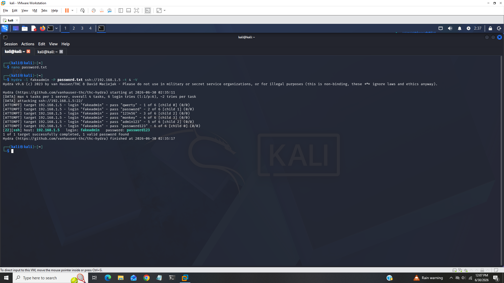
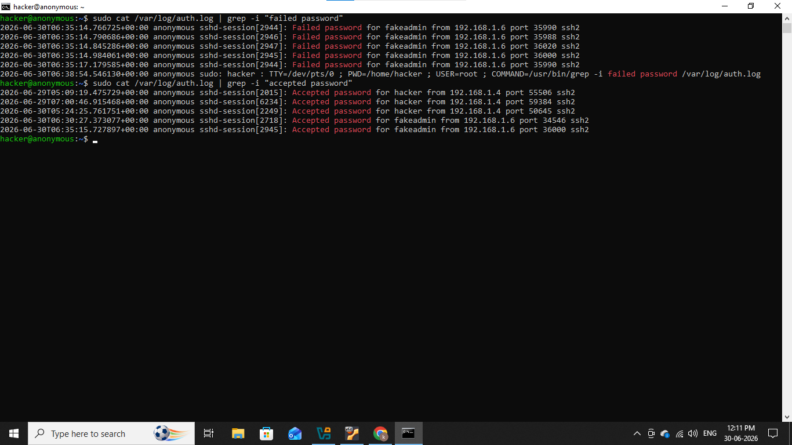
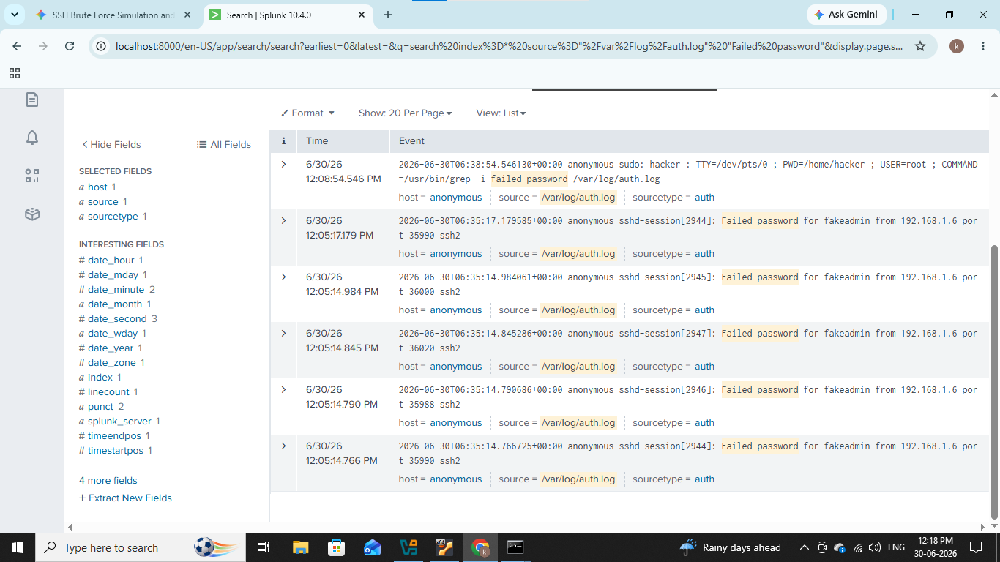
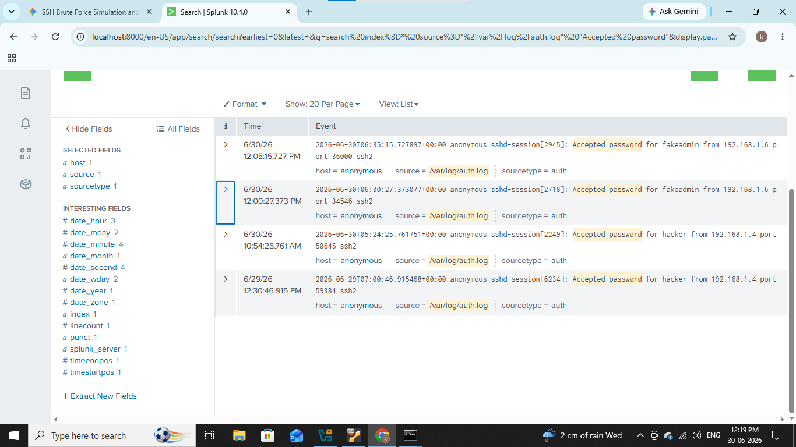

# &#x1F512; SSH Bruteforce (Ubuntu)

---------------------------------------------------------------------------------------

### In this home lab we will understands how attacker performs bruteforce attack on ssh service and how we will detect it.

--------------------------------------------------------------------------------------

## Lab Architecture & Prerequisites

- Attacker Machine: Kali Linux (IP: 192.168.1.6)

- Target Machine: Ubuntu Server (IP: 192.168.1.5)

--------------------------------------------------------------------------------------

## 1. Preparing the Ubuntu Server

By default, Ubuntu Server uses the ssh service and logs authentication events to /var/log/auth.log. Let's ensure everything is enabled and configured to allow standard password-based authentication.

To enable password-based SSH logins We will set PasswordAuthentication field to yes in sshd_config file and restart the SSH service.

After we will add new user named "fakeadmin" and set its password "password123" for our lab purpose.

Ok all is set let's simulate the bruteforce attack.

## 2). Attack Simulation (From Kali Linux)

We will use Hydra, a parallelized login hacker, to simulate a noisy online brute-force attack

Let's build small wordlist in real world attackers use "rockyou.txt" which contains bilion's of leaked passwords.

We can see i add few random passwords which contains our original password of user fakeadmin.

Now run Hydra against the target Ubuntu machine specifying the user fakeadmin and your password list.

### hydra -l fakeadmin -P passwords.txt ssh://192.168.1.5 -t 4 -V

- -l fakeadmin: The targeted username.

- -P passwords.txt: The path to your password wordlist.

- -t 4: Number of parallel tasks/connections (keeps it steady but fast).

- -V: Verbose mode (shows login attempts in real-time).

Hydra will performs bruteforce attack rapidly before hitting password123.

As we can see from above screenshot our attack is successfulled and password is found for user fakeadmin.

## 3). Detection & Analysis 

## Manual Log Inspection (On Ubuntu Server)

Linux tracks all authentication events inside /var/log/auth.log let's check it inside auth.log

I filtered only failied password events to reduse noise

We can see few events with failed passwords came from ip 192.168.1.6 for user fakeadmin and also password accepted for user fakeadmin.

### SIEM Detection (Splunk)

I uses splunk in my home lab 

To detect failed events i used below SPL query

### index=* source="/var/log/auth.log" "Failed password"

We can see that failed events in splunk which we saw in in manual detection.

### index=* source="/var/log/auth.log" "Accepted password"

This query will list events where attacker successfully found valid password for account.

Although this both queries which i used is only for my home lab purpose in real world SOC analysts uses effective queries.

---------------------------------------------------------------------------------------------------------

## IOC (Indicator of Compromise)

|    Field            |    Value       |
|---------------------|----------------|
|  Attacker's Ip      |  192.168.1.6   |
|  Victime's Ip       |  192.168.1.5   |
|  Username           |  fakeadmin     |
|  Tools & Techniques |  hydra         |

----------------------------------------------------------------------------------------------------------

## MITRE ATT&CK Mapping

|    Technique    |     Id        |
|-----------------|---------------|
| SSH Bruteforce  |  T1110.002    |

-------------------------------------------------------------------------------------------------------

## Recommendations

- Disable password authentication

- Enable SSH keys

- Enable Fail2Ban

- Restrict SSH using firewall

- Disable root login

- MFA where possible
