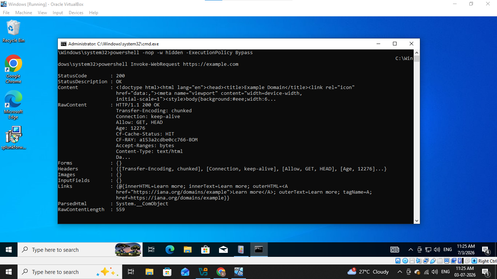
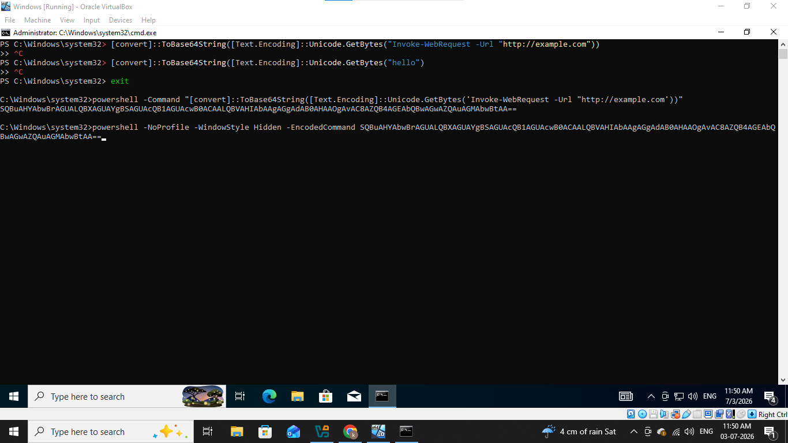
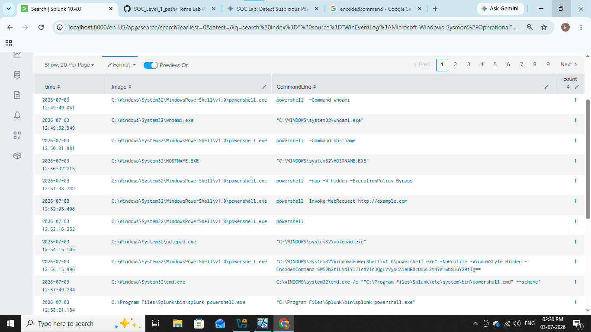
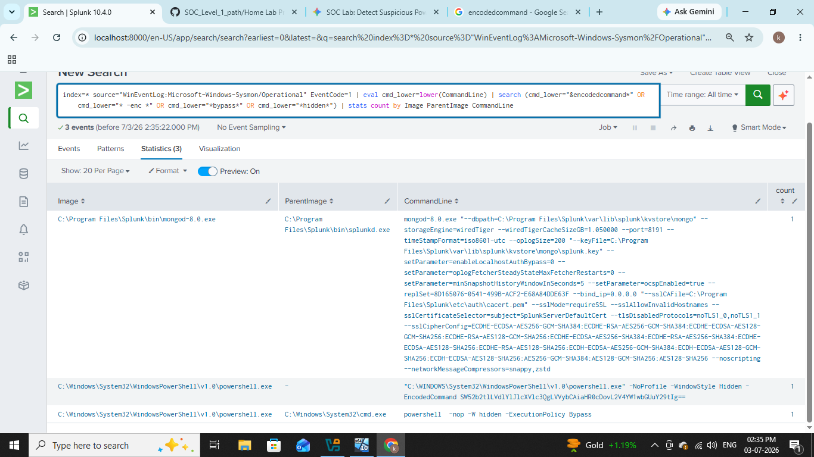

# &#x1F512; Suspicious Powershell Execution

------------------------------------------------------------

## In this home lab we will see how attackers use powershell for fileless execution, reconnaissance and initial access as well let see step by step practical how attackers do it and how we detect it.

----------------------------------------------------------

## 1). Lab Architecture

- Windows VM (Victim) 
  - Sysmon
  - PowerShell Logging enabled
  - Splunk Universal Forwarder
 
- Main VM
  - Splunk

## 1). Enable PowerShell Logging

1. Press Win + R, type gpedit.msc, and hit Enter.

2. Navigate to: Computer Configuration > Administrative Templates > Windows Components > Windows PowerShell.

3. Double-click Turn on PowerShell Script Block Logging, set it to Enabled, and check Log script block execution start / stop events.

## 2). Install Sysmon (System Monitor)

1. Download Sysmon from Microsoft Sysinternals.

2. Install it with a standard security configuration (like SwiftOnSecurity's Sysmon-config):

   #### .\Sysmon64.exe -i sysmonconfig-export.xml

Make sure SIEM agent is configured to monitor the Microsoft-Windows-PowerShell/Operational log and the Microsoft-Windows-Sysmon/Operational log.

ok all setup is done let's launch the attack.

-----------------------------------------------------------------------------

## 2). Execute the "Suspicious" PowerShell Attack

Let's starts with basic commands that attacker executes

### 1. powershell -nop -WindowStyle Hidden -ExecutionPolicy Bypass

-  Powershell: this command tells windows to run commands using powershell.

- -nop: this flag stops powershell to load default scripts.

- -windowStyle Hidden: this flag blocks pop up and commands will run silently in background.

- -ExecutionPolicy Bypass: this flag bypass windows security policies to run command without any warnings.

### 2. powershell -InvokeWebRequest "https://example.com"

This command will sends http/https request to web server and intractive APIs.

### 3. (New-Object Net.WebClient).DownloadString("http://example.com")

- New-Object Net.WebClient is component of .NET framework use to send and recieve data from the internet.

- DownloadString is a function of webclient which takes website's url as an input and gets data of website in string format.

### 4. powershell -NoProfile -WindowStyle Hidden -EncodedCommand SW52b2tlLVdlYlJlcXVlc3QgLVVybCAiaHR0cDovL2V4YW1wbGUuY29tIg==

- EncodedCommand: this falg is used to execute scripts or commands as a Base64 encoded UTF-16LE string.

Attackers use this technique to bypass security measures now let's see in our SIEM how we can detect it.

--------------------------------------------------------------------------

## 3). Detection in our SIEM

First we will start with basic query,

### index=* powershell

We can see all powershell commands wich we executed let's try some advance queries,

### index=* EventCode=1 
### | eval cmd_lower = lower(CommandLine) 
### | search (cmd_lower="*-EncodedCommand*" OR cmd_lower="*-enc*" OR cmd_lower="*-w Hidden*" OR cmd_lower="*bypass*") 
### | stats count by Image ParentImage CommandLine

This command will finds all keywords which we mentioned and aggregate data by this fields.

-----------------------------------------------------------------------

## IOC (Indicator of compromise)

|     Field               |     Value                                                      |
|-------------------------|----------------------------------------------------------------|
|  Powershell Cmdlets     |  -nop                                                          |
|                         |  -WindowsStyle                                                 |
|                         |  -ExecutionPolicy                                              |
|                         |  -EncodedCommand                                               |
|                         |  -Invoke-WebRequest                                            |
|                         |  -New-Object                                                   |      
|  Base64 Encoded String  |  SW52b2tlLVdlYlJlcXVlc3QgLVVybCAiaHR0cDovL2V4YW1wbGUuY29tIg==  |

--------------------------------------------------------------------

## MITRE ATT&CK Mapping

|    Technique                     |     Id     |
|----------------------------------|------------|
|  Sucpicious Powershell Execution |  T1059.001 |

------------------------------------------------------------------------

## Recommendations

### 1. Enforce Constrained Language Mode (CLM)
- In powershell there is diffrent kind of languages it is on by default on full language mode so enforced CLM at end-user's workstation.

### 2. Change the Execution Policy
- Set execution policy to ALLSigned or RemoteSigned in whole domain using group policy object (GPO).

### 3. Disable Powershell v2
- Uncheck or disable powershell 2.0 completly beacuse in version 2 there is not any advance features like script block logging and other advance security machenisms so attackers can take advantage of it.

### 4. Use AppLocker or Windows Defender Application Control (WDAC)
- Use AppLocker and create rules that allows only admin approved scripts to be execute.

### 5. Network Segmentation and LOLBAS
- Set strict firewall rules at workstation that blocks any outbound connections at unknown ip or url.

### 6. AMSI (Antimalware Scan Interface)
- AMSI scans every scripts before their execution in memory whatever it is obfuscated or encoded.

