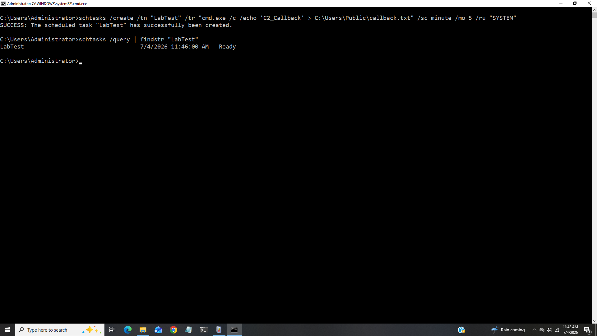
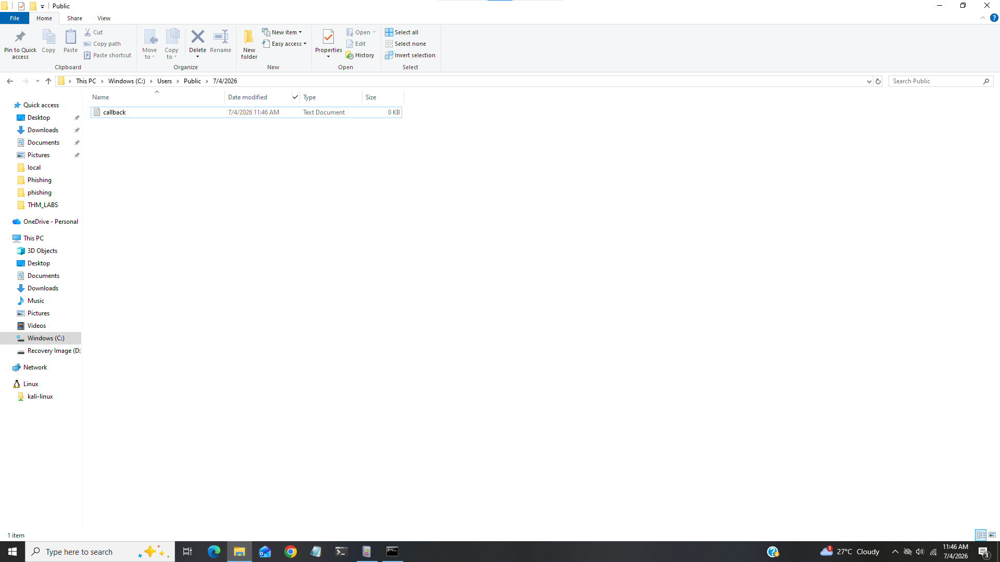
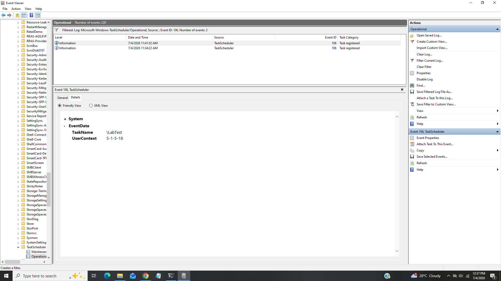
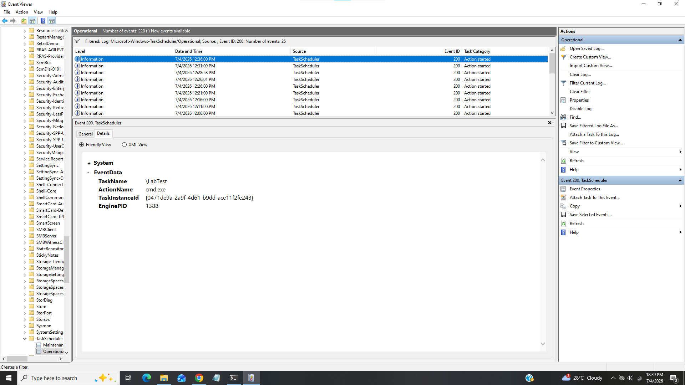
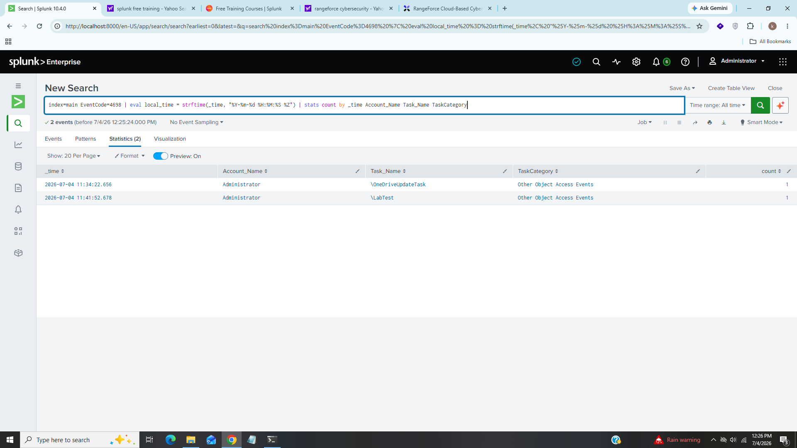
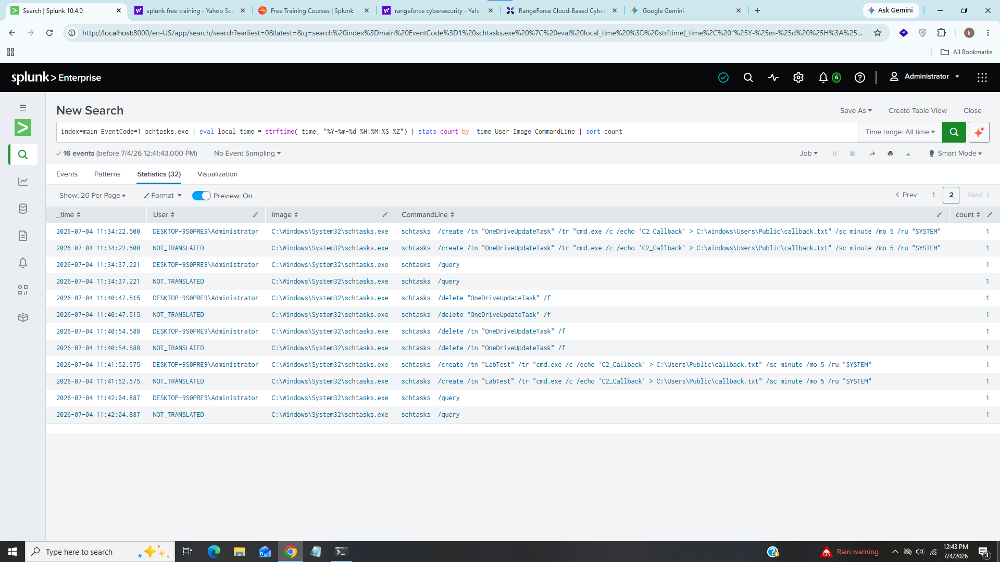

# 🔒 Scheduled Script Execution

-----------------------------

## Schedule Task or Task Schedular is a built-in Microsoft windows utility that automatically launches programs, scripts or commands. In this lab we will see how attackers use it for malware or script execution,persistence or privilege escalation and, how we as a SOC Analyst detect and remidiate it.

---

## 1). Lab Architecture & Prerequisites

- Windows 10 Vm.
- Splunk Enterprise (SIEM).
- Windows Event Logs and Sysmon.

---

## 2). Attack Simulation

First, we need to create a task that mimics a real adversary. Threat actors typically schedule living-off-the-land binaries (cmd.exe, powershell.exe) or binaries dropped into user-writable folders (\AppData\, \Public\, \Temp\).

We will Open Command Prompt (as Administrator) on our Windows virtual machine and run the following command to emulate the attack:

**schtasks /create /tn "LabTest" /tr "cmd.exe /c echo 'C2_Callback' > C:\Windows\Temp\callback.txt" /sc minute /mo 5 /ru "SYSTEM"**

- **/tn "LabTest"**: Masquerading. it is name of our schedule task.

- **/tr "cmd.exe ..."**: Execution. it will Spawn a shell to run a script/command.

- **/sc minute /mo 5**: High Frequency. it will the task to trigger every 5 minutes (typical for persistent C2 beacons, whereas legitimate admin tasks usually run daily or weekly).

- **/ru "SYSTEM"**: Privilege Escalation. it will Force the task to execute with the highest level of system privileges.

as we can see our schedule task is registered. it will create callback.txt file inside **Temp** folder after 5 min with system privileges. 

As we can see that a file named **callback.txt** is created inside **Temp** folder. so it was basic task that creates a txt now let's move on our defender side how we can detect it.

---

## 3). Detection

first we will analyze windows and sysmon event logs then move on SIEM,

### Windows Native Security Logs (Event Viewer -> Security)

- **Event ID 4698: A scheduled task was created**:- It indicates that schedule task was created.
- **Event ID 4702: A scheduled task was updated**:- Useful if an attacker hijacks an existing task.

### Microsoft Windows Task Scheduler Operational Logs

We will Navigate to Applications and Services Logs -> Microsoft -> Windows -> TaskScheduler -> Operational:

- **Event ID 106**: It indicates that scheduled task registered/created.

- **Event ID 200**: It indicates that task Scheduler fired and launched the action process.

Now let's move on our Splunk,

First we will find all logs for event id 4698,

**index=main EventCode=4698 | eval local_time = strftime(_time, "%Y-%m-%d %H:%M:%S %Z") | stats count by _time Account_Name Task_Name TaskCategory**

first i convert UTC time to our local time and aggregate all details by time,account name,task name and task category, we can see our task **LabTest** there executed using system privileges.

Now let's filter for sysmon event id 1 that refers for process creation,

**index=main EventCode=1 schtasks.exe | eval local_time = strftime(_time, "%Y-%m-%d %H:%M:%S %Z") | stats count by _time User Image CommandLine | sort count**

We can see complete information with time,user and commandline.

---

## 4) IOC (Indicator of Compromise)

|    Indicator     |    Value        |
|------------------|-----------------|
|  Process         |  schtasks.exe   |
|  Schedule Task   |  LabTest        |
|  Spawned Process |  cmd.exe        |
|  Created File    |  callback.txt   |
|  Event IDs       |  4698,106,200,1 |

---

## 5) MITRE ATT&CK Mapping

|   Technique              |    Id      |
|--------------------------|------------|
|  Schedule Task Execution |  T1053.005 |

---

## 6) Recommendations

### AppLocker / WDAC Rules
- Monitor commandline parameters of administrative utilities and block script execution from temporary locations such as C:\Windows\Temp\, AppData\Local\Temp\

### Least Privilege Access
- Restrict admin rights for local users so anyone can't perform system level tasks.

### Continuous Monitoring
- Monitor for event id 4698 and sysmon event id 1(schtasks.exe /create) for real time 
