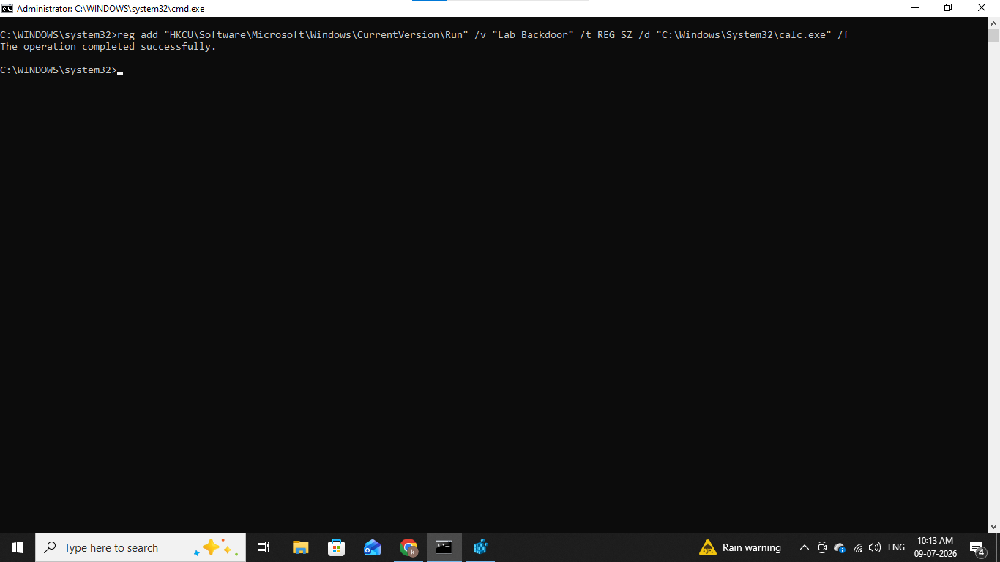
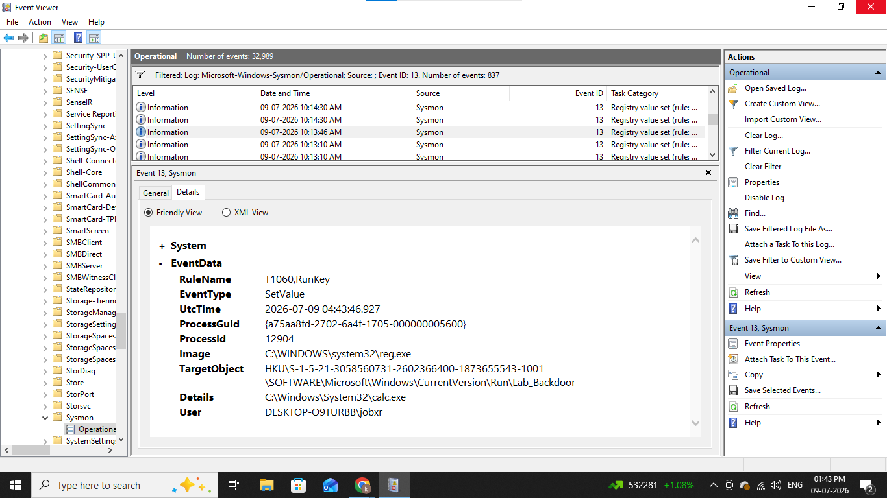
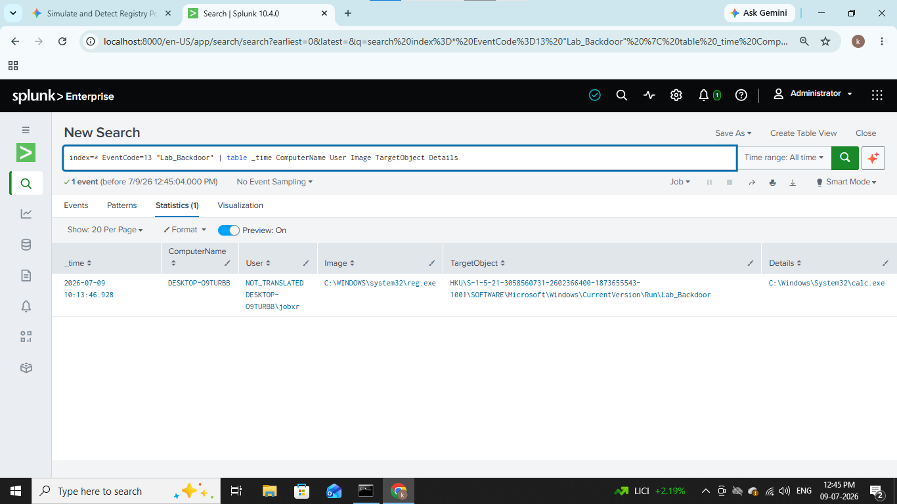
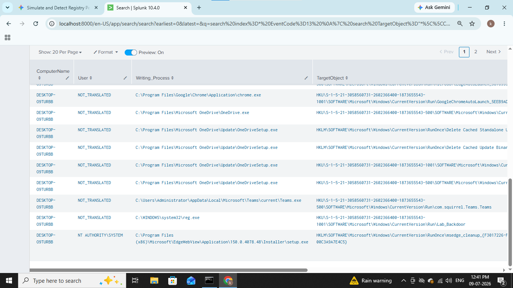

# &#x1F512; Persistence by registry key

----------------------------------

## In this lab we will se how attackers achieve persistence by setting registry keys.

## Registry Run keys are Windows Registry locations that automatically execute programs or scripts when a system boots up or a user logs in Widely used by threat actors for persistence, they allow malicious payloads to run either under a specific user or system-wide.

---------------------------------

## 1). Lab Architecture & Prerequisites

- Windows 10 (victim).

- Sysmon with SwiftOnSecurity's sysmonconfig.

- SIEM (splunk).

- Windows Event Viewer.

## 2). The Attack Simulation

We will simulate a standard CurrentVersion\Run registry modification. This technique maps directly to MITRE ATT&CK T1547.001.

First open cmd or poweshell in windows machine then Run the following command to add a fake malicious entry into the current user's Run key. This points to a mock beacon payload (calc.exe)

### reg add "HKCU\Software\Microsoft\Windows\CurrentVersion\Run" /v "Lab_Backdoor" /t REG_SZ /d "C:\Windows\System32\calc.exe" /f

We can see from above screenshot our registry key is successfuly added,

Now let's how we can detect this step by step.

## 3). Detection & Log Analysis

First we will see in standard windows event logs While native Windows Security Log Event ID 4657 can track registry changes but it is disabled by default. Sysmon is the industry preference for tracking this telemetry cleanly.

Let's open event viewer,

Locate to Applications and Services Logs -> Microsoft -> Windows -> Sysmon -> Operational.

Look for Event ID 13 (RegistryValueSet).

We can see full event details of registry key which we added EventType, Image, TargetObject, Details etc.

Now let's move into SIEM and write some queries to detect it.

## 4). SIEM Queries & Alert Rules

First we will start by writing basic query,

### index=* EventCode=13 "Lab_Backdoor" 
### | table _time ComputerName User Image TargetObject Details

this query will filter only events with id 13 since we know the name of registry key so we will find by it name and arrange result in table format,

We can see from above screenshot whole details with time, computer, user etc.

Let's write industry standard queries,

### index=* EventCode=13 
### | search TargetObject="*\\CurrentVersion\\Run*" OR TargetObject="*\\CurrentVersion\\RunOnce*"
### | stats count min(_time) as firstTime max(_time) as lastTime by ComputerName, User, Image, TargetObject, Details
### | rename Image as "Writing_Process", Details as "Persisted_Payload"

This query will filter only events with id 13 and search target object by \\CurrentVersion\\Run and \\CurrentVersion\\RunOnce. * is wildcard character it will give all output with this keywords and then i used aggregation commands min and max to reduse result and at last i renamed the image and details field for better look and redable format.

------------------------------------------------

## IOC (Indicator of Compromise)

|      Indicator    |     Value       |
|-------------------|-----------------|
|  Victim           |   Windows 10    |
|  Event Id         |   13            |
|  Logs             |   Sysmon        |
|  SIEM             |   Splunk        |
|  Registry Value   |   Lab_Backdoor  |
|  Startup Program  |   calc.exe      |

------------------------------------------------

## MITRE ATT&CK Mapping

|    Technique    |    Id      |
|-----------------|------------|
|  Registry Key   |  T1547.001 |

-------------------------------------------------

## Recommendations

### 1. Implement Principle of Least Privilege (PoLP)
- Remove Admin Rights.
- Restricted User Access.

### 2. Attack Surface Reduction (ASR) Rules
- Block Process Creations.
- Block Executable Files in Emails/Downloads.

### 3. Harden Registry and Scripts via Group Policy (GPO)
- Disable Registry Tool.
- PowerShell Execution Policy.
- Disable Script Hosts.

### 4. Proactive Monitoring & High-Fidelity Alerting
- Deploy EDR/SIEM Alerts.
- Monitor Untrusted Paths.
