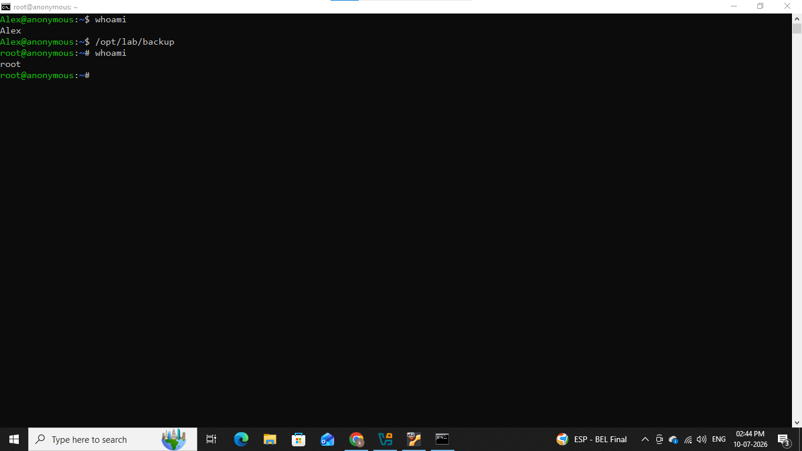
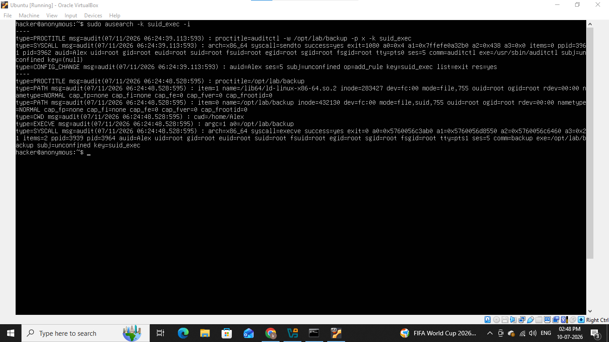
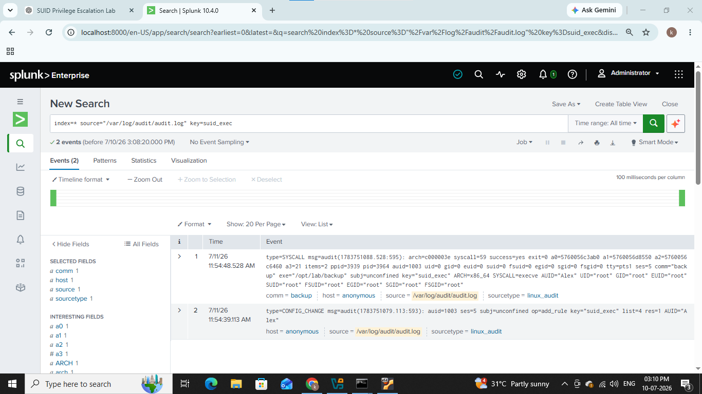
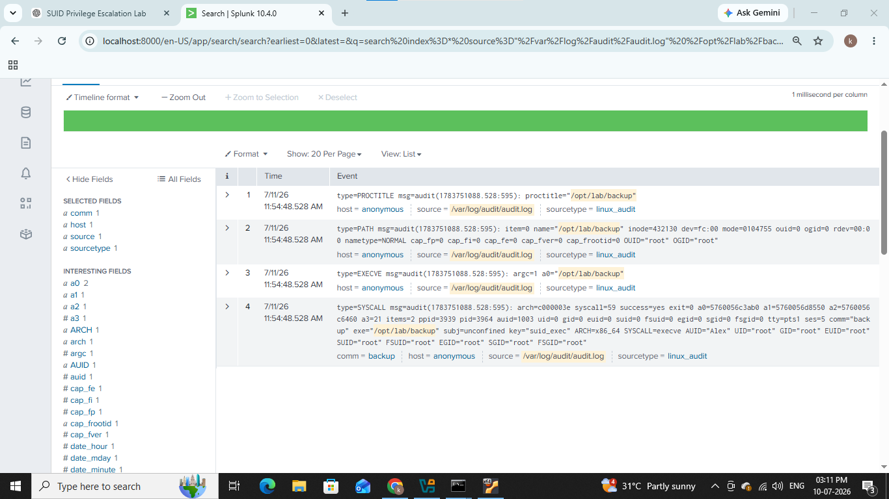

# &#x1F512; SUID Privilege Escalation

------------------------------------------------

## SUID stands for "Set-User Identification" it is special access right granted to executable files. it allows a user to run an executable file with the permissions of the file's owner instead of the user running it. while misconfigured SUID executables are prime targets for cyberattacks. if an attacker gains control of a program running with SUID root.

## In this lab we will see step by step how attackers use SUID misconfigurations to perform privilege escalation and how we can detect it.

-------------------------------------------------

## 1). Lab Architecture & Prerequisites

- Victim Machine:- Ubuntu (ip:- 192.168.1.6)

- SIEM:- Splunk

- Audit logs

## 2). Attack Simulation

First we will create a new user for our lab purpouse,

### sudo useradd Alex

Next we will log in as Alex via ssh,

### ssh Alex@192.168.1.6

Ok all is done now let's create some SUID missconfiguration,

We will write a vulnerable C program that will spawn a root shell,

Let's create a file backup.c and add this code inside it,

### #include <unistd.h>
### #include <stdlib.h>

### int main()
### {

###      setuid(0);
###      setgid(0);

###      system("/bin/bash");

###      return 0;

### }

Let's breakdown this code,

- setuid(0); :- this function attempts to set the effective user id (uid) of thr current process to 0 which belongs to the root user.

- setgid(0); :- similarly, this attempts to set the effective group id (gid) of current process to 0 which belongs to root group.

- system("/bin/bash") :- this executes a system command to oprn a new bash terminal session.

Compile this file using gcc compiler it will compile this file and create a new file named backup,

### gcc backup.c -o backup

Now set the owner to root of backup file,

### sudo chown root:root backup

Now set SUID bit on file backup,

### sudo chmod 4755 backup

Here 4 is reffer as SUID bit because we already set owner of this file to root now after setting SUID bit this file will run with root-level privileges.

Now let's start Attack on our ssh terminal,

We can see from above screenshot we were normal user but after running backup script it spawn a new root shell and now we are root user.

### This is just demo lab for understanding in real systems there are not this kind of vulnerable program exists attacker try different techniques and misconfigurations.

## 3). Detection & Log Analysis

We will use audit logs to detect this

Create a rule that will generates a log after execution,

### sudo auditctl -w /opt/lab/backup -p x -k suid_exec

We can see a rule triggered after execution of backup file.

Let see in splunk how we can detect it,

Use this basic query,

### index=* source=/var/log/audit/audit.log" key=suid_exec

We can also detect it by script name,

### index=* source=/var/log/audit/audit.log" /opt/lab/backup

-------------------------------------------------------

## IOC (Indicator of Compromise)

|     Indicator        |    Value            |
|----------------------|---------------------|
|  User                |  Alex               |
|  Ip Address          |  192.168.1.6        |
|  Vulnerable Scripts  |  backup.c & backup  |
|  Audit Rule          |  suid_exec          |

--------------------------------------------------------

## MITRE ATT&CK Mapping

|     Technique       |    Id      |
|---------------------|------------|
|  Setuid and Setgid  |  T1548.001 |

--------------------------------------------------------

## Recommendations

### 1). File Permissions & Capabilities
- Audit SUID/SGID binaries.
- Manage linux capabilities.

### 2). Sudo Configuration
- Avoid NOPASSWD.
- Enforce full paths.
- Restrict wildcards.

### 3). Services & Schduled Tasks
- Run as non-root.
- Secure cron jobs.
- disable root login.

### 4). Auditing & Monitoring
- Enumerate vulnerabilities.
- Monitor changes.
