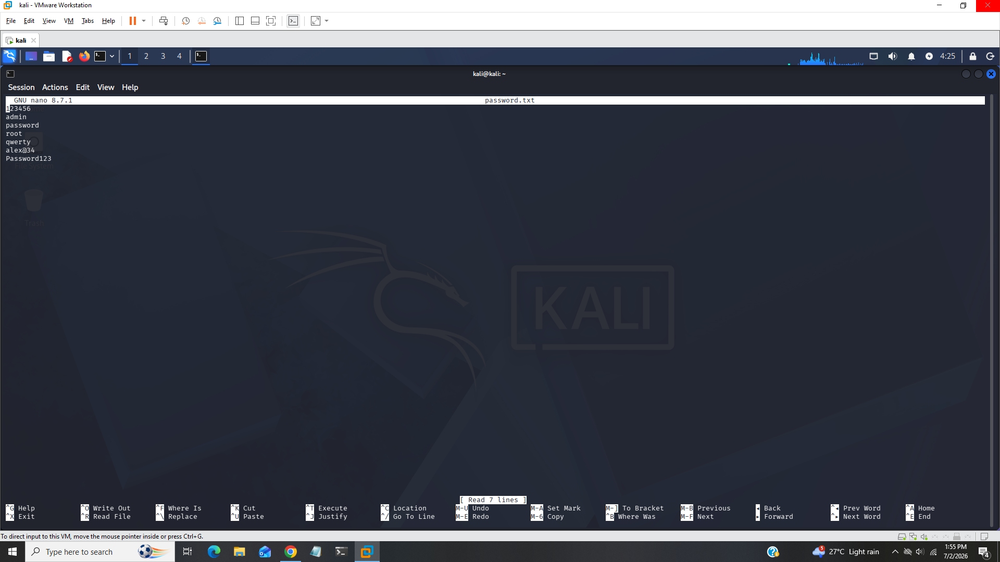
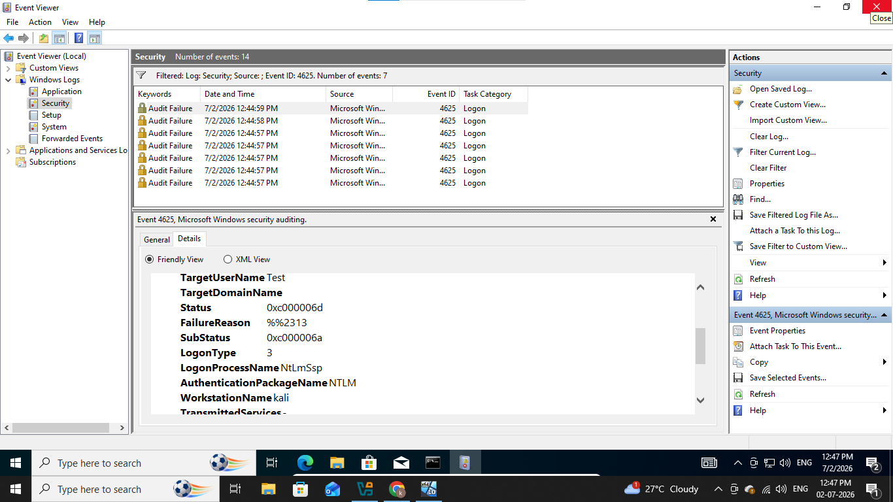
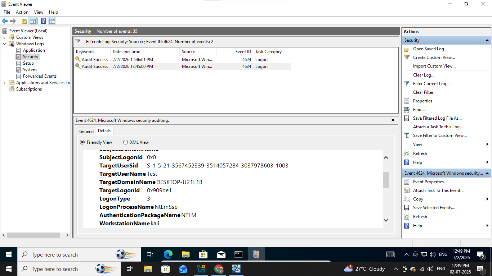
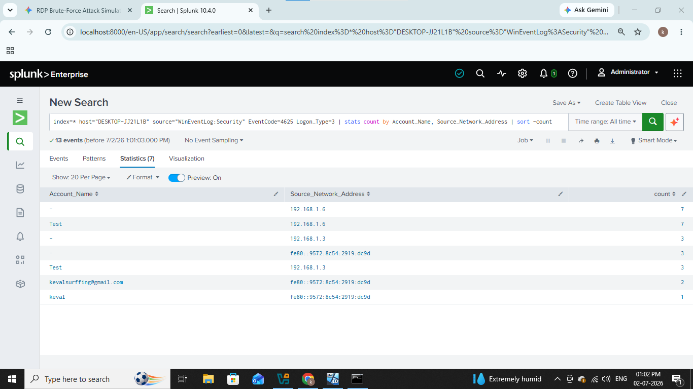
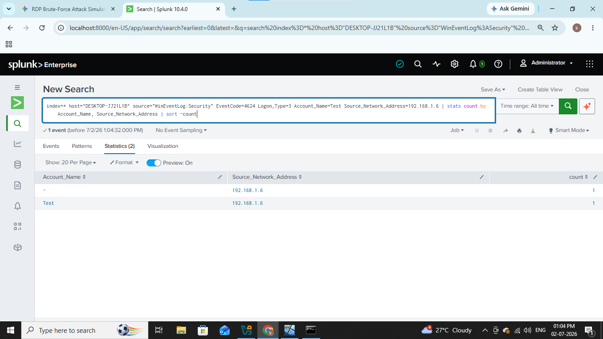

# &#x1F512; RDP Bruteforce

--------------------------------------------------

### In this lab we will see how attackers performs bruteforce attack on RDP services and misconfigurations.

### RDP (Remote Desktop Protocol) is a proprietary microsoft technology allowing users to connect and control windows computer or server remotly over a network and attackers use to gain entry through weak passwords, credential stuffing, lateral movement and ransomware deployment.

### Let see practical how it works

---------------------------------------------------

## Lab Architecture & Prerequisites

- Attacker Machine: Kali Linux (IP: 192.168.1.6)

- Target Machine: Windows 10 (IP: 192.168.1.5)

- SIEM: Splunk

- Logs: Windows Security Logs

----------------------------------------------------

## 1). Environment Setup

Before starting, ensure both your Windows and Kali Linux VMs are on the same virtual network and can ping each other.

### Enable RDP on the Windows Target

Open the Start menu, search for Remote Desktop settings, and turn it On.

### Create a Target Test User

Create a temporary account that we will target during the brute-force attack.

Run cmd as an administrator and run following command,

#### net user victim_user Password123 /add

### Ensure Auditing is Enabled
 
Windows must be configured to log failed login attempts.

1. Press Win + R, type secpol.msc, and hit Enter to open the Local Security Policy.
2. Navigate to Security Settings > Local Policies > Audit Policy.
3. Double-click Audit logon events and check both Success and Failure.

Ok now all is done lets strat the attack on our victime machine.

## 2). The Attack Simulation

Switch over to Kali Linux machine to simulate the brute-force attack using Hydra, a popular network login cracker.

### Create a Mini Wordlist

Create custom small worlist that contains original password like shown in below

### Launch the Hydra Attack

Run Hydra against the Windows machine's IP address targeting the standard RDP port ($3389$).  

#### hydra -l Test -P passwords.txt -t 4 -V rdp://192.168.1.5

- -l Test: Directs the attack at our specific test user.
- -P passwords.txt: Points to the password list we just created.
- -t 4: Uses 4 parallel threads (keeps it stable without crashing the RDP service).
- -V: Verbose mode, allowing you to see every attempt in real-time.

Hydra will cycle through the list, showing failures until it hits Password123 and turns green.

WE can see from above screenshot hydra attempted passwords one by one and finally found original password which we set it means our attack is successful now let's jump on our windows machine to detect this bruteforce attack.

## 3). Detection & SIEM Analysis

Now, let's look at the digital footprint left behind in the Windows Event logs.

### Check Windows Event Viewer Locally

1. On the Windows machine, press Win + R, type eventvwr.msc, and press Enter.
2. Expand Windows Logs and click on Security.
3. Look for a flood of Event ID 4625 (An account failed to log on).

We can see multiple failed event logs at same time with workstation name kali and targetuser Test.

Now it is important to check what attacker is succeed to gain access or not

We can see from above screenshot attacker successfully gained access of windows machine now let's analyze this logs in our SIEM.

Open splunk dashboard and go to Search and Reporting

I used following query

### inedx=* host="DESKTOP-JJ21L1B" EventCode=4625 Logon_Type=3 
### | stats count by Account_Name Source_Network_Address 
### | sort - count

This query will show logs with failed events and aggregate data by account name and source ip address so we can understand result properly

We cans ee multiple failed events from source ip 192.168.1.6 on target user Test.

We can also see successful login after failed attempt using following query

### index=* host="DESKTOP-JJ21L1B" EventCode=4624 Logon_Type=3 Account_Name=Test Source_Network_Address=192.168.1.6 
### | stats count by Account_Name Source_Network_Address 
### | sort - count

As usual we can see successful login from attcker.

--------------------------------------------------------------

## IOC (Indicator of Compromise)

|     Field            |    Value         |
|----------------------|------------------|  
|  Attacker's Ip       |  192.168.1.6     |
|  Victim's Ip         |  192.168.1.5     |
|  Tools & Techniques  |  Hydra           |
|  User                |  Test            |
|  Event IDs           |  4624, 4625      |
|  host                |  DESKTOP_JJ21L1B |

----------------------------------------------------------------

## MITRE ATT&CK Mapping

|    Technique               |    Id       |
|----------------------------|-------------|
|  RDP Bruteforce            |  T1110.001  |
|  External Remote Services  |  T1133      |

------------------------------------------------------------------

## Recommendations

- Hardening Remote Access
  - Never Expose RDP Directly
  - Enforce MFA
  - Enable Network Level Authentication
 
- Restricting Access & Traffic
  - Use an RD Gateways
  - Configure IP Whitelisting
  - Change the Default Port
