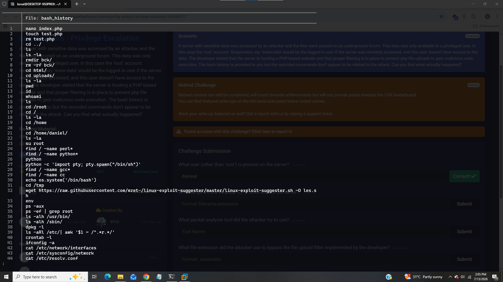
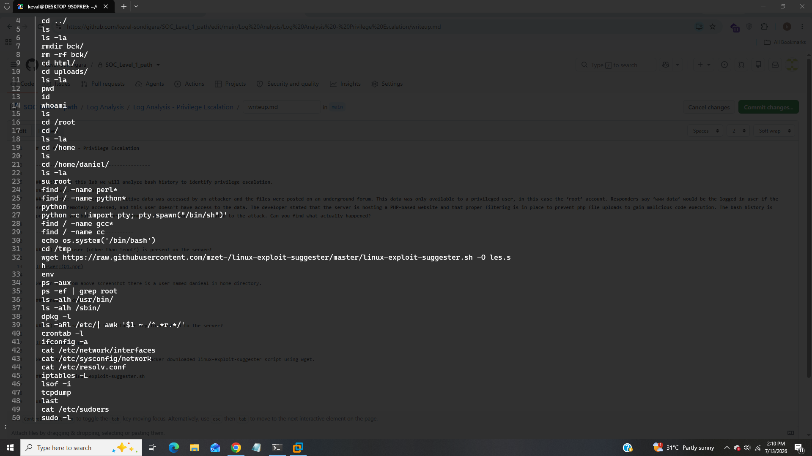
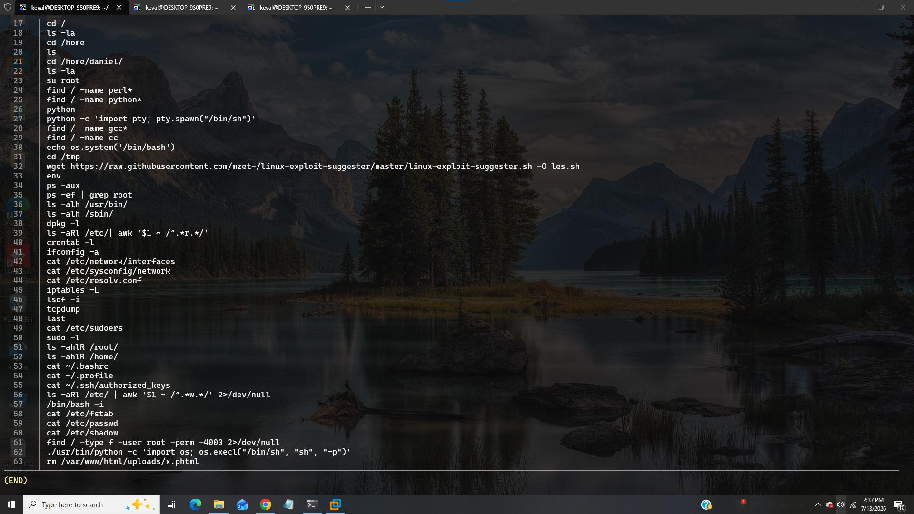

# Log Analysis - Privilege Escalation

-----------------------------------------

## Title:- In this lab we will analyze bash history to identify privilege escalation.
## Category:- Log Analysis
## Scenario:- A server with sensitive data was accessed by an attacker and the files were posted on an underground forum. This data was only available to a privileged user, in this case the ‘root’ account. Responders say ‘www-data’ would be the logged in user if the server was remotely accessed, and this user doesn’t have access to the data. The developer stated that the server is hosting a PHP-based website and that proper filtering is in place to prevent php file uploads to gain malicious code execution. The bash history is provided to you but the recorded commands don’t appear to be related to the attack. Can you find what actually happened?

-----------------------------------

### 1). What user (other than ‘root’) is present on the server?

We can see from above screenshot there is a user named danieal in home directory.

### Answer:- danieal

### 2). What script did the attacker try to download to the server? 

We can see from above screenshot that attacker downloaded linux-exploit-suggester script using wget.

### Answer:- linux-exploit-suggester.sh

### 3). What packet analyzer tool did the attacker try to use?

We can see in task 2 that attacker used tcpdump as packet analyzer

### Answer:- tcpdump

### 4). What file extension did the attacker use to bypass the file upload filter implemented by the developer?

We can see in in last line that .phtml extension to bypass the file upload filter.

### Answer:-  .phtml

### 5). Based on the commands run by the attacker before removing the php shell, what misconfiguration was exploited in the ‘python’ binary to gain root-level access? 1- Reverse Shell ; 2- File Upload ; 3- File Write ; 4- SUID ; 5- Library load

We can see in task 4 that attacker listed SUID binaries using find command and just after execute python library it indicates that attacker used misconfigured SUID binaries to gain root-level access.

### Answer:- 4 , SUID

------------------------------------------------

## IOC (Indicator of Compromise)

|     Indicator      |    Value                     |
|--------------------|------------------------------|
|  Local User        |  danieal                     |
|  Downloaded Script |  linux-exploit-suggester.sh  |
|  Packet Analyzer   |  tcpdump                     |
|  File Extension    |  .phtml                      |
|  Misconfiguration  |   SUID                       |

---------------------------------------------------

## MITRE ATT&CK Mapping

|    Technique            |    Id      |
|-------------------------|------------|
|  SUID Missconfiguration |  T1548.001 |
|  Reverse Shell          |  T1059.004 |
