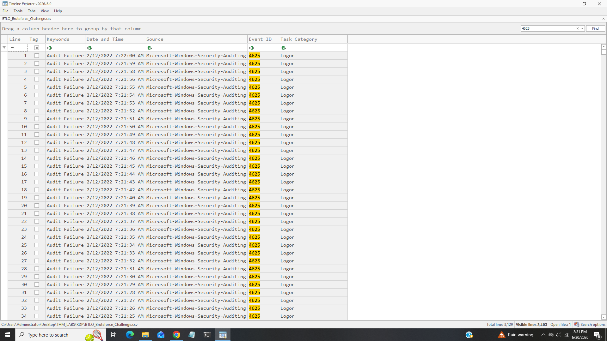
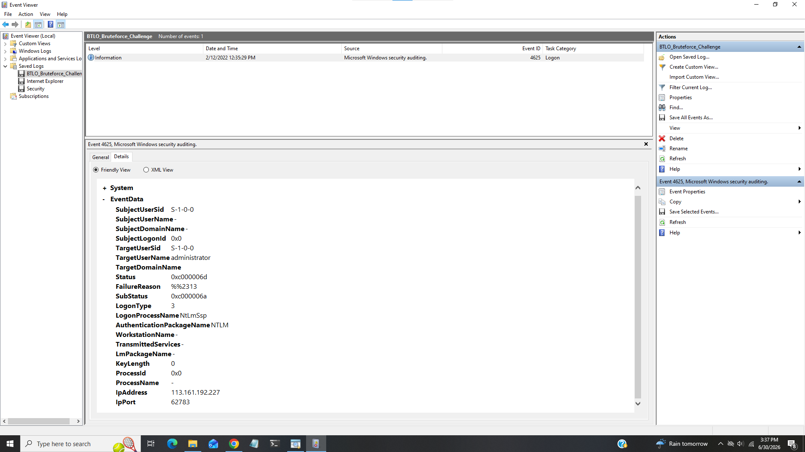
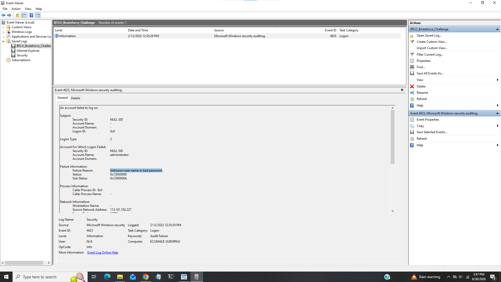
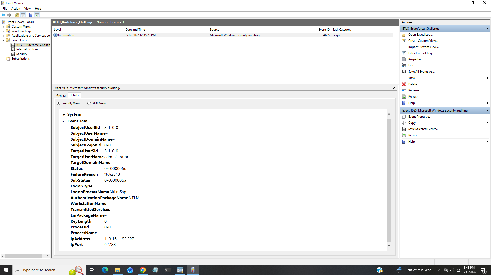
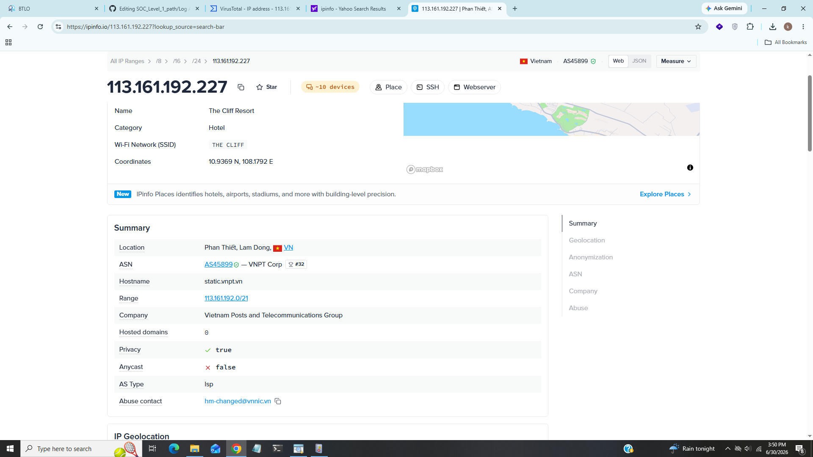

# RDP Bruteforce

----------------------------------------------------------------------------------

### Title:- In this lab we will analyzw windows event logs.
### Category:- Log Analysis
### Scenario:- Can you analyze logs from an attempted RDP bruteforce attack?

### One of our system administrators identified a large number of Audit Failure events in the Windows Security Event log.

### There are a number of different ways to approach the analysis of these logs! Consider the suggested tools, but there are many others out there!

----------------------------------------------------------------------------------

### 1). How many Audit Failure events are there? (Format: Count of Events)

I opend .CSV file in timeline explorer which is digital forensics and incident response tool by Eric Zimmerman and filter for event id 4625 which indicates audit failure

We can see in bottom right corner total visible lines 3103.

### Answer:- 3103

### 2). What is the username of the local account that is being targeted? (Format: Username) 

For this task i opened .EVTX file which contains only event in details tab we can see that attacker targeted administrator.

### Answer:- administrator

### 3). What is the failure reason related to the Audit Failure logs? (Format: String)

In event viewer go to general tab 

We can see failure reason under failure information section that audit fail logs failed beacause of Unknown user name or bad password.

### Answer:-Unknown user name or bad password

### 4). What is the Windows Event ID associated with these logon failures

As we discuss event id 4625 is associated with logon failures.

### Answer:- 4625

### 5). What is the source IP conducting this attack?

In details tab we can see ip under ip address field

### Answer:- 113.161.192.227

### 6). What country is this IP address associated with? (Format: Country) 

We can use any ip intelligence plateform like virustotal,ipinfo to find details associated with ip address

We can see that this ip is associated with vietnam.

### Answer:- vietnam

----------------------------------------------------------------------------------------------------------

## IOC (Indicator of Compromise)

|    Field           |    Value                            |
|--------------------|-------------------------------------|
|  Victime Username  |  administrator                      |
|  Failure Reason    |  Unknown user name or bad password  |
|  Failure EventID   |  4625                               |
|  Source Ip         |  113.161.192.227                    |
|  Origin Country    |  Vietnam                            |

---------------------------------------------------------------------------------------------------------------

## Incident Summary

In this investigation the attacker performed RDP bruteforce attack by targeting administrator the reason was Unknown user name or bad password further investigation reavealed that requests were comming from source ip 113.161.192.227 from vietnam.

----------------------------------------------------------------------------------------------------------------

## MITRE ATT&CK Mapping

|     Technique       |     Id        |
|---------------------|---------------|
|  RDP Bruteforce     |   T1110.001   |
