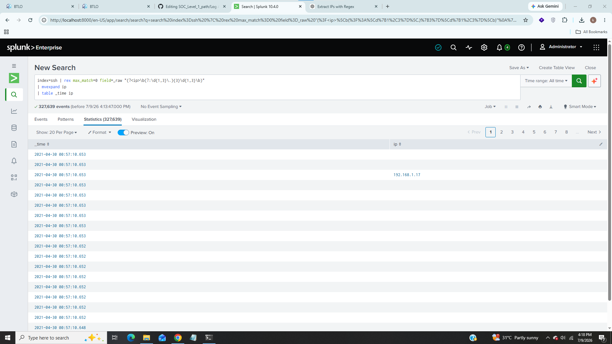
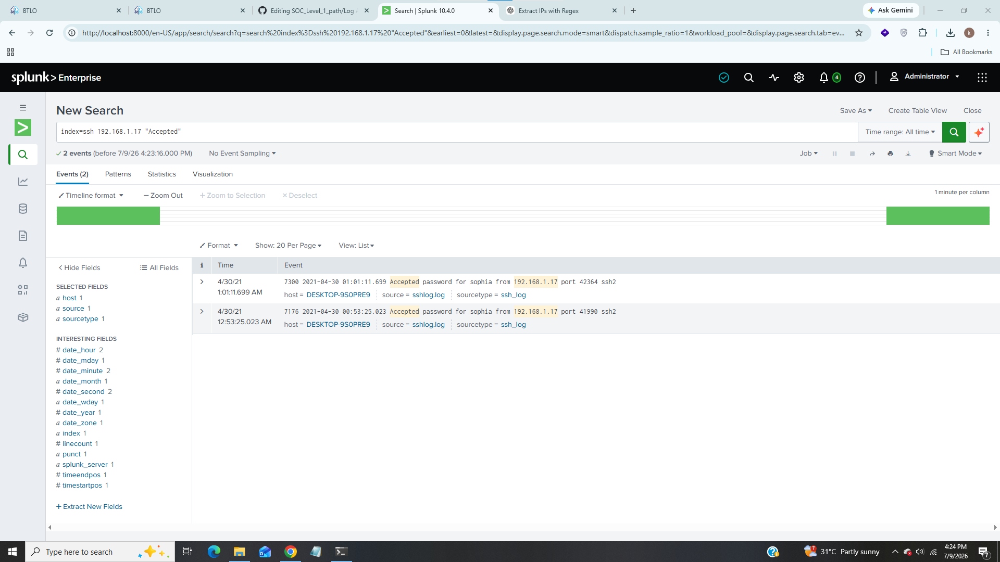
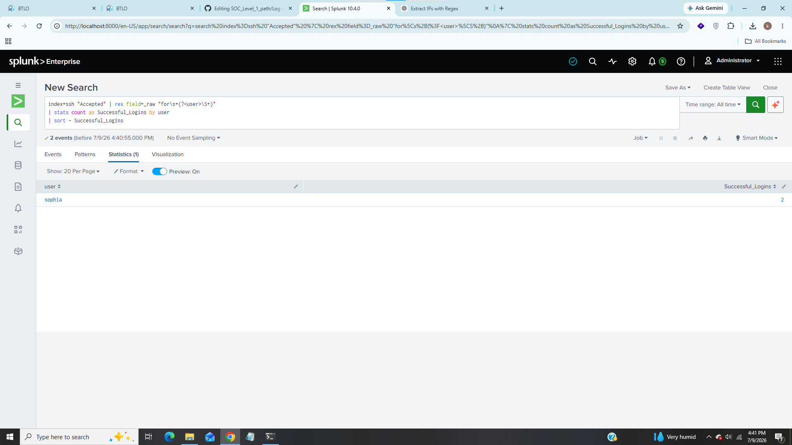
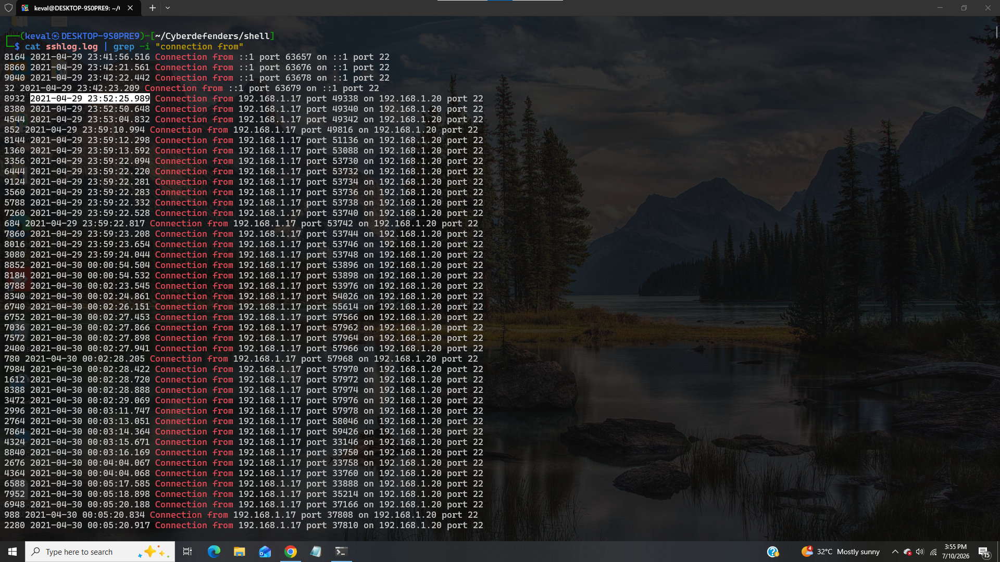
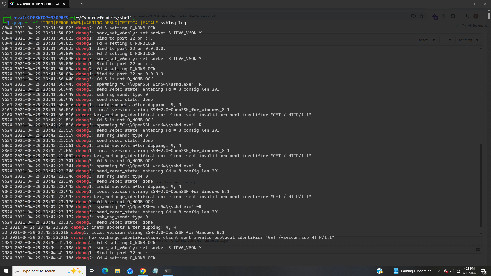

# Secure Shell

-----------------------------------

### Title:- In this lab we will analyze ssh logs to identify unusual activities.
### Category:- Log Analysis
### Scenario:- Hey! We had a SSH service on a system and noticed unusual change in size of the log file. Don’t panic, it was the new IT guys’ daughter who said she was able to break into the system. I had given her permission to test some of these services. I am giving you the log file, can you solve the following queries?

---------------------------------

### 1). Is it an internal or external attack, what is the attacker IP?

For this task i used regex to extract ip address from each log like this,

#### index=ssh | rex max_match=0 field=_raw "(?<ip>\b(?:\d{1,3}\.){3}\d{1,3}\b)"
#### | mvexpand ip
#### | table _time ip

We can see the internal ip address 192.168.1.17 there which is likely attacker's ip because i found this ip so many times so far.

### Answer:- internal:192.168.1.17

### 2). How many valid accounts did the attacker find, and what are the usernames?

From the question it looks like that attacker tried bruteforce attack to find username and password let's filter for some keywords in splunk,

#### index=ssh 192.168.1.17 "Accepted"

this query will show results if attacker found any valid accounts

We can see from above screenshot that password was accepted for user sophia.

### Answer:- 1:sophia

### 3). How many times did the attacker login to these accounts?

Run following query to find exact count of successful login,

#### index=ssh "Accepted" | rex field=_raw "for\s+(?<user>\S+)"
#### | stats count as Successful_Logins by user
#### | sort - Successful_Logins

### Answer:- 2

### 4). When was the first request from the attacker recorded?

Use this command to list all connections from the attacker,

#### cat sshlog.log | grep -i "connection from"

We can see first request from ip 192.168.1.17 was came at 2021-04-29 23:52:25.989

### Answer:- 2021-04-29 23:52:25.989

### 5). What is the log level for the log file?

A log level is a classification tag attached to a log entry that indicates its imprortance and severity.

There are many log levels like fatal, error, warning, info, debug etc. let's try some among of them,

#### grep -i -E "INFO|ERROR|WARN|WARNING|DEBUG|CRITICAL|FATAL" sshlog.log

This command will show all results with matching this keywords,

We can see there are many logs with debug keyword.

### Answer:- debug

### 6). Where is the log file located in Windows?

The defalult location of ssh logs are in event viewer is Windows Logs -> Application and there is listed sshd but there are alternative locations also that stores ssh logs, after doing some research on internet i found that windows also stores ssh logs as text files inside "C:\ProgramData\ssh\logs" so it should be our answer for this question.

### Answer:- C:\ProgramData\ssh\logs\sshd.log

------------------------------------------

## IOC (Indicator of Compromise)

|     Indicator                   |    Value                           |
|---------------------------------|------------------------------------|
|  Attacker's Ip                  |  192.168.1.17                      |
|  User Account                   |  sophia                            |
|  Successfull Logins             |  2                                 |
|  First Connection From Attacker |  2021-04-29 23:52:25.989           |
|  Log Level                      |  debug                             |
|  Log File Location              |  C:\ProgramData\ssh\logs\sshd.log  |

-----------------------------------------

## Incident Summary

In this investigation an internal ip 192.168.1.17 found to perform suspicious activities started at 2021-04-29 23:52:25.989 further investigation revaled that attacker performed bruteforce attack to found valid credentials and later password accepted for user sophia and attacker loged-in twice into this account.

-----------------------------------------

## MITRE ATT&CK Mapping

|   Technique     |   Id       |
|-----------------|------------|
|  SSH Bruteforce |  T1110.001 |
