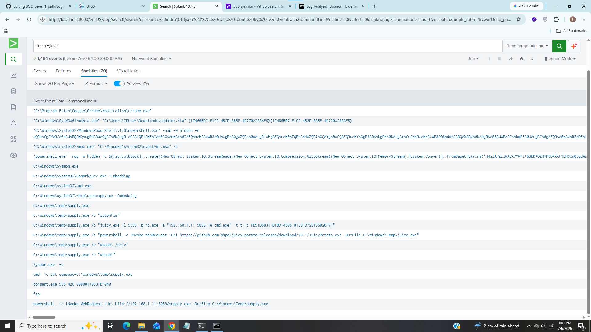
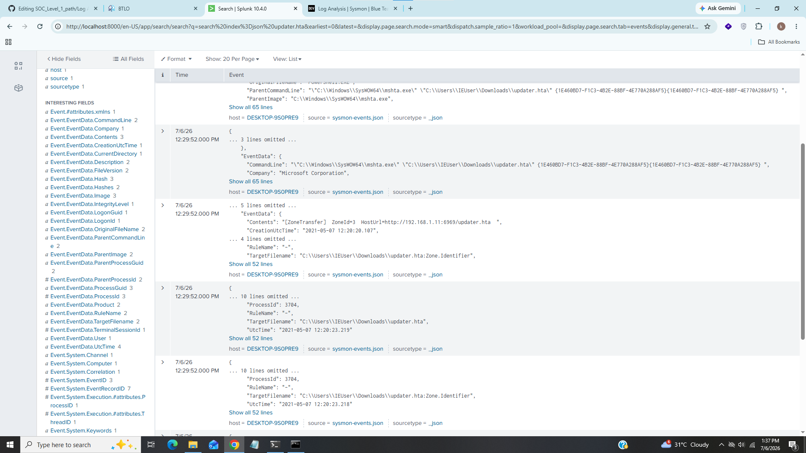
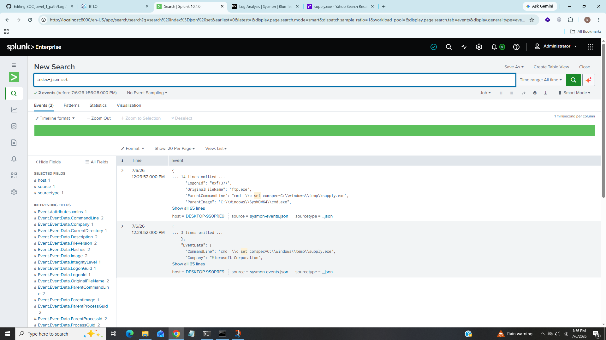
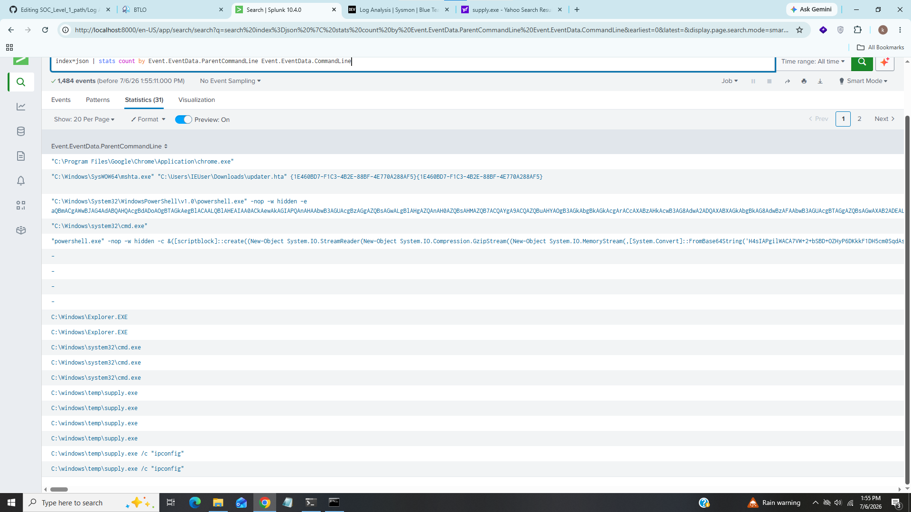
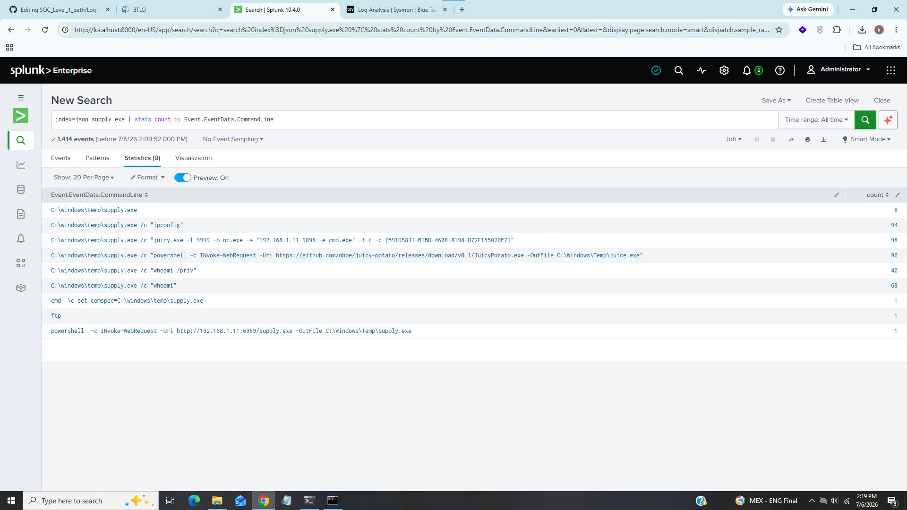
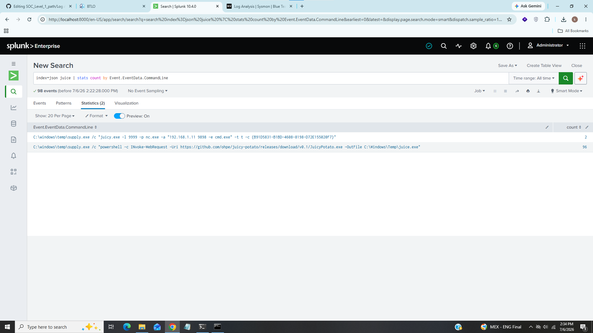

# Log Analysis - Sysmon

------------------------------------------

## Title:- In this lab We will analyze sysmon logs.
## Category:- Log Analysis
## Scenario:- You are provided with Sysmon logs from a compromised endpoint. Analyse the logs to find out the steps and techniques used by the attacker.

---------------------------------------------

### 1). What is the file that gave access to the attacker

For this task i use this query

### index=json | stats count by Event.EventData.CommandLine Event.EventData.ProcessId Event.EventData.ParentProcessId

We can see in second event updater.hta file is running under powershell.exe .hta file is html file that are executed using Microsoft HTML Application Host (mshta.exe).

### Answer:- updater.hta

### 2). What is the powershell cmdlet used to download the malware file and what is the port?

Now we knows the malware file filter updater.hta in splunk

We can see ip address and port used to download the malware file.

### Invoke-WebRequest, 6969

### 3). What is the name of the environment variable set by the attacker?

For this task i researched on internet after i found there is "set" command is used to display, create, modify and remove environment variables so i simply searched for set keyword in my splunk

We can see the evvironment variables set by the attacker.

### Answer:- comspec=C:\\windows\\temp\\supply.exe

### 4). What is the process used as a LOLBIN to execute malicious commands? 

A LOLBIN (Living Off The Land Binary) refers to a legitimate, trusted executable or tool that is already present on the system. Attackers abuse these binaries to execute malicious commands or payloads, reducing the likelihood of detection by security software.
Common examples of LOLBINs include PowerShell, cmd.exe, ftp.exe, and wscript.exe, which are integral to the operating system.

In this case it could be powershell.exe or ftp.exe, because all malicious activity was started with powershell command it also downloads malicious file from internet like supply.exe, but in some instances of supply.exe the parent process is ftp.exe.
the correct answer according to the lab is ftp.exe

### Answer:- ftp.exe

### 5). Malware executed multiple same commands at a time, what is the first command executed?

We can see from above screenshot supply.exe which is downloaded using powershell executed ipconfig as first command.

### Answer:- ipconfig

### 6). Malware then downloads a new file, find out the full url of the file download?

We can see from above screenshot a new file JuicyPotato.exe downloaded from github using powershell

### Answer:- https://github.com/ohpe/juicy-potato/releases/download/v0.1/JuicyPotato.exe

### 7). What is the port the attacker attempts to get reverse shell? 

We can see full command from above screenshot that attacker was trying to get reverse shell on port 9898

### Answer:- 9898

