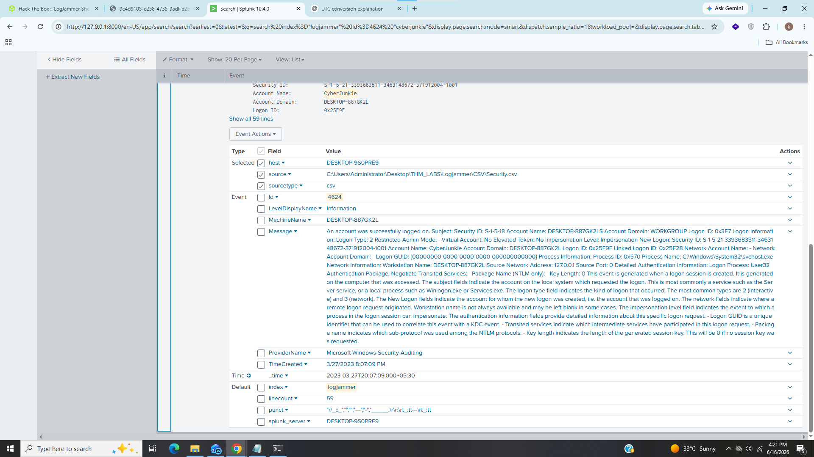
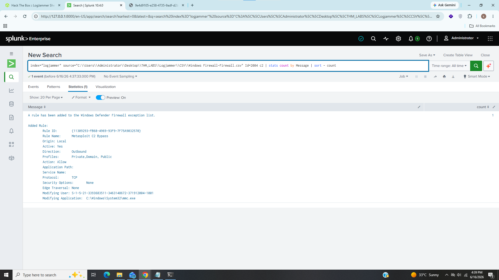
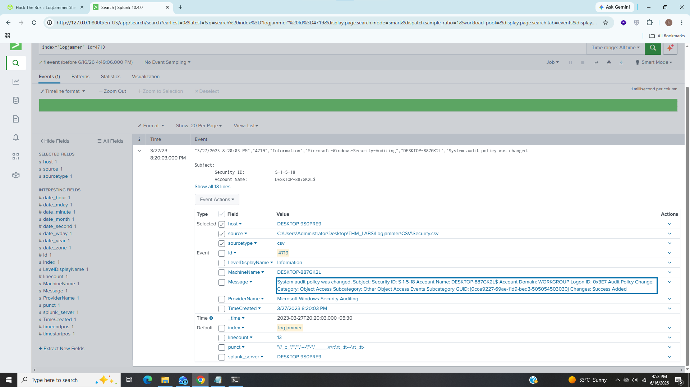
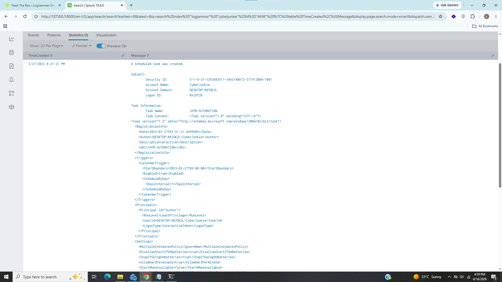
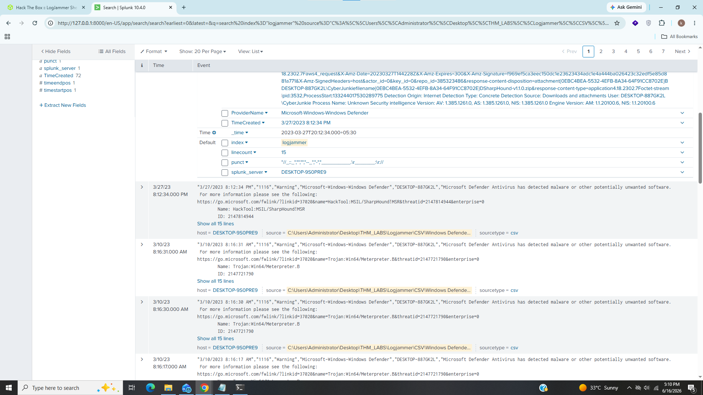
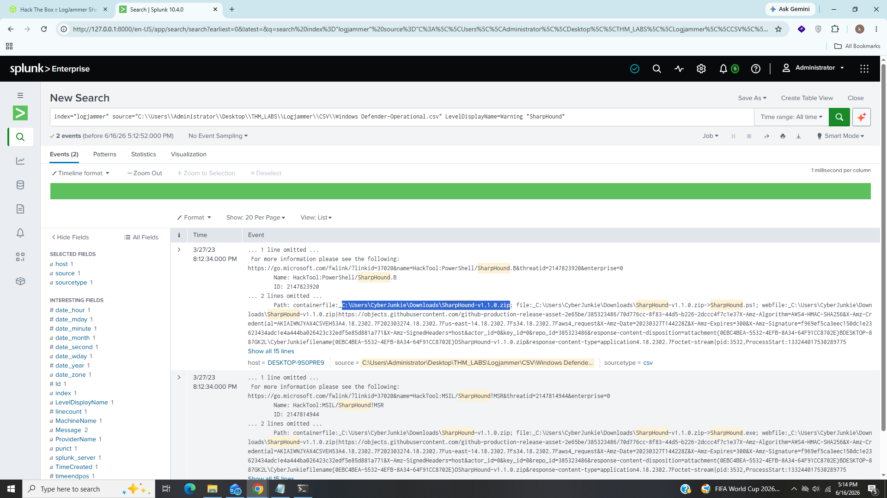
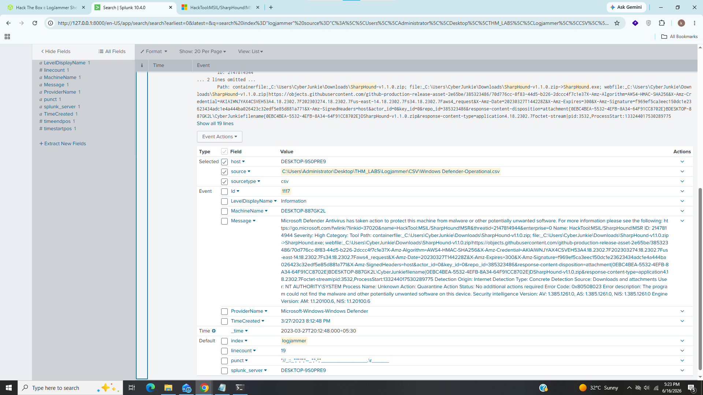
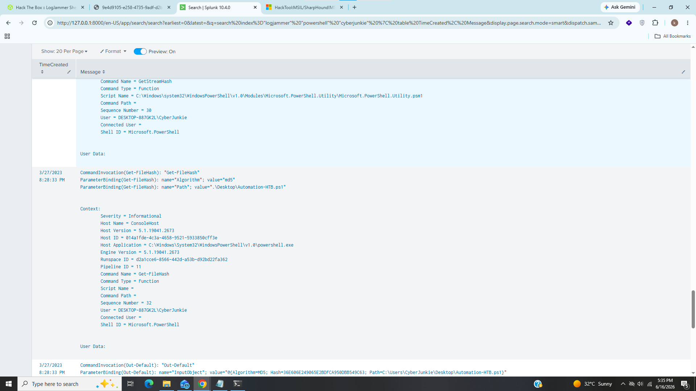
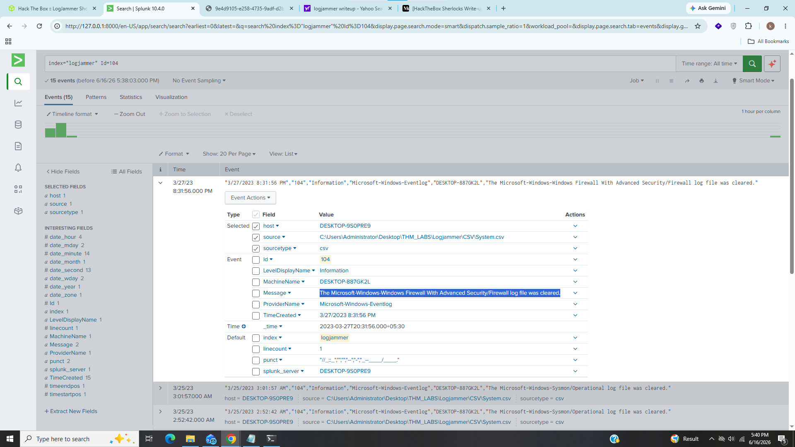

# Logjammer

---------------------------------------------------------------------------------------

### Title:- In this sherlock we will analyze windows event logs.
### Cartegory:- DFIR
### Scenario:- You have been presented with the opportunity to work as a junior DFIR consultant for a big consultancy. However, they have provided a technical assessment for you to complete. The consultancy Forela-Security would like to gauge your knowledge of Windows Event Log Analysis.

--------------------------------------------------------------------------------------

### 1). When did the cyberjunkie user first successfully log into his computer? (UTC)

I used this query in splunk

### index="logjammer" Id=4624 cyberjunkie

Event id 4624 refers successfull login 
We can see that user cyberjunkie successfully loged in at 27/03/2023 14:37:09

### Answer:- 27/03/2023 14:37:09

### 2). The user tampered with firewall settings on the system. Analyze the firewall event logs to find out the Name of the firewall rule added?

For this task i used this query

### index="logjammer" Id=2004 c2 | stats count by message | sort -count

Event id 2004 indicates that a new rule has been added to the windows defender firewall exeception list

We can see that attacker added new outbound rule with name Metasploit C2 Bypass.

### Answer:- Metasploit C2 Bypass

### 3). Whats the direction of the firewall rule?

As we saw in task 2 that attacker added outbound rule.

### Answer:- outbound

### 4). The user changed audit policy of the computer. Whats the Subcategory of this changed policy?

There are several events related policy such as event id 4719(for policy changes), 4902(for audit policy table created), 4907(setting changes) i filter event id 4719

As we can see that attacker changed policy under subcategory "Other Object Access Events"

### Answer:- Other Object Access Events

### 5). The user "cyberjunkie" created a scheduled task. Whats the name of this task?

### index="logjammer" Id="4698" | table Timecreated, message

Event id 4698 indicates that new scheduled task created on a system and i arranged this output in table formate

As we can see that user cyberjunkie created scheduled task "HTB-AUTOMATION".

### Answer:- HTB-AUTOMATION

### 6). Whats the full path of the file which was scheduled for the task?

After scrolling we can see in <command> tag the full path of the file which was scheduled for the task.

### Answer:- C:\Users\CyberJunkie\Desktop\Automation-HTB.ps1

### 7). What are the arguments of the command?

We can see the arguments in <arguments> tag.

### Answer:- -A cyberjunkie@hackthebox.eu

### 8). The antivirus running on the system identified a threat and performed actions on it. Which tool was identified as malware by antivirus?

### index="logjammer" LevelDisplayName="warning"

This query shows where antivirus generates warnings

We can see that antivirus detected potentially unwanted software called "SharpHound" which is data collector for BloudHound.

### Answer:- Sharphound

### 9). Whats the full path of the malware which raised the alert?

Since we knows that sharphound is detected as malware I just added the name of malware "SharpHound" in task 8's query

We can see full path of SharpHound's zip file.

### Answer:- C:\Users\CyberJunkie\Downloads\SharpHound-v1.1.0.zip

### 10). What action was taken by the antivirus?

### index="logjammer" Id="1117" "SharpHound"

After some researching on internet i found that event id 1116 is used for detecting malwares and id 1117 is used to confirm that microsoft defender has taken action to remidiate the system.

we can see from message field that antivirus Quarantined the system as part of action.

### Answer:- Quarantine

### 11). The user used Powershell to execute commands. What command was executed by the user?

I used this splunk query 

### index="logjammer" powershell.exe cyberjunkie

After some findings we can see that attacker used "Get-FileHash" cmdlet with MD5 algorithm to retrive hash of Automation-HTB.ps1.

### ANswer:- Get-FileHash -Algorithm md5 .\Desktop\Automation-HTB.ps1

### 12). We suspect the user deleted some event logs. Which Event log file was cleared?

For this task i did some research in on internet and found some event id 1102 which indictaes that local security audit logs is cleared by an administrator.

We can see that Microsoft-Windows-Windows Firewall With Advanced Security/Firewall logs were cleared by attacker

### Answer:- Microsoft-Windows-Windows Firewall With Advanced Security/Firewall

-----------------------------------------------------------------------------------------------------------------------------------------------------------

## What I Learned?

- Windows Event Log Analysis
- Splunk Queries
- Threat Hunting

-------------------------------------------------------------------------------------------------------------------------------------------------------

## Incident Summary

In this investigation a user " cyberjunkie" logged in into the system and added the outbound rule "Metasploit C2 Bypass" by tampered with firewall settings on the system and further investigation revaled that user changed audit policy of the computer under subcategory "Other Object Access Events" and later user "cyberjunkie" created a scheduled task "HTB-AUTOMATION" and after some activities antivirues identified a threat "SharpHound" and qurantined the system as a part of action and later attacker executed some powershell commands on a system and deleted Microsoft-Windows-Windows Firewall With Advanced Security/Firewall.

----------------------------------------------------------------------------------------------------------------------------------------------------

## IOC (Indicator of Compromise)

|      Field           |      Value                                                          |
|----------------------|---------------------------------------------------------------------|
|  Login Timestemp     |  27/03/2023 14:37:09                                                |
|  Outbound Rule       |  Metasploit C2 Bypass                                               |
|  Policy Subcategory  |  Other Object Access Events                                         |
|  Scheduled Task      |  HTB-AUTOMATION                                                     |
|  Scheduled Task Path |  C:\Users\CyberJunkie\Desktop\Automation-HTB.ps1                    |
|  Malware             |  ShareHound                                                         |
|  Powershell Command  |  Get-FileHash -Algorithm md5 .\Desktop\Automation-HTB.ps1           |
|  cleared Event Logs  |  Microsoft-Windows-Windows Firewall With Advanced Security/Firewall |

-------------------------------------------------------------------------------------------------------------------------------------------------

## MITRE ATT&CK Mapping

|     Technique           |      Id          |
|-------------------------|------------------|
|  Adding Firewall Rule   |   T1686.003      |
|  Scheduled Task         |   T1053.005      |
|  Powershell Execution   |   T1059.001      |
|  Clearing Firewall Logs |   T1685.005      |
