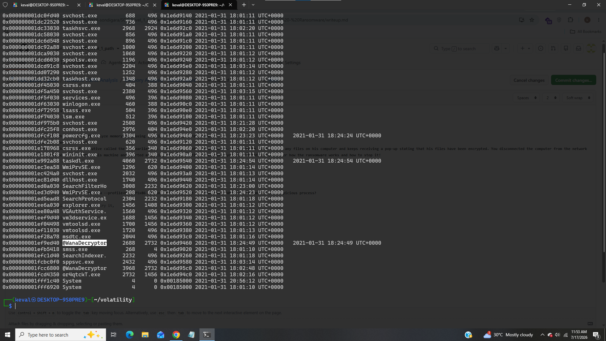
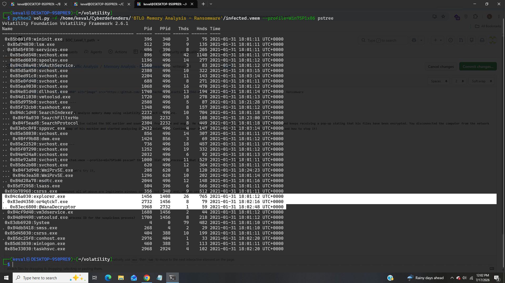
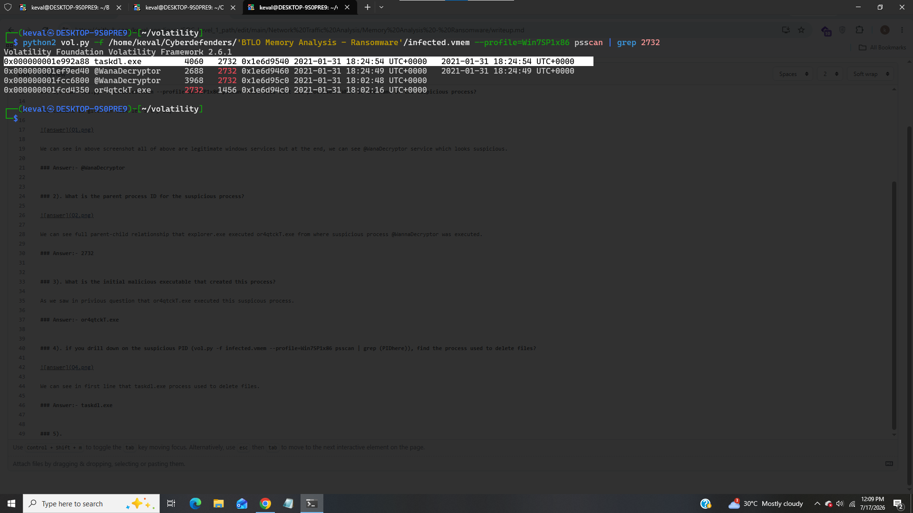
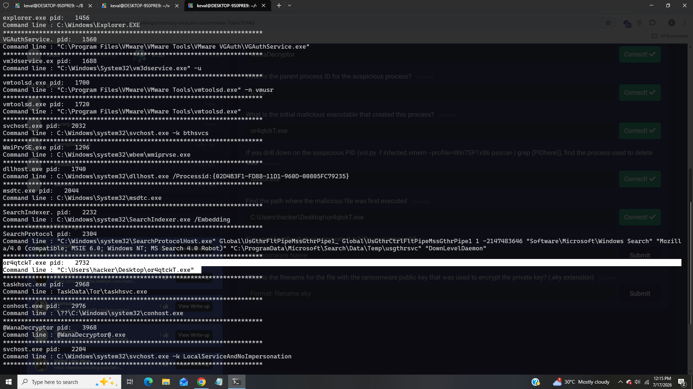
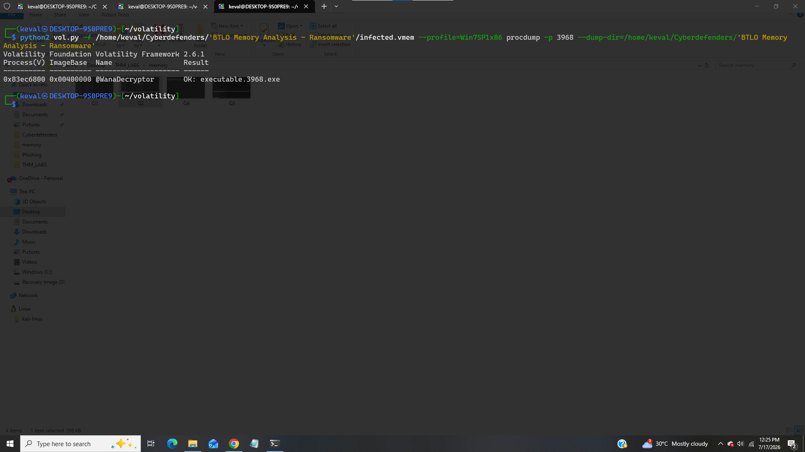
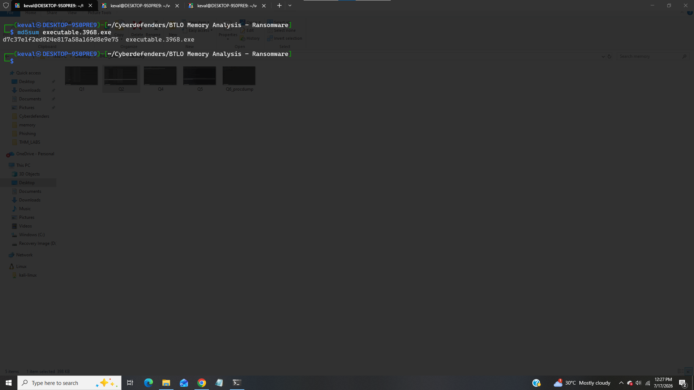
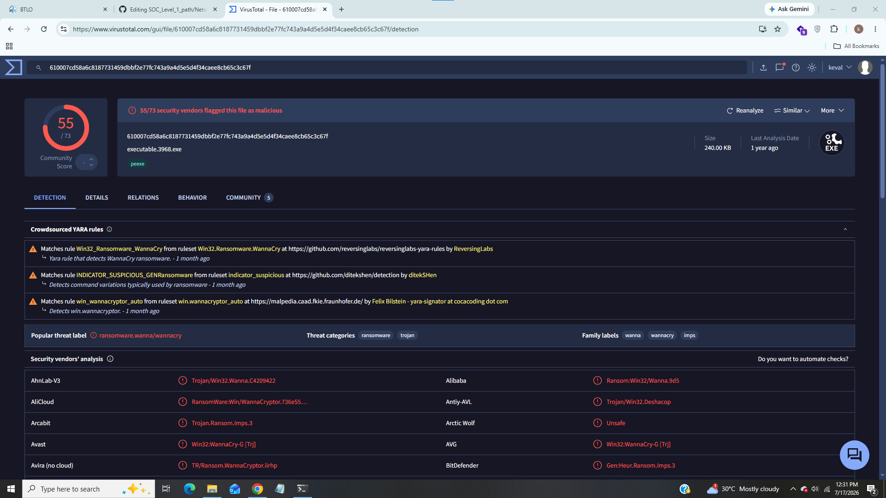
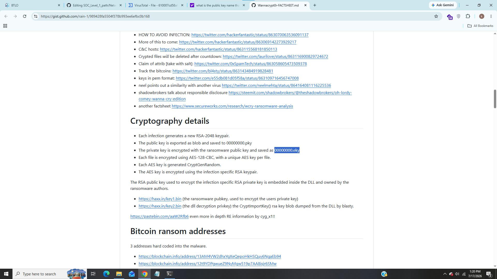

# Memory Analysis - Ransomware

-------------------------------

### Title:- In this lab we will analyze memory dump using volatility to detect ransoware.
### Category:- Memory forensic
### Scenario:- The Account Executive called the SOC earlier and sounds very frustrated and angry. He stated he can’t access any files on his computer and keeps receiving a pop-up stating that his files have been encrypted. You disconnected the computer from the network and extracted the memory dump of his machine and started analyzing it with Volatility. Continue your investigation to uncover how the ransomware works and how to stop it!

------------------------------

### 1). Run “vol.py -f infected.vmem --profile=Win7SP1x86 psscan” that will list all processes. What is the name of the suspicious process?

The command is given in task let's try it,

We can see in above screenshot all of above are legitimate windows services but at the end, we can see @WanaDecryptor service which looks suspicious.

### Answer:- @WanaDecryptor

### 2). What is the parent process ID for the suspicious process? 

We can see full parent-child relationship that explorer.exe executed or4qtckT.exe from where suspicious process @WannaDecryptor was executed.

### Answer:- 2732

### 3). What is the initial malicious executable that created this process?

As we saw in privious question that or4qtckT.exe executed this suspicous process.

### Answer:- or4qtckT.exe

### 4). if you drill down on the suspicious PID (vol.py -f infected.vmem --profile=Win7SP1x86 psscan | grep (PIDhere)), find the process used to delete files?

We can see in first line that taskdl.exe process used to delete files.

### Answer:- taskdl.exe

### 5). Find the path where the malicious file was first executed?

We will use "cmdline" plugin of volatility,

Since we know that or4qtckT.exe is parent process of WannaDecryptor so it was executed first from here.

### Answer:- C:\Users\hacker\Desktop\or4qtckT.exe

### 6). Can you identify what ransomware it is?

For this task we will have to download this malicious binary file then we will extract hash and upload it on virustotal let's do it

We will use procdump plugin of volatility to dump binary,

We successfully dump the binary, now calculate the hash,

We can see MD5 hash let's upload it on virustotal,

We can see in family label that it is famous ransomware WannaCry.

### Answer:- WannaCry

### 7). What is the filename for the file with the ransomware public key that was used to encrypt the private key? (.eky extension)

For this task i searched on internet,

We can see from above github report that "00000000.eky" public key is used to encrypt the private key.

### Answer:- 00000000.eky

-------------------------------------

## IOC (Indicator of Compromise)
 
|     Indicator              |    Value                              |
|----------------------------|---------------------------------------|
|  Suspicious Process        |  @WanaDecryptor                       |
|  Parent Process Id         |  2732                                 |
|  Parent Process            |  or4qtckT.exe                         |
|  Process used for Deletion |  taskdl.exe                           |
|  Parent Process Path       |  C:\Users\hacker\Desktop\or4qtckT.exe |
|  Ransomware Family         |  WannaCry                             |
|  Public Key                |  00000000.eky                         |

----------------------------------------

## Incident Summary

In this investigation a varient of popular ransomware "WannaCry" hit in system named with "@WannaDecryptor" further investigation revealed that it was executed parent process "or4qtckT.exe" also it uses "taskdl.exe" to delete the files and it uses public key "00000000.eky" to encrypt the private key.

