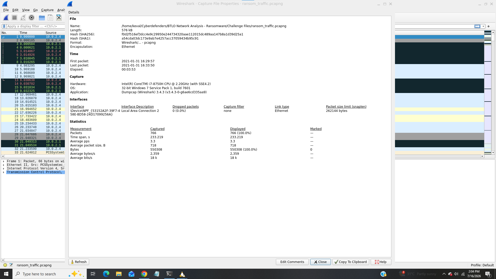
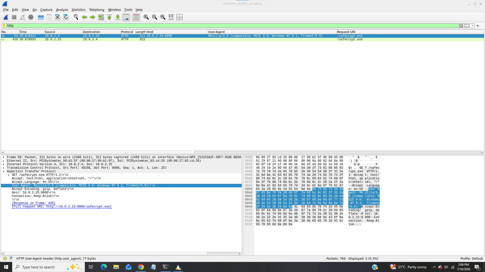
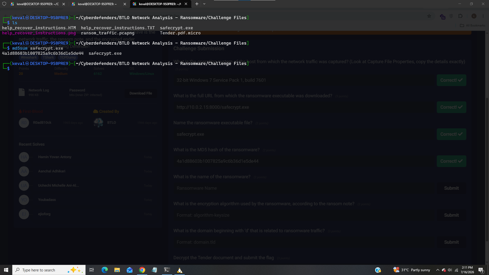
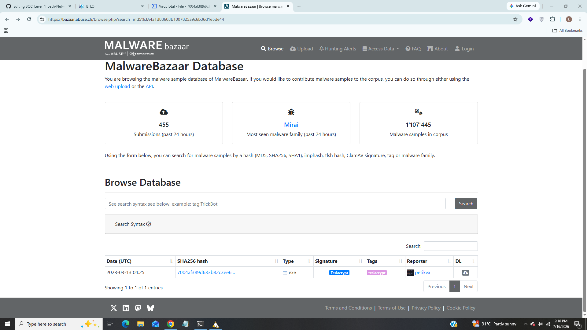
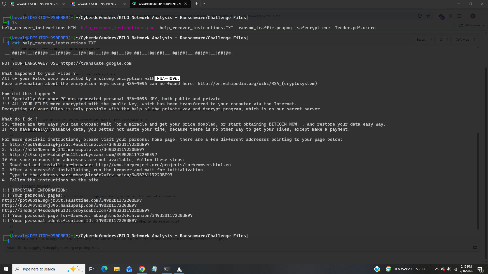
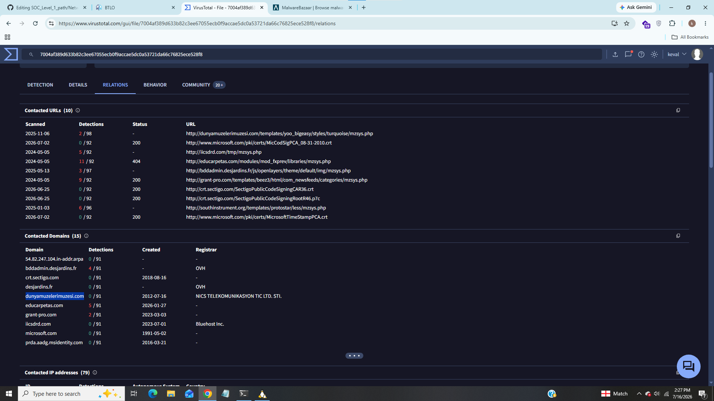
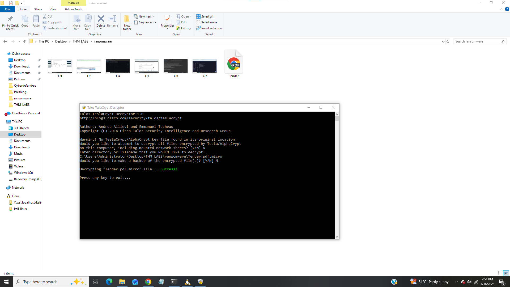
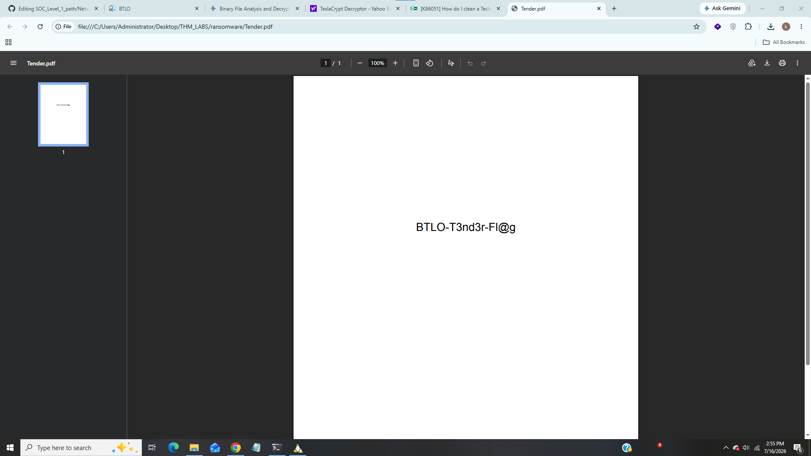

# Network Analysis - Ransomware

----------------------------------

### Title:- In this lab we will analyze network traffic to detect ransomware.
### Category:- Network Traffic Analysis
### Scenario:- ABC Industries worked day and night for a month to prepare a tender document for a prestigious project that would secure the company’s financial future. The company was hit by ransomware, believed to be conducted by a competitor, and the final version of the tender document was encrypted. Right now they are in need of an expert who can decrypt this critical document. All we have is the network traffic, the ransom note, and the encrypted ender document. Do your thing Defender!​

-----------------------------------

### 1). What is the operating system of the host from which the network traffic was captured? (Look at Capture File Properties, copy the details exactly)?

In question there is mentioned so we will se in wireshark -> Capture File properties,

We can see complete name and version details in os field.

### Answer:- 32-bit Windows 7 Service Pack 1, build 7601

### 2). What is the full URL from which the ransomware executable was downloaded?

We will filter for http packets,

And we can see only two packets there let's open the packet, we can see full url where ransomware was downloaded.

### Answer- http://10.0.2.15:8000/safecrypt.exe

### 3). Name the ransomware executable file?

As we saw in privious question that it was safecrypt.exe.

### Answer:- safecrypt.exe

### 4). What is the MD5 hash of the ransomware?

for this task we will have to export this file into our local machine, we can do it by using export objects feature in wireshark,

Then we will use md5sum utility to extract md5 hash of this executable file,

We can see md5 hash of this ransomware executable.

### Answer:- 4a1d88603b1007825a9c6b36d1e5de44

### 5). What is the name of the ransomware?

I upload this hash on malwarebazar whcih is public databse of malware samples,

We can see our md5 hash is matched and in signature field, we can see the name of ransomware.

### Answer:- Teslacrypt

### 6). What is the encryption algorithm used by the ransomware, according to the ransom note?

We can see in ransom note that ransomware used RSA-4096 which is highly secure, 4096-bit asymetric cryptographic standard used for secure data transmission, digital signature and key exchange.

### Answer:- 4096

### 7). What is the domain beginning with ‘d’ that is related to ransomware traffic?

I already uploaded md5 hash on virustotal,

We can see that domain starts with letter 'd' in relations tab.

### Answer:- dunyamuzelerimuzesi.com

### 8). Decrypt the Tender document and submit the flag

TeslaCrypt was a notorious ransomware active between 2015 and 2016. originally targeting video game files and user profiles, it utilized various file extensions like .ccc, .vvv, .xxx and .micro, in our case we have Tender.pdf.micro file it means this ransomware encrypted original Tender.pdf file with .micro extension we have to decrypt this file.

the devlopers of TeslaCrypt officilly ceased operations and released their master encryption keys in 2016.

So lets download TeslaCryptDecrypter to decrypt this pdf file,

We can see from above screenshot that it successfully decrypt the pdf file, let's open the pdf file to find the flag.

### Answer:- BTLO-T3nd3r-Fl@g

-------------------------------------

## IOC (Indicator of Compromise)

|     Indicator          |     Value                                    |
|------------------------|----------------------------------------------|
|  OS Information        |  32-bit Windows 7 Service Pack 1, build 7601 |
|  Source Ip             |  10.0.2.15                                   |
|  Source Port           |  8000                                        |
|  Malicious Executable  |  safecrypt.exe                               |
|  MD5 Hash              |  4a1d88603b1007825a9c6b36d1e5de44            |
|  Ransomware            |  TeslaCrypt                                  |
|  Encryption Algorithm  |  RSA-4096                                    |
|  Domain                |  dunyamuzelerimuzesi.com                     |
|  Encrypted Document    |  Tender.pdf.micro                            |
|  Flag                  |  BTLO-T3nd3r-Fl@g                            |

------------------------------------

## Incident Summary

In this network analysis investigation the ABC Industries hit by a populer ransomware "TeslaCrypter", the ransomware was downloaded from source ip 10.0.2.15 as safecrypt.exe, this ransomware use a secure cryptographic algorithm RSA-4096 to encrypt files and apends some extensions at the end of the file, also ransomware communicated with domain "dunyamuzelerimuzesi.com" and it encrypted a pdf document "Tender.pdf" into "Tender.pdf.micro" although we successfully decrypted this pdf document later.

-----------------------------------

## MITRE ATT&CK Mapping

|     Technique           |     Id     |
|-------------------------|------------|
|  Ransomware Downloaded  |  T1204.002 |
|  Encrypted PDF File     |  T1486     |
