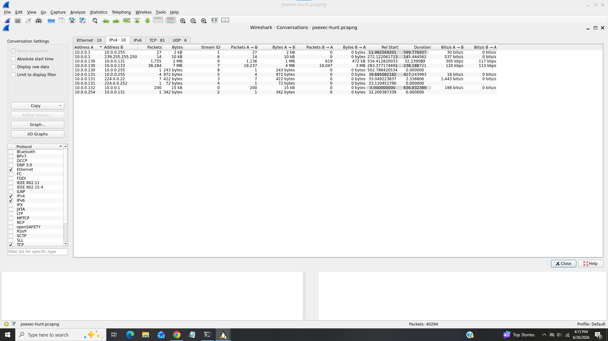
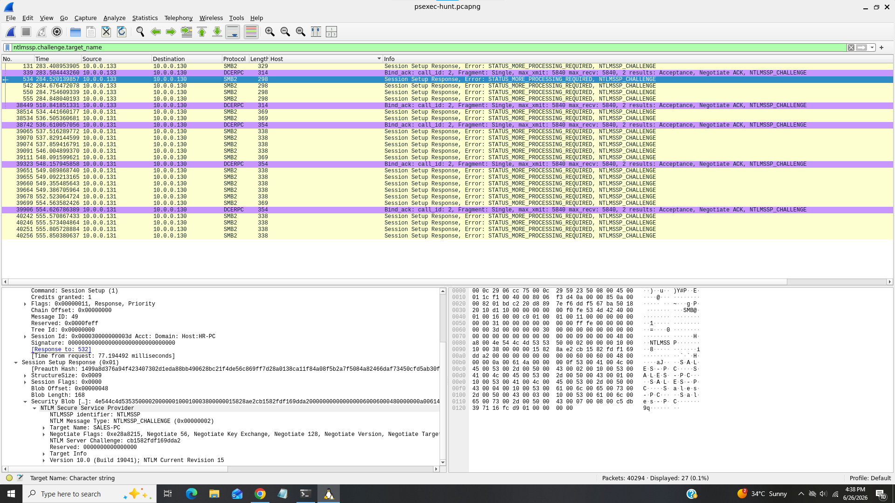
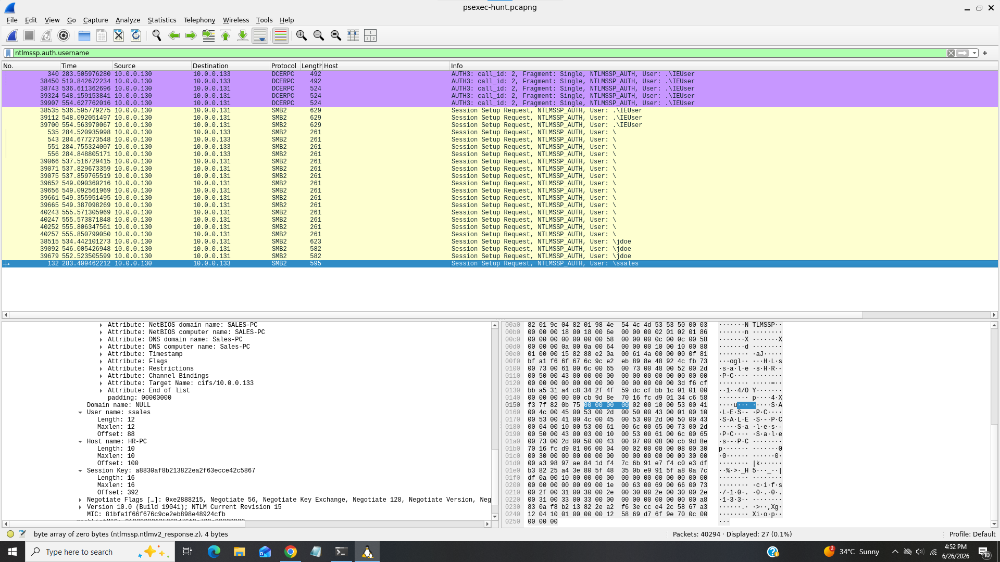
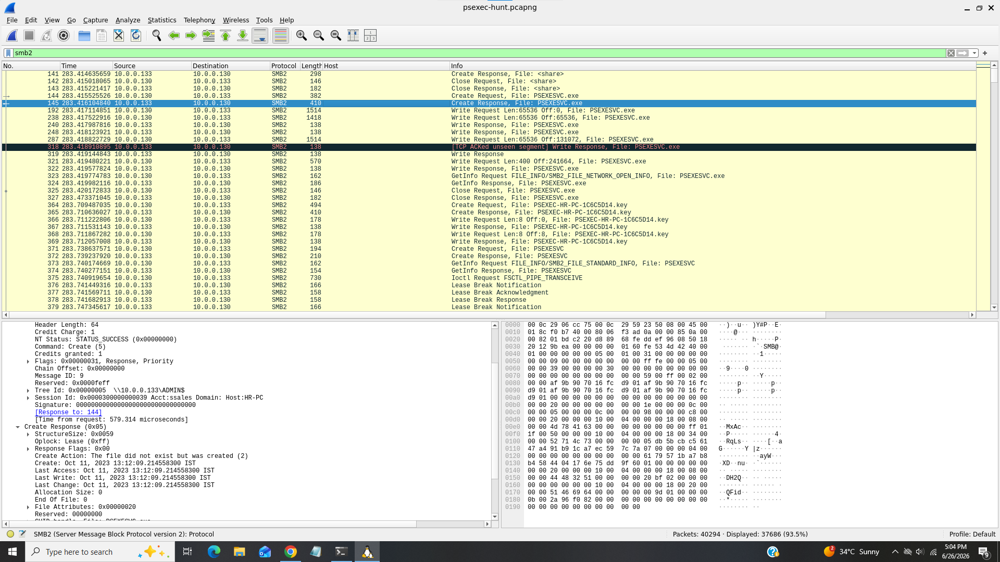
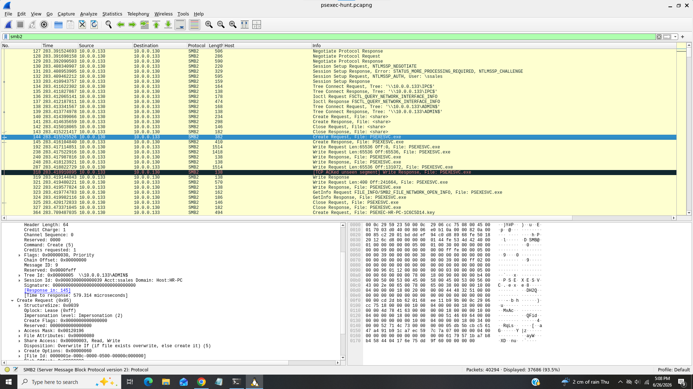
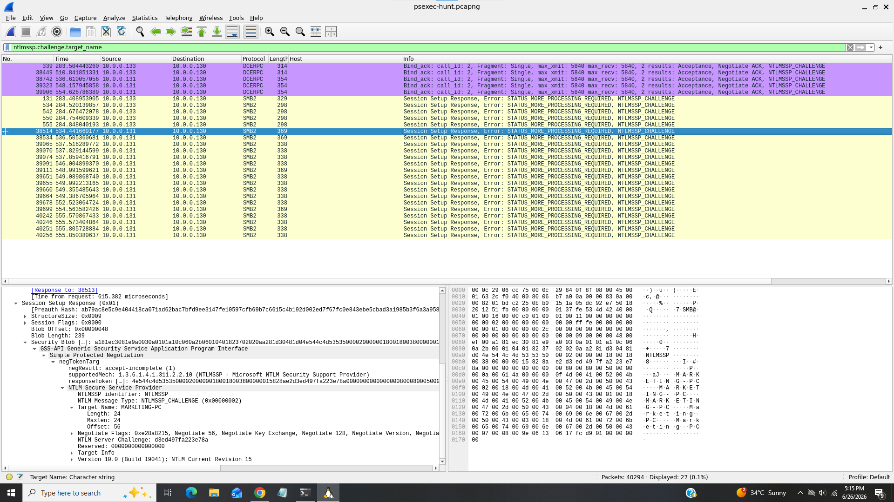

# Psexec

---------------------------------------------------

### Title:- Suspicious lateral movement activity from pcap file.
### Category:- Network Traffic Analysis.
### Scenario:- An alert from the Intrusion Detection System (IDS) flagged suspicious lateral movement activity involving PsExec. This indicates potential unauthorized access and movement across the network. As a SOC Analyst, your task is to investigate the provided PCAP file to trace the attacker’s activities. Identify their entry point, the machines targeted, the extent of the breach, and any critical indicators that reveal their tactics and objectives within the compromised environment.

----------------------------------------------------

### 1). To effectively trace the attacker's activities within our network, can you identify the IP address of the machine from which the attacker initially gained access?

For this task i used wireshark's Statistics > Conversations tab to identify from IP addresses have high traffic volume or frequent connections.

We can see that there are many connections from ip "10.0.0.130" and looks like attacker initially gained access from this ip.

### Answer:- 10.0.0.130

### 2). To fully understand the extent of the breach, can you determine the machine's hostname to which the attacker first pivoted?

For this task i filter SMB protocol and ntlmssp.challenge.target_name in Wireshark to locate the challenge message and identify the target machine's hostname

We can see inside the target name field that attacker first pivoted SALES-PC host.

### 3). Knowing the username of the account the attacker used for authentication will give us insights into the extent of the breach. What is the username utilized by the attacker for authentication?

I filtered for "ntlmssp.auth.username" which is refers for username used in the NTLMSSP(NTLM Security Support Provider) authentication process

We can see in user name field that attacker used "ssales" username for authentication.

### 4). After figuring out how the attacker moved within our network, we need to know what they did on the target machine. What's the name of the service executable the attacker set up on the target?

I filtered SMB protocol to view the traffic that what file attacker set up on the target 

And we can see here one file "PSEXESVC.exe" which is made requests to share.

### Answer:- PSEXESVC.exe

### 5). We need to know how the attacker installed the service on the compromised machine to understand the attacker's lateral movement tactics. This can help identify other affected systems. Which network share was used by PsExec to install the service on the target machine?

From task 4 we can see that request was made using share "ADMIN$"

### Answer:- ADMIN$

### 6). We must identify the network share used to communicate between the two machines. Which network share did PsExec use for communication?

From above screenshot we can see that "IPC$" share used to communicate between two machines.

### Answer:- IPC$

### 7). Now that we have a clearer picture of the attacker's activities on the compromised machine, it's important to identify any further lateral movement. What is the hostname of the second machine the attacker targeted to pivot within our network?

As in Q2, i used the filter "ntlmssp.challenge.target_name" to identify the second machine that the attacker targeted for pivoting.

As we can see that "MARKETING-PC" was the second machine that attacker targeted to pivot within our network.

### Answer:- MARKETING-PC

