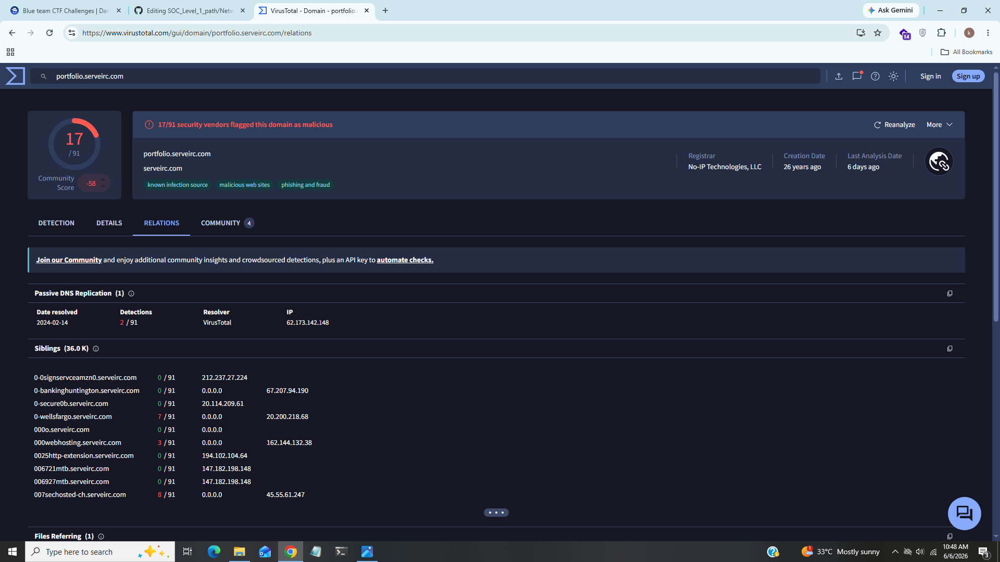
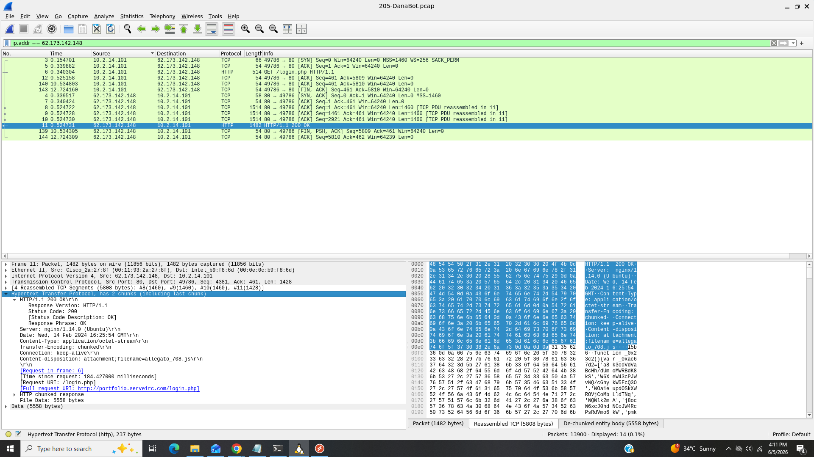
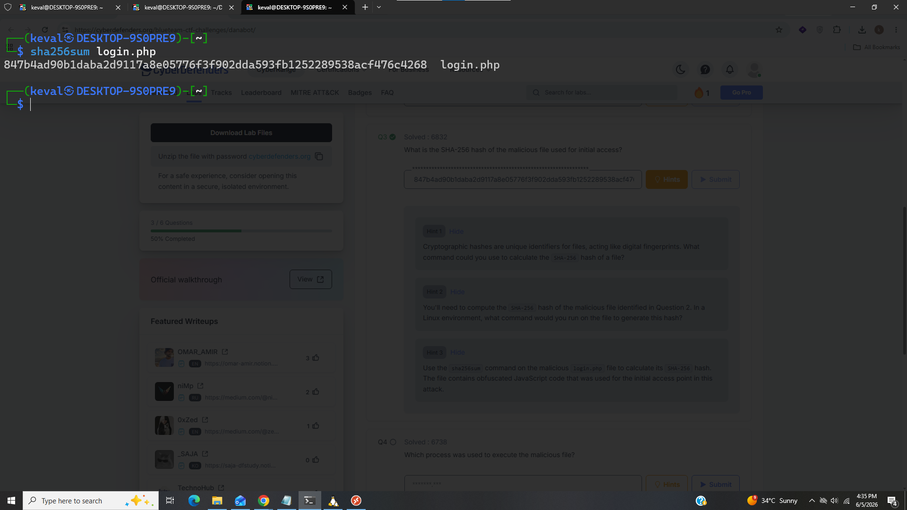
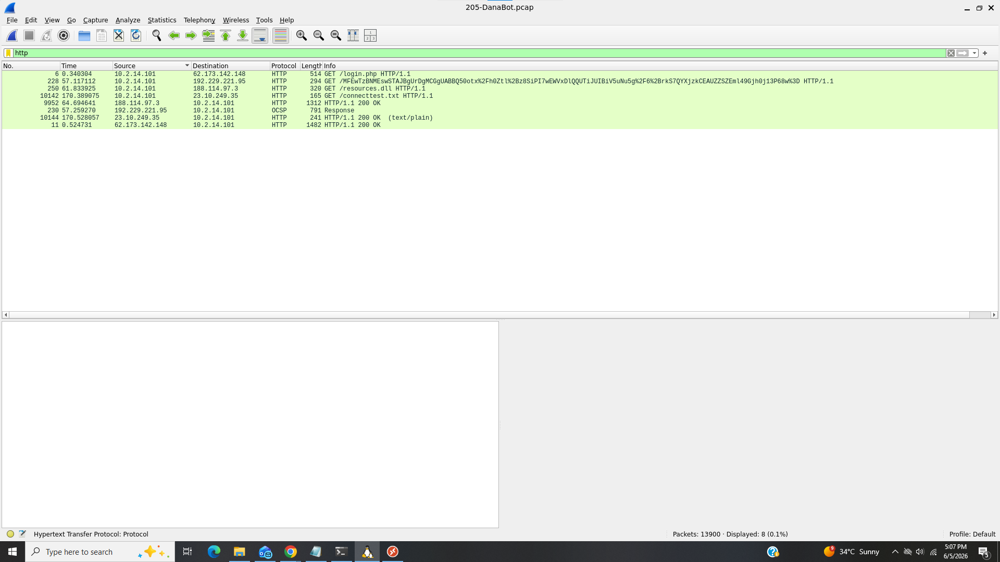
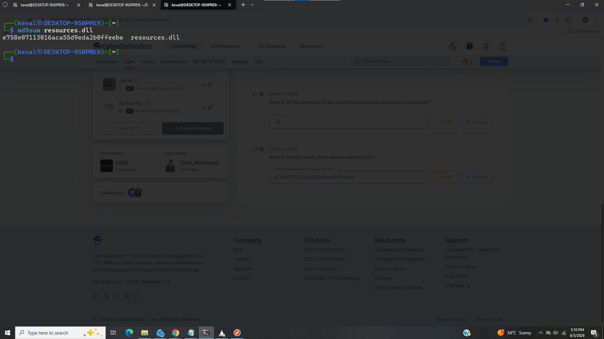

# DanaBot

------------------------------------------------------------------------------------

### Title:- In this lab we will analyze network traffic using Wireshark to identify DanaBot initial access, deobfuscate malicious JavaScript, and extract IOCs like IPs, file hashes, and execution processes.
### Category:- Network Forensics
### Scenario:- The SOC team has detected suspicious activity in the network traffic, revealing that a machine has been compromised. Sensitive company information has been stolen. Your task is to use Network Capture (PCAP) files and Threat Intelligence to investigate the incident and determine how the breach occurred.

-----------------------------------------------------------------------------------

### 1). Which IP address was used by the attacker during the initial access?

In this task first i checked protocol hirarchey that which protocols are used in this .pcap file there were SMb,HTTP,NetBios and DNS protocols listed i checked all one by one in DNS i found one domain "portfolio.serveirc.com" which was looks suspicious and searched it in virustotal here what i found

We can see this domain is found suspicious by virustotal and we can also see ip address of domain there but we are not sure that attacker used this ip so i searched this ip in wireshark.

after searching ip address we can see some packets in wireshark so we can say that the attacker used this ip address to gain initial access.

### Answer:- 62.173.142.148

### 2). What is the name of the malicious file used for initial access?

For this task i filtering the ip address 62.173.142.148 look in packet number 148 after expanding it we can see in content-disposition header there is one javascript file "alegato_708.js" attached

### Answer:- alegato_708.js

### 3). What is the SHA-256 hash of the malicious file used for initial access?

I tried so many things but non of them worked then i go for hint and it suggested me to compound the hash of login.php file which attacker used  so for this first we will have to save this file into our machine.

In wireshark click on file --> export objects --> http we can see some files there click on login.php and save it in desireable place

now use "sha256sum" which is built-in linux utility uswed to calculate the sha256 hashes.

### Answer:- 847b4ad90b1daba2d9117a8e05776f3f902dda593fb1252289538acf476c4268

### 4). Which process was used to execute the malicious file?

For this task we will have to do some research on internet that which processes are used when .js file executes in windows i found 2 major processes that windows uses "wscript.exe" and "cscript.exe" 

cscript.exe used for commandline it means we will have to execute javascript file using commands and on the other hand wscript.exe is GUI based we will have to execute javacript file by double clicking and it there is high chance that wscript.exe is used because when any attacker sends any malware via phishing emails or other social enginnering techniques they Expect that victime double clicke it and after the execution of .js file wscript.exe comes in action instead of cscript.exe so our answer should be wscript.exe

### Asnwer:- wscript.exe

### 5). What is the file extension of the second malicious file utilized by the attacker?

This javascript file downloads another file from the malicious domain called "resources" and we can also see in wireshark that a file "resources.dll" was downloaded from malicious domain

### Answer:- .dll

### 6) What is the MD5 hash of the second malicious file?

I did same thing of task 3 to calculate the MD5 hash of resources.dll but here we will use "md5sum" instead of "sha256sum" 

### Answer:- e758e07113016aca55d9eda2b0ffeebe

---------------------------------------------------------------------------------------------------------------------------------------------------

## IOC (Indicator of Compromise)

|     Field            |     Value                                                          |
|----------------------|--------------------------------------------------------------------|
|   Ip Address         |   62.173.142.148                                                   |
|   Malicious File     |   allegato_708.js                                                  |
|   SHA-256 Hash       |   847b4ad90b1daba2d9117a8e05776f3f902dda593fb1252289538acf476c4268 |
|   process            |   wscript.exe                                                      |
|   Stage 2 Payload    |   resources.dll                                                    |
|   MD5 Hash           |   e758e07113016aca55d9eda2b0ffeebe                                 |

---------------------------------------------------------------------------------------------------------------------------------------------------

### What I Learned?

- .PCAP File Analysis
- Network Forensics
- VirusTotal

--------------------------------------------------------------------------------------------------------------------------------------------------

## Incident Summary 

In this incident the attacker used a domain "portfolio.serveirc.com" to delivered a payload "allegato_708.js" to the victime machine to gain initial access and this file downloaded another stage 2 payload "resources.dll" and utilized by the attacker for further attack simulation.

----------------------------------------------------------------------------------------------------------------------------------------------------

## MITRE Mapping

|    Technique             |    Id     |
|--------------------------|-----------|
|   Initial Access         |  TA0001   |
|   Ingress Tool Transfer  |  T1105    |

