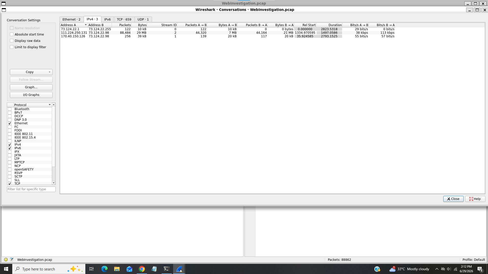
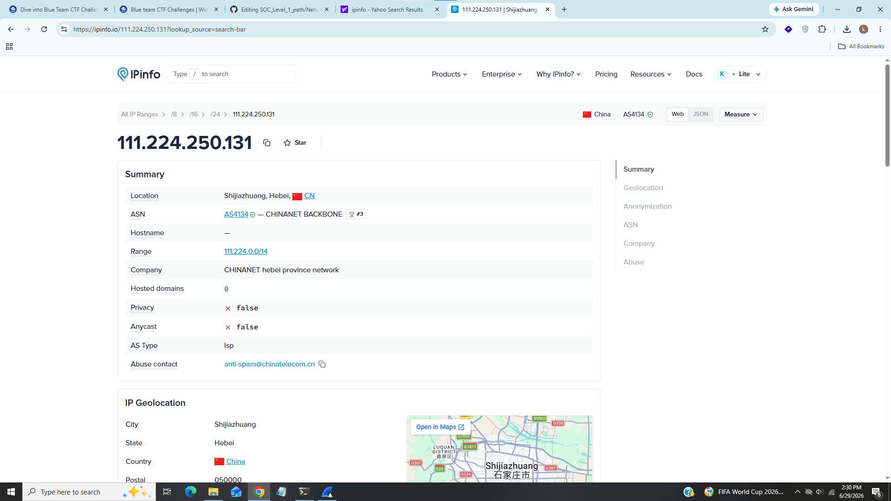
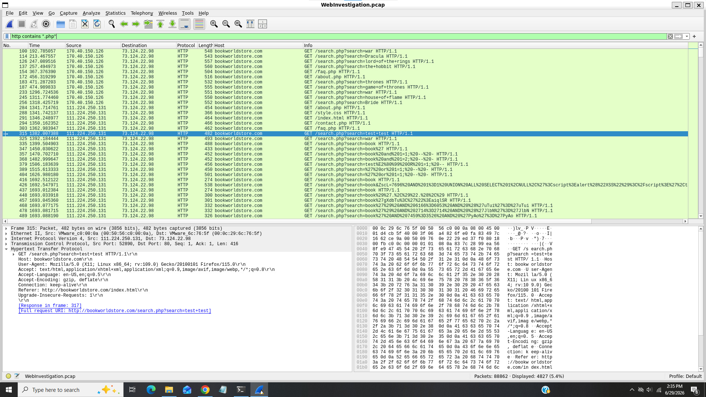
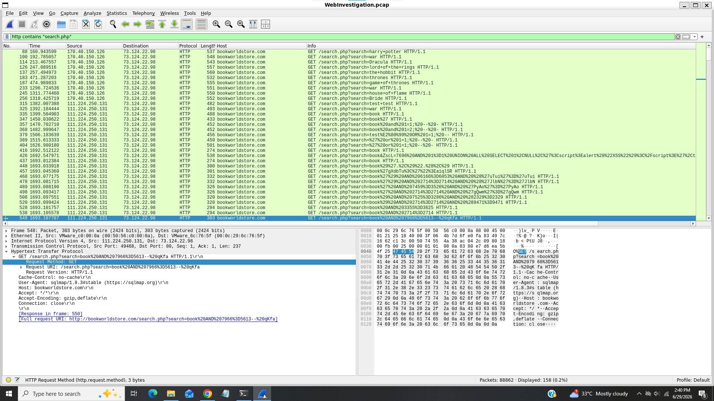
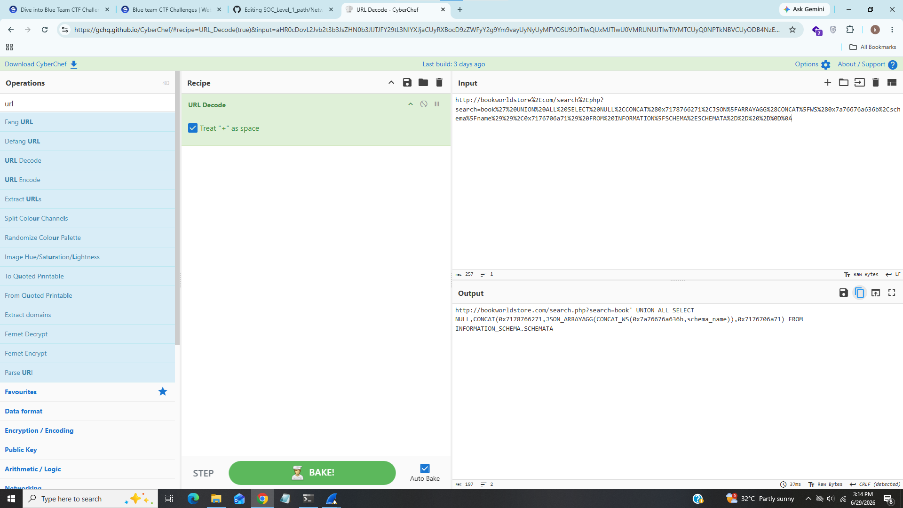
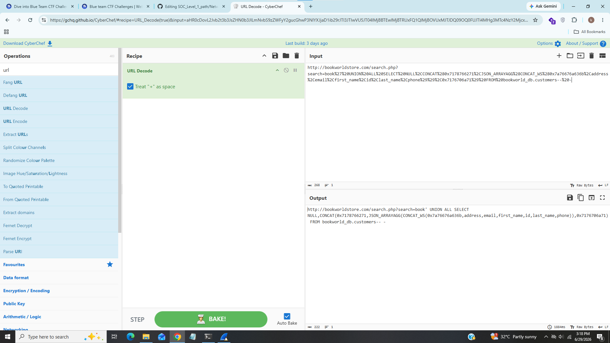
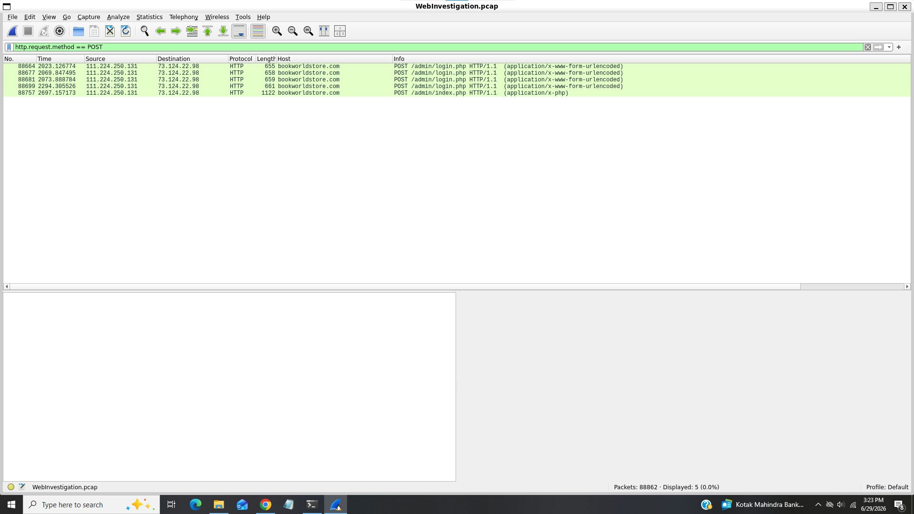
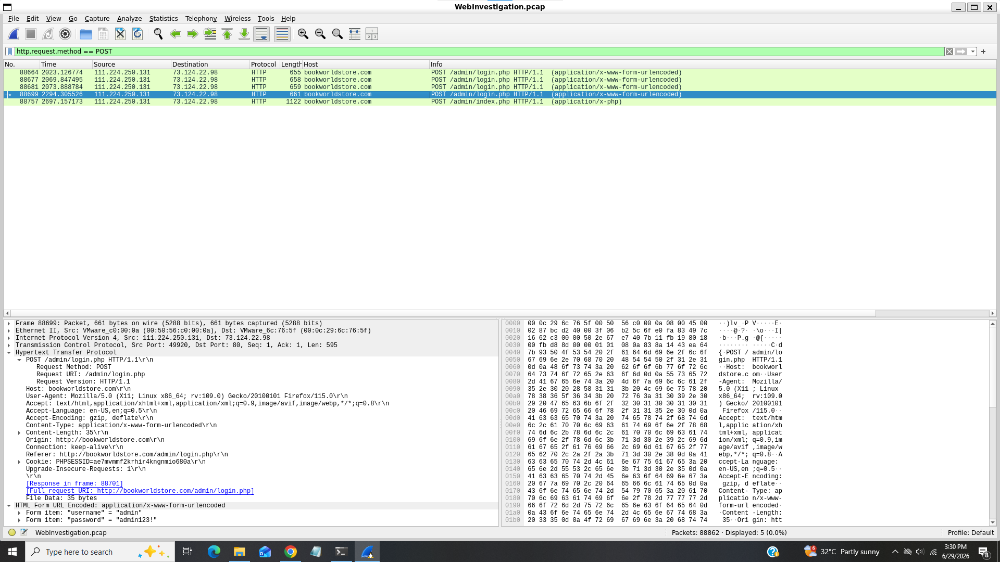
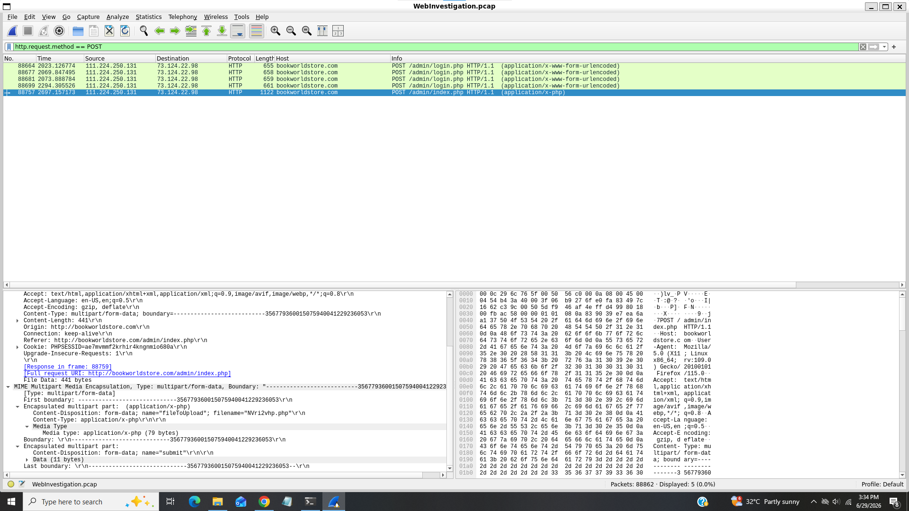

# Web Investigation Lab

-------------------------------------------------------------------------------------------

### Title:- Finding suspicious activity in BookWorld.
### Category:- Network Forensics
### Description:- ou are a cybersecurity analyst working in the Security Operations Center (SOC) of BookWorld, an expansive online bookstore renowned for its vast selection of literature. BookWorld prides itself on providing a seamless and secure shopping experience for book enthusiasts around the globe. Recently, you've been tasked with reinforcing the company's cybersecurity posture, monitoring network traffic, and ensuring that the digital environment remains safe from threats.
Late one evening, an automated alert is triggered by an unusual spike in database queries and server resource usage, indicating potential malicious activity. This anomaly raises concerns about the integrity of BookWorld's customer data and internal systems, prompting an immediate and thorough investigation.
As the lead analyst in this case, you are required to analyze the network traffic to uncover the nature of the suspicious activity. Your objectives include identifying the attack vector, assessing the scope of any potential data breach, and determining if the attacker gained further access to BookWorld's internal systems.

-------------------------------------------------------------------------------------------

### 1). By knowing the attacker's IP, we can analyze all logs and actions related to that IP and determine the extent of the attack, the duration of the attack, and the techniques used. Can you provide the attacker's IP?

For this task i go in Statstics -> Conversations tab to identify whhich ip contains high volume of traffic 

And we can see that there are too much noise from ip 111.224.250.131 and looks suspicious then others.

### Answer:- 111.224.250.131

### 2). If the geographical origin of an IP address is known to be from a region that has no business or expected traffic with our network, this can be an indicator of a targeted attack. Can you determine the origin city of the attacker?

For this task i used IP geolocations tools like MAxMind and IPinfo 

As we can see that this ip address is belonged to Shijiazhuang,hebei,china.

### Answer:- Shijiazhuang

### 3). Identifying the exploited script allows security teams to understand exactly which vulnerability was used in the attack. This knowledge is critical for finding the appropriate patch or workaround to close the security gap and prevent future exploitation. Can you provide the vulnerable PHP script name?

Since we know that it is php script so i used this filter "http contains ".php"" to filter out only php files from http traffic

We can see there is search.php file accessed repeatedly.

### Answer:- search.php

### 4). Establishing the timeline of an attack, starting from the initial exploitation attempt, what is the complete request URI of the first SQLi attempt by the attacker?

I used http contains "search.php" to reduse http noise

From above screenshot we can see in first half attacker tried some random strings and suddenly we can see encoding strings appear from book value of search parameter

After decoding the value we can see that attacker was trying to inject sql injection payloads.

### Answer:- /search.php?search=book and 1=1; -- -

### 5). Can you provide the complete request URI that was used to read the web server's available databases?

I tried so many decoded strings one by one

### Answer:- /search.php?search=book' UNION ALL SELECT NULL,CONCAT(0x7178766271,JSON_ARRAYAGG(CONCAT_WS(0x7a76676a636b,schema_name)),0x7176706a71) FROM INFORMATION_SCHEMA.SCHEMATA-- -

### 6). Assessing the impact of the breach and data access is crucial, including the potential harm to the organization's reputation. What's the table name containing the website users data?

We can see that customers table contains website's user data like address,email,first_name,id,last_name,phone.

### Answer:- customers

### 7). The website directories hidden from the public could serve as an unauthorized access point or contain sensitive functionalities not intended for public access. Can you provide the name of the directory discovered by the attacker?

I searched for post requests to focus on requests where data is being submitted, which often indicate login attempts or interactions with restricted areas

We can see that /admin/ directory discovered by the attacker.

### Answer:- /admin/

### 8). Knowing which credentials were used allows us to determine the extent of account compromise. What are the credentials used by the attacker for logging in?

From above screenshot we can see that attacker used "admin:admin123!" credentials to compromise the account and accessed index.php file.

### 9). We need to determine if the attacker gained further access or control of our web server. What's the name of the malicious script uploaded by the attacker?

We can see that attacker uploaded php script named "nvri2vhp.php" 

### Answer:- nvri2vhp.php

--------------------------------------------------------------------------------------------------------------------------------------------------------------------------

## Incident Summary

In this pcap investigation i found too much noise comming from ip "111.224.250.131" from Shijiazhuang,china further http traffic investigation revealed that attacker exploited critical SQL injection vulnerability using vulnerable php script named "search.php" and attacker successfully gained access of database and extracted crucial informations from customers table and later the attacker discovered admin directory which contains sensitive functionalities and gained access inside it using appropriate credentials and at last uploaded malicious script to gained further access or control of web server.

------------------------------------------------------------------------------------------------------------------------------------------------------------------------

### IOC

|  Field                       |   Value                               |
|------------------------------|---------------------------------------|
| Ip Address                   | 111.224.250.131                       |
| Origin City                  | Shijiazhuang                          |
| Vulnerable PHP Script        | search.php                            |
| Initial Exploitation Attepmt | /search.php?search=book and 1=1; -- - |
| User Table                   | customers                             |
| Enumerated Directory         | /admin/                               |
| Username                     | admin                                 |
| Password                     | admin123!                             |
| Uploaded Malicious Script    | nvri2vhp.php                          |

---------------------------------------------------------------------------------------------------------------------------------------------------------------------

### MITRE ATT&CK Mapping

|     Technique                     |   Id            |
|-----------------------------------|-----------------|
| Exploit Public-Facing Application |  T1190          |
| Upload Malware                    |  T1608.001      |
