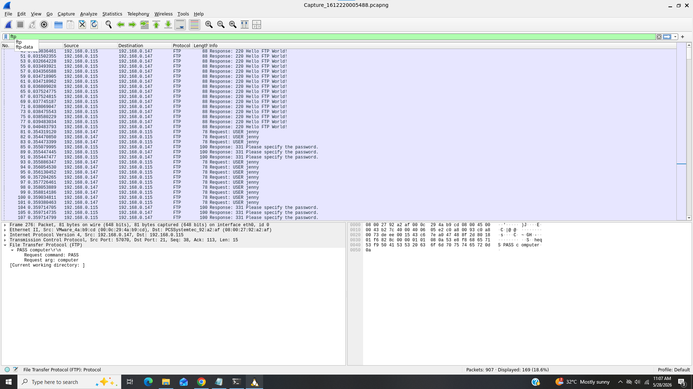
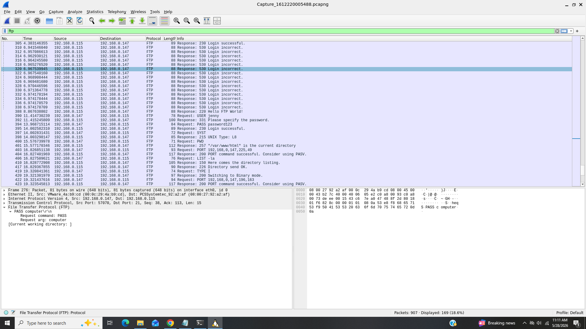
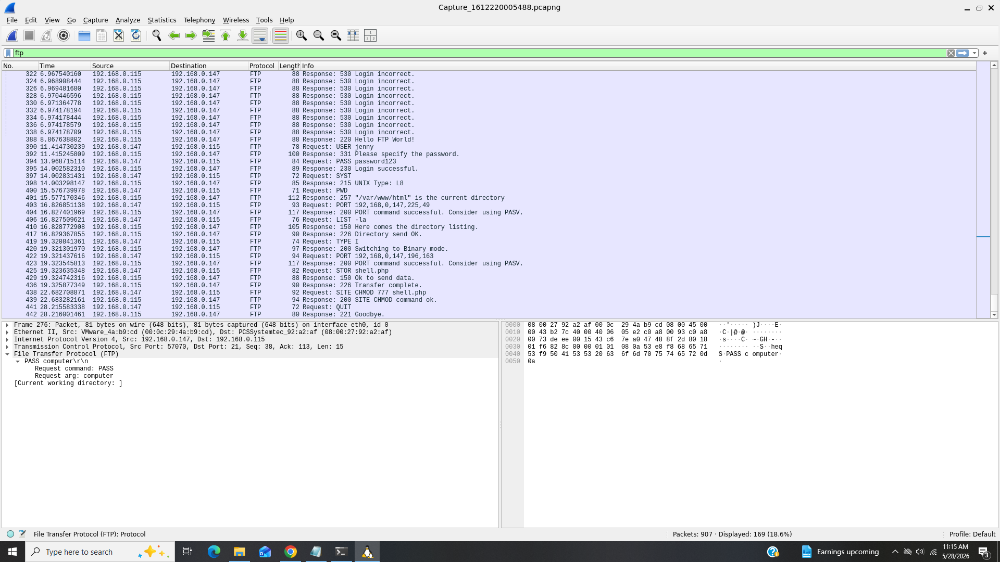
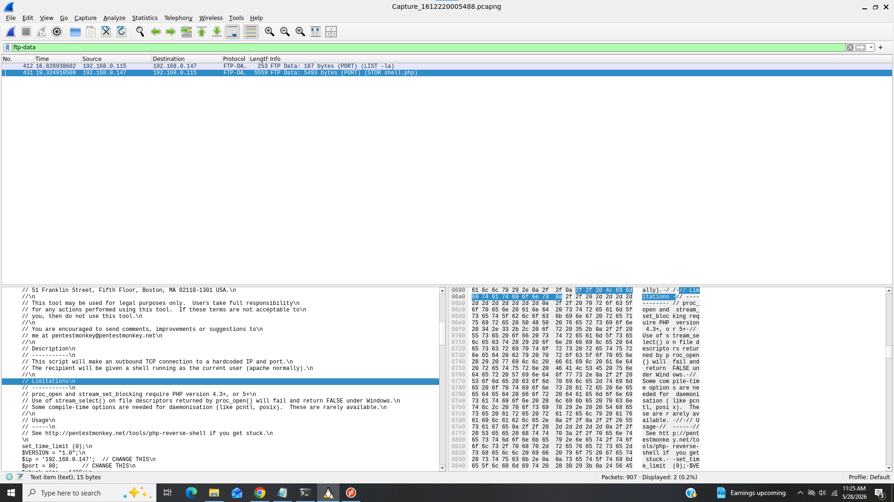
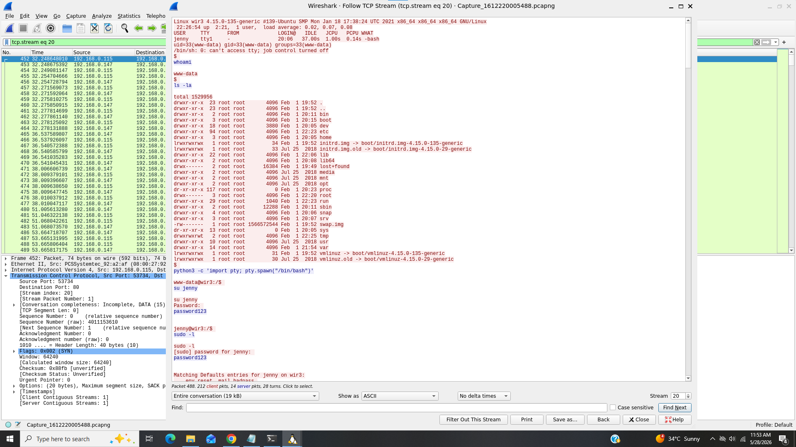
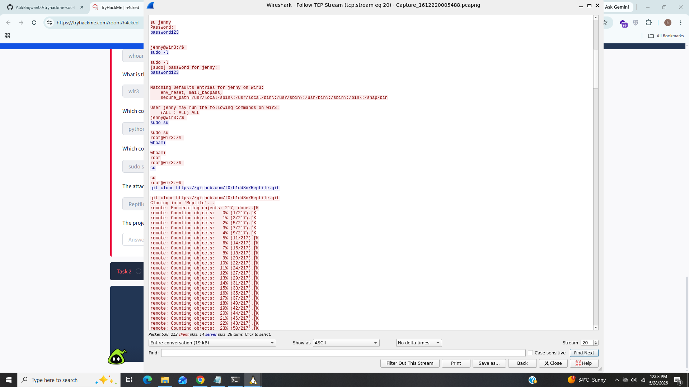

# h4cked

### Title:- This is simple pcap file analysis.
### Category:- Network Traffic Analysis.
### Description:- It is is a simple CTF challenge which is a combination of blue and red teaming, where you have to analyze a network traffic capture in order to find out the activities of an adversary and hack your way back in order to gain root access because the adversary has changed some configuration.

-----------------------------------------------------------------------------------------------------

### 1). The attacker is trying to log into a specific service. What service is this?

I opend the statistics tab of wireshark to see which protocols are used in this .pcap file and i found there were to much traffic of ftp and attacker was trying to login in ftp service.

We can see attacker was trying to bruteforce in ftp service.

### Answer:- FTP

### 2). There is a very popular tool by Van Hauser which can be used to brute force a series of services. What is the name of this tool?

I did litle bit research on internet about Van Hauser and it was hydra popular tool used by attacker to bruteforce.

### Answer:- Hydra

### 3). The attacker is trying to log on with a specific username. What is the username?

We can see from below screenshot attacker was trying to bruteforce ftp service with jenny username.

### Answer:- Jenny

### 4). What is the user’s password?

If we scroll down the attacker was successfuly log in in ftp with password "password123".

### Answer:- password123

### 5). What is the current FTP working directory after the attacker logged in?

From above screenshot on packet number 401 attacker was in /var/www/html directory after logged in.

### Answer:- /var/www/html

### 6). The attacker uploaded a backdoor. What is the backdoor’s filename?

From below screenshot i found one PHP file which is likely a backdoor.

### Answer:- shell.php

### 7). The backdoor can be downloaded from a specific URL, as it is located inside the uploaded file. What is the full URL?

I spend lot of time on this task and i filtered ftp-data protocol which is used to transfer files from a server to client and expand packet there was details about shell.php.

## Answer:- http://pentestmonkey.net/tools/php-reverse-shell

### 8). Which command did the attacker manually execute after getting a reverse shell?

After spending a lot of time i found a packet after the execution of backdoor and i followed TCP stream and the command was "whoami" that attacker executed manually.

### Answer:- whoami

### 9). What is the computer’s hostname?

When looking closly in TCP stream there is shell contains OS and hostname and it should be "wir3"

### Answer:- wir3

### 10). Which command did the attacker execute to spawn a new TTY shell?

When scrolling down in the TCP stream we can clearly see that attacker used python to spawn tty shell.

### Answer:- python3 -c 'import pty; pty.spawn("/bin/bash")'

### 11). Which command was executed to gain a root shell?

We know in linux there is sudo command is ued to switch in root shell and from above task the attacker also used sudo command to gain root shell.

### Answer:- sudo su

### 12). The attacker downloaded something from GitHub. What is the name of the GitHub project?

after gaining root shell the attacker clone the Reptile binary which is rootkit based on linux kernel module to gaining unauthorized access of systems.

### Answer:- Reptile

### 13). The project can be used to install a stealthy backdoor on the system. It can be very hard to detect. What is this type of backdoor called?

Since we know that attacker used rootkit to gain unauthorized access and it is very hard to detect.

### Answer:- Rootkit

------------------------------------------------------------------------------------------------------------------------------------------------------

## IOC (Indicators of Compromise)

|           field              |     value                   |
|------------------------------|-----------------------------|
|    username & password       |     Jenny & password123     |
|    tools & technique         |     Hydra for bruteforcing  |
|    file                      |     shell.php               |
|    malware                   |     Reptile (Rootkit)       |

----------------------------------------------------------------------------------------------------------------------------------------------------

## What i learned?

- Network Traffic Analysis
- PCAP File Investigation
- Packet Analysis
- Threat Hunting

----------------------------------------------------------------------------------------------------------------------------------------------------

## Incident Summary

In this pcap file investigation the attacker used ftp service and popular tool hydra by van hauser to bruteforce and finaly gained access by user "Jenny" and password "password123" and further investigation revealed that attacker used reverse shell to gain further access after gaining shell the attacker executed some system commands and clone github repository "Reptile" which is type of linux kernel module rootkit.

------------------------------------------------------------------------------------------------------------------------------------------------------

## MITRE ATT&CK mapping

|    Technique                          |      Id        |
|---------------------------------------|----------------|
|    Bruteforce                         |     T1110      |
|    Command and Scripting Interpreter  |     T1059      |
|    Reptile                            |     S1219      |
