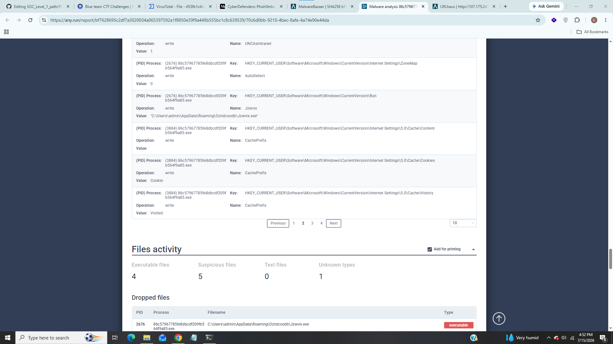
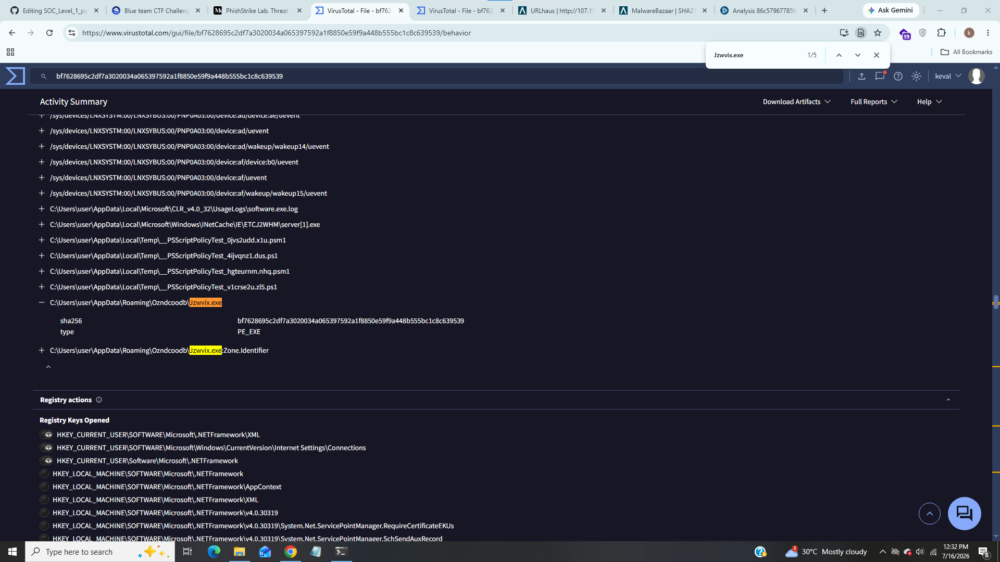
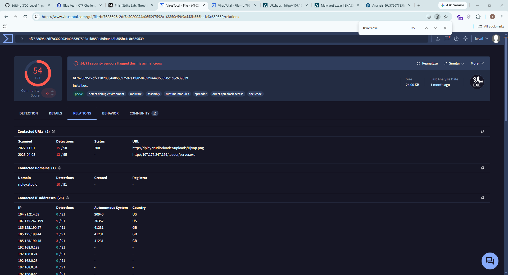
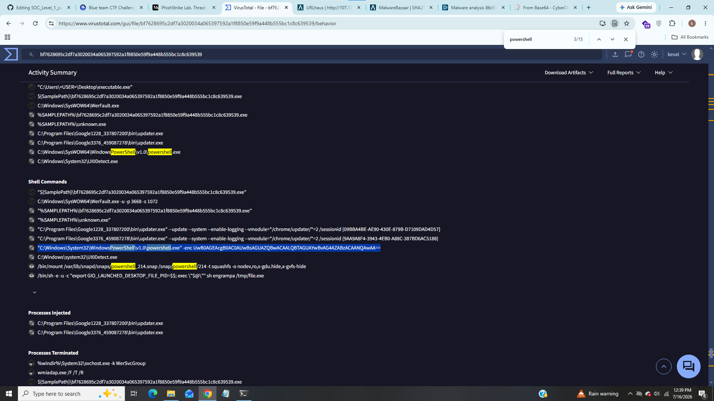
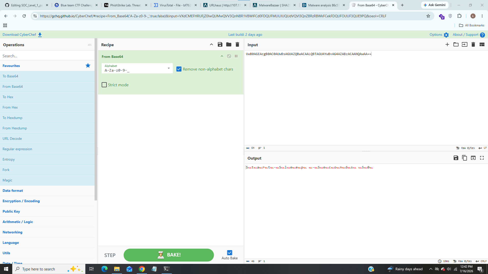
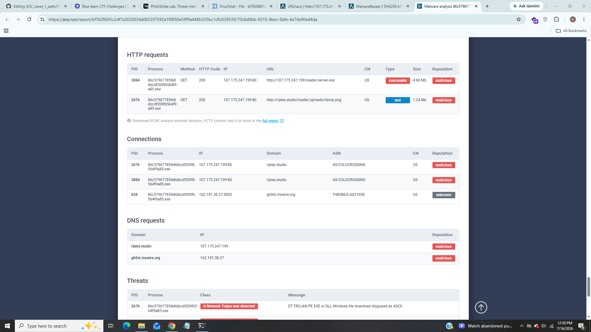
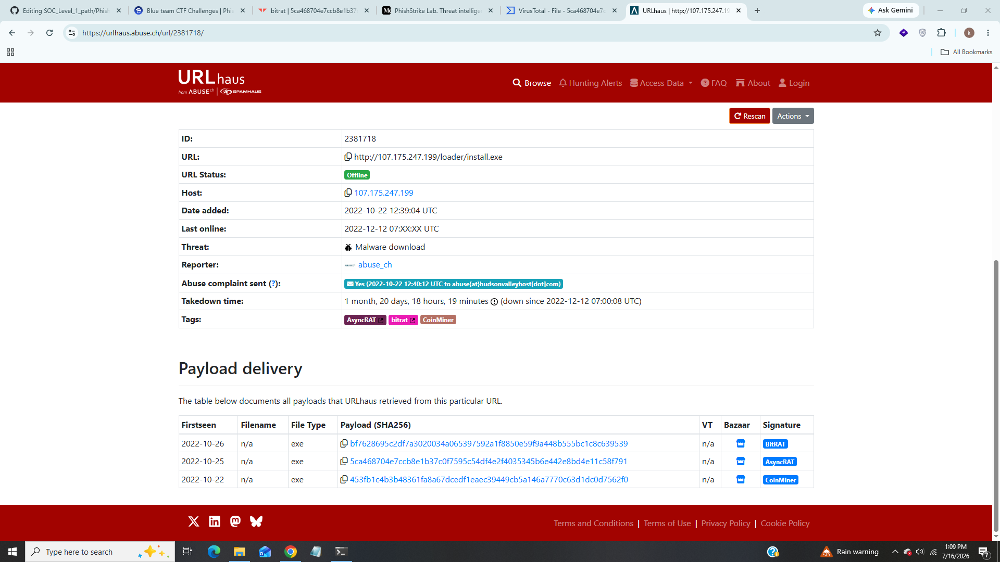
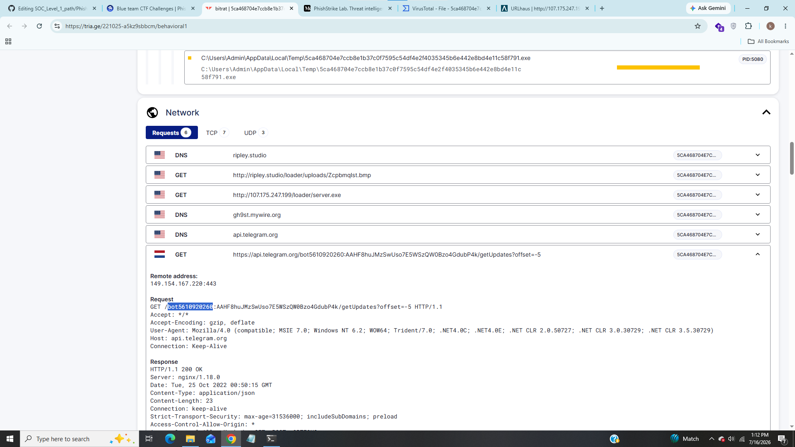

# PhishStrike Lab

------------------------------

### Title:- In this lab we will analyze email headers and threat intelligence to identify phishing indicators, malware persistence, and C2 channels, extracting actionable IOCs.
### Category:- Phishing Analysis
### Scenario:- As a cybersecurity analyst at an educational institution, you receive an alert about a phishing email targeting faculty members. The email appears to be from a trusted contact and claims a $625,000 purchase, providing a link to download an invoice.
### Your task is to investigate the email using Threat Intel tools. Analyze the email headers and inspect the link for malicious content. Identify any Indicators of Compromise (IOCs) and document your findings to prevent potential fraud and educate faculty on phishing recognition.

------------------------------

### 1). Identifying the sender's IP address with specific SPF and DKIM values helps trace the source of the phishing email. What is the sender's IP address that has an SPF value of softfail and a DKIM value of fail?

We can see the ip address with SPF and DKIM values.

### Answer:- 18.208.22.104

### 2). Understanding the return path of an email is essential for tracing its origin. What is the return path specified in this email?

We can see the return path value from above screenshot.

### Answer:- erikajohana.lopez@uptc.edu.co

### 3). Identifying the source of malware is critical for effective threat mitigation and response. What is the IP address of the server hosting the malicious file related to malware distribution?

From above screenshot we can see the ip address of the server that hosting the malicious file.

### Answer:- 107.175.247.199

### 4). Identifying malware that exploits system resources for cryptocurrency mining is critical for prioritizing threat mitigation efforts. The malicious URL can deliver several malware types. Which malware family is responsible for cryptocurrency mining?

From above screenshot we can see some information about malware let's search for hashes in malwarebazar,

We can see malware family in signature tab.

### Answer:- coinminer

### 5). Identifying the specific URLs malware requests is key to disrupting its communication channels and reducing its impact. Based on the previous analysis of the cryptocurrency malware sample, what does this malware request the URL?

We can see full url where malware requests.

### Answer:- 	http://ripley.studio/loader/uploads/Qanjttrbv.jpeg

### 6). Understanding the registry entries added to the auto-run key by malware is crucial for identifying its persistence mechanisms. Based on the BitRAT malware sample analysis, what is the executable's name in the first value added to the registry auto-run key?

We will copy sha-256 hash with BitRAT tagfrom privious question, i used any.run and pasted this hash,

We can see full report after scrolling we can see inside registry activity that attacker added Jzwvix.exe in registry auto-run key.

### Answer:- Jzwvix.exe

### 7). Identifying the SHA-256 hash of files downloaded from a malicious URL is essential for tracking and analyzing malware activity. Based on the BitRAT analysis, what is the SHA-256 hash of the file previously downloaded and added to the autorun keys?

Just paste sha-256 hash which we copied from task 6 in virustotal and go in behaviour tab inside file dropped section we can see sha-256 hash of JZWVIX.exe.

### Answer:-  bf7628695c2df7a3020034a065397592a1f8850e59f9a448b555bc1c8c639539

### 8). Analyzing the HTTP requests made by malware helps in identifying its communication patterns. What is the URL in the HTTP request used by the loader to retrieve the BitRAT malware?

In virustotal go in relations tab we can see that malware server.exe to load BitRAT malware

We can see that malware used server.exe to retrieve BitRAT malware.

### Answer:- http://107.175.247.199/loader/server.exe

### 9). Introducing a delay in malware execution can help evade detection mechanisms. What is the delay (in seconds) caused by the PowerShell command according to the BitRAT analysis?

We can see that powershell executed base74 encoded command let's decode it using cyberchef,

We can see that powershell command delays 50 seconds according to the BitRAT analysis.

### Answer:- 50

### 10). Tracking the command and control (C2) domains used by malware is essential for detecting and blocking malicious activities. What is the C2 domain used by the BitRAT malware?

I look for any.run report for BitRAT malware,

We can see intresting domain in connection tab from different ip, it looks like that BitRAT malware used this domain for C2 communication.

### Answer:- gh9st.mywire.org

### 11). Understanding how malware exfiltrates data is essential for detecting and preventing data breaches. According to the AsyncRAT analysis, what is the Telegram Bot ID used by this malware?

We will copy second sha-256 hash for AsyncRAT,

I saw various online reports for this but i found it on triage website.

### Answer:- bot5610920260
