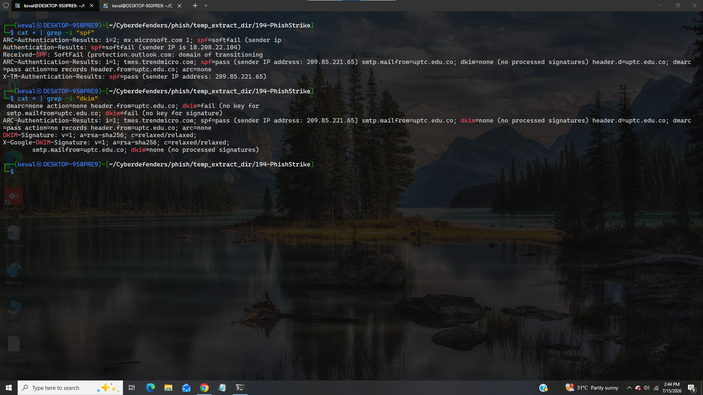
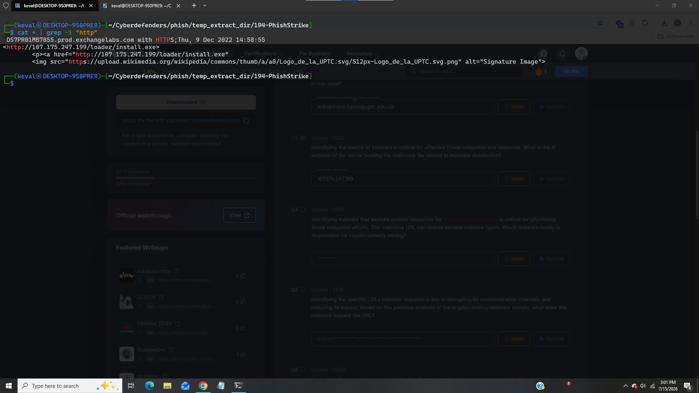
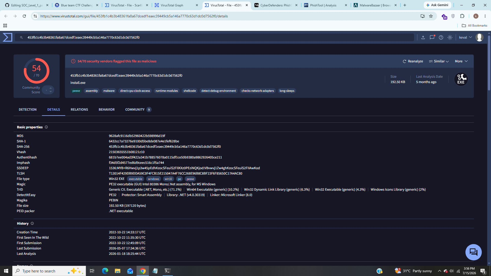
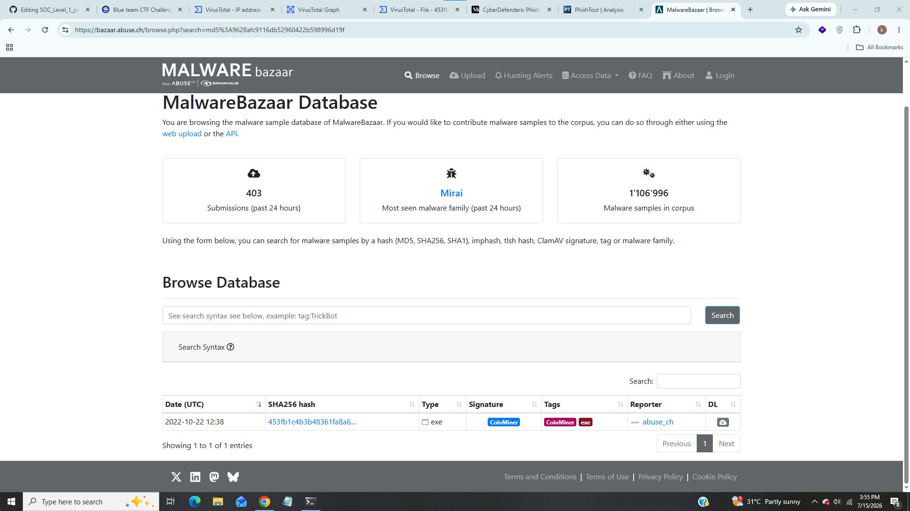
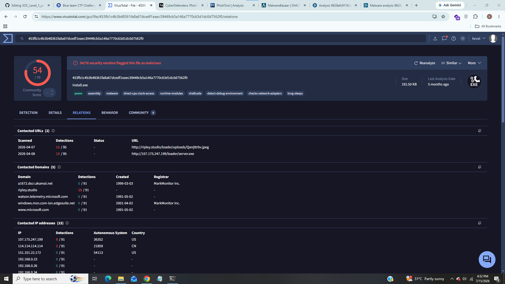

# PhishStrike Lab

------------------------------

### Title:- In this lab we will analyze email headers and threat intelligence to identify phishing indicators, malware persistence, and C2 channels, extracting actionable IOCs.
### Category:- Phishing Analysis
### Scenario:- As a cybersecurity analyst at an educational institution, you receive an alert about a phishing email targeting faculty members. The email appears to be from a trusted contact and claims a $625,000 purchase, providing a link to download an invoice.
### Your task is to investigate the email using Threat Intel tools. Analyze the email headers and inspect the link for malicious content. Identify any Indicators of Compromise (IOCs) and document your findings to prevent potential fraud and educate faculty on phishing recognition.

------------------------------

### 1). Identifying the sender's IP address with specific SPF and DKIM values helps trace the source of the phishing email. What is the sender's IP address that has an SPF value of softfail and a DKIM value of fail?

We can see the ip address with SPF and DKIM values.

### Answer:- 18.208.22.104

### 2). Understanding the return path of an email is essential for tracing its origin. What is the return path specified in this email?

We can see the return path value from above screenshot.

### Answer:- erikajohana.lopez@uptc.edu.co

### 3). Identifying the source of malware is critical for effective threat mitigation and response. What is the IP address of the server hosting the malicious file related to malware distribution?

From above screenshot we can see the ip address of the server that hosting the malicious file.

### Answer:- 107.175.247.199

### 4). Identifying malware that exploits system resources for cryptocurrency mining is critical for prioritizing threat mitigation efforts. The malicious URL can deliver several malware types. Which malware family is responsible for cryptocurrency mining?

From above screenshot we can see some information about malware let's search for hashes in malwarebazar,

We can see malware family in signature tab.

### Answer:- coinminer

### 5). Identifying the specific URLs malware requests is key to disrupting its communication channels and reducing its impact. Based on the previous analysis of the cryptocurrency malware sample, what does this malware request the URL?

We can see full url where malware requests.

### Answer:- 	http://ripley.studio/loader/uploads/Qanjttrbv.jpeg

### 6). Understanding the registry entries added to the auto-run key by malware is crucial for identifying its persistence mechanisms. Based on the BitRAT malware sample analysis, what is the executable's name in the first value added to the registry auto-run key?

