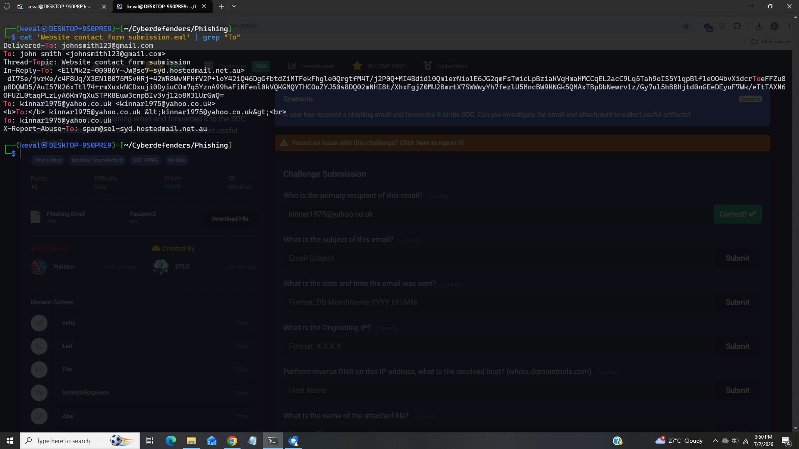
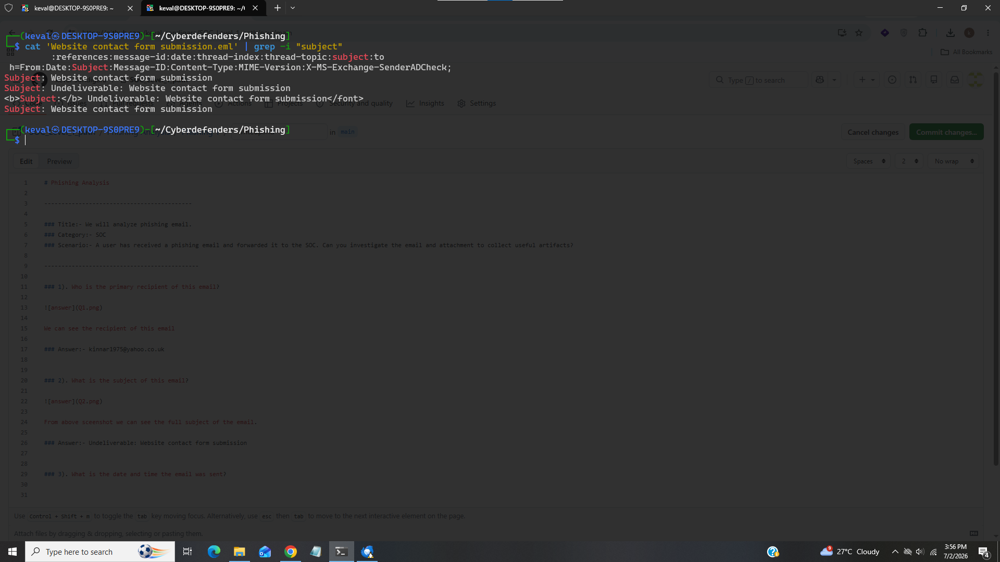
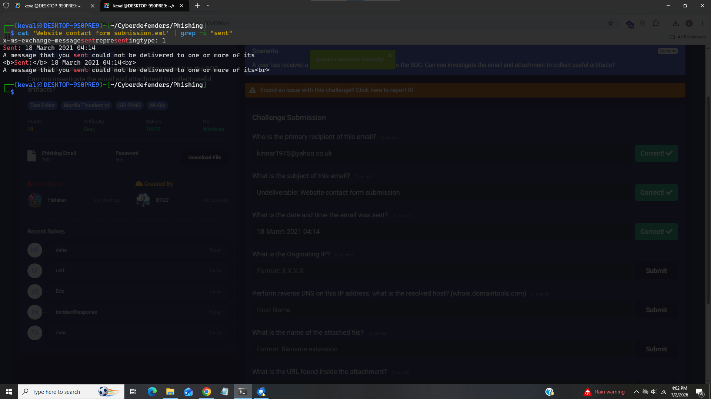
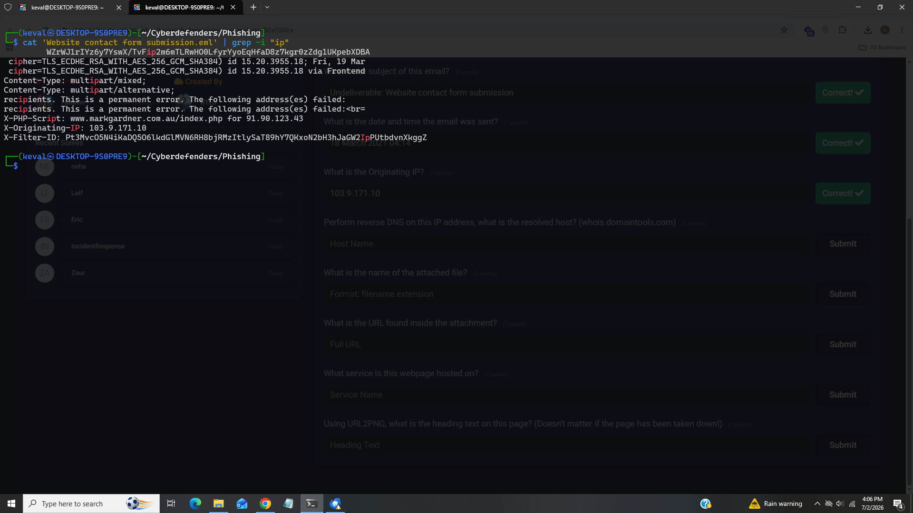
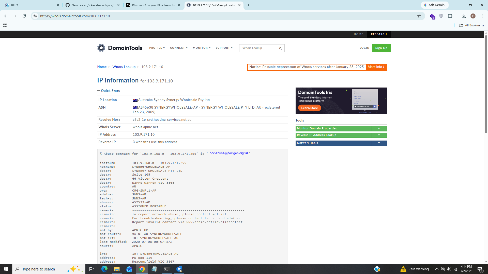
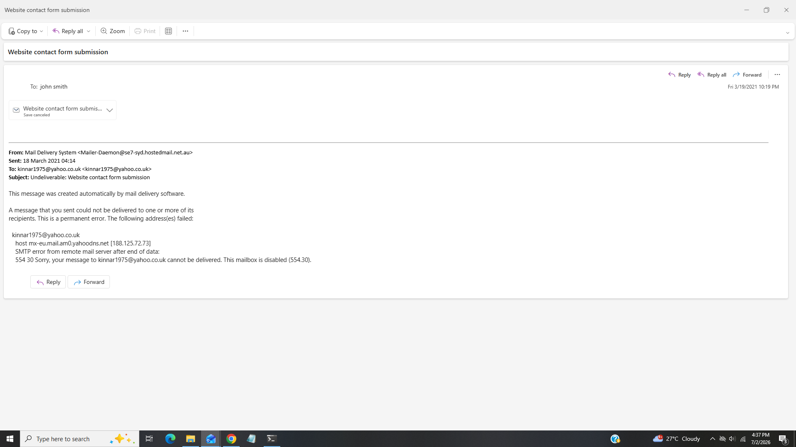
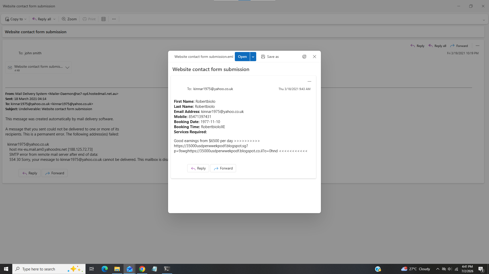
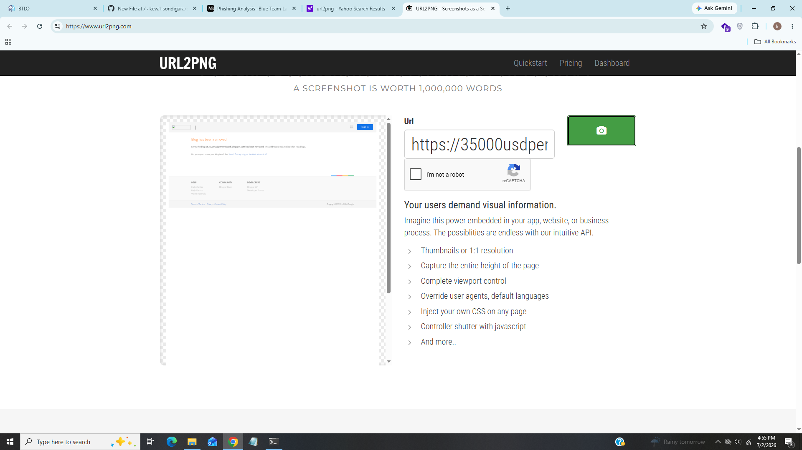

# Phishing Analysis

-------------------------------------------

### Title:- We will analyze phishing email.
### Category:- SOC
### Scenario:- A user has received a phishing email and forwarded it to the SOC. Can you investigate the email and attachment to collect useful artifacts?

---------------------------------------------

### 1). Who is the primary recipient of this email?

We can see the recipient of this email

### Answer:- kinnar1975@yahoo.co.uk

### 2). What is the subject of this email?

From above sceenshot we can see the full subject of the email.

### Answer:- Undeliverable: Website contact form submission

### 3). What is the date and time the email was sent? 

We can see that email was sent at 18 March 2021 04:14.

### Answer:- 18 March 2021 04:14

### 4). What is the Originating IP?

We can see the originating ip in X-Originating-IP header.

### Answer:- 103.9.171.10

### 5). Perform reverse DNS on this IP address, what is the resolved host?

Use reverse ip lookup tool to find resolved host we can see resolved host for ip address 103.9.171.10

### Answer:- c5s2-1e-syd.hosting-services.net.au

### 6). What is the name of the attached file? (2 points)

Open the email in any email client i used outlook for better experience

We caan see the attachement file there.

### Answer:- Website contact form submission

### 7). What is the URL found inside the attachment?

Open the email attachement

We can see full url at last.

### Answer:- https://35000usdperwwekpodf.blogspot.sg?p=9swghttps://35000usdperwwekpodf.blogspot.co.il?o=0hnd

### 8). What service is this webpage hosted on?

We can see in url it is related to blog.

### Answer:- blogspot

### 9). Using URL2PNG, what is the heading text on this page? (Doesn't matter if the page has been taken down!)

Submit the url in URL2PNG to find the heading text

From above screenshot we can see full heading text in red color.

### Answer:- Blog has been removed

-----------------------------------------------------------

## IOC (Indicator of Compromise)

|      Field          |    Value                                                                                          |
|---------------------|---------------------------------------------------------------------------------------------------|
|  Recipient's Email  |  kinnar1975@yahoo.co.uk                                                                           |
|  Subject            |  Undeliverable: Website contact form submission                                                   |
|  Email's Time       |  18 March 2021 04:14                                                                              |
|  Ip Address         |  103.9.171.10                                                                                     |
|  Resolved Host      |  c5s2-1e-syd.hosting-services.net.au                                                              |
|  Attachment         |  Website contact form submission                                                                  |
|  Url                |  https://35000usdperwwekpodf.blogspot.sg?p=9swghttps://35000usdperwwekpodf.blogspot.co.il?o=0hnd  |
|  Hosted Service     |  blogspot                                                                                         |
|  Heading Text       |  Blog has been removed                                                                            |

-------------------------------------------------------------

## Incident Summary

In this investigation i found a kinnar1975@yahoo.co.uk recieves an email at 18 March 2021 a subjectline highlighted "Undeliverable: Website contact form submission" further investigation revealed that email came from ip address 103.9.171.10 also email contains one attachment "Website contact form submission" after analyzing the attachment there was blogpost hosted at url "https://35000usdperwwekpodf.blogspot.sg?p=9swghttps://35000usdperwwekpodf.blogspot.co.il?o=0hnd" and later using url2png platefrom i found that this blog has been removed permanantly from hosted service.

----------------------------------------------------------------

## MITRE ATT&CK Mapping

|    Technique          |    Id       |
|-----------------------|-------------|
|  Phishing Attachment  |  T1566.001  |
