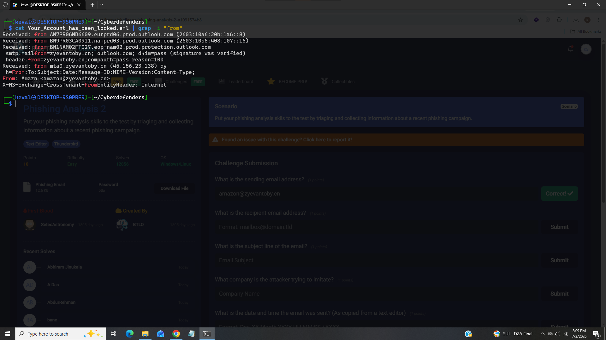
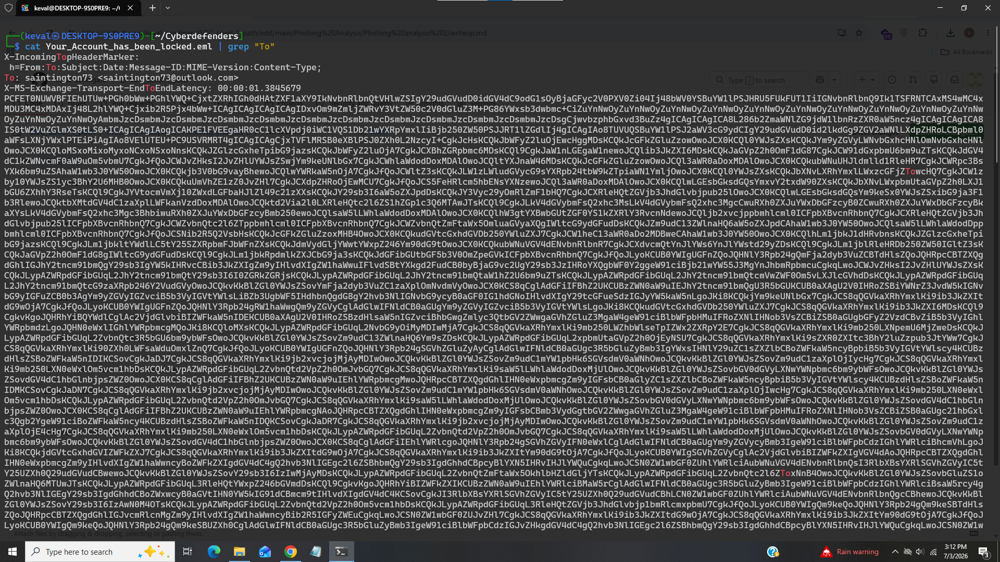
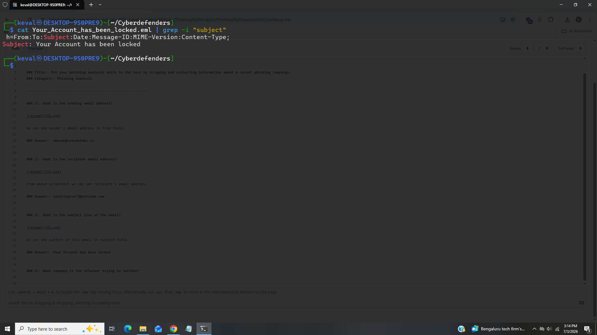
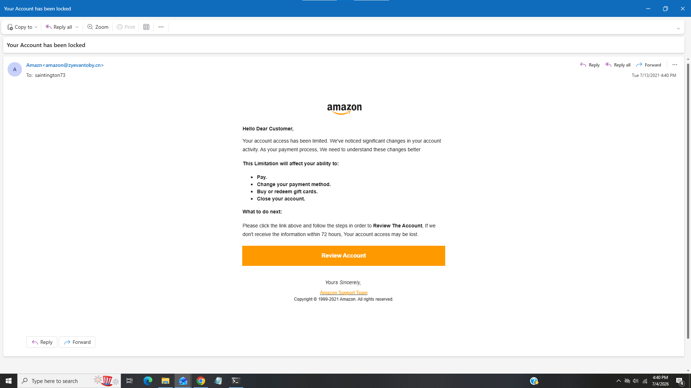
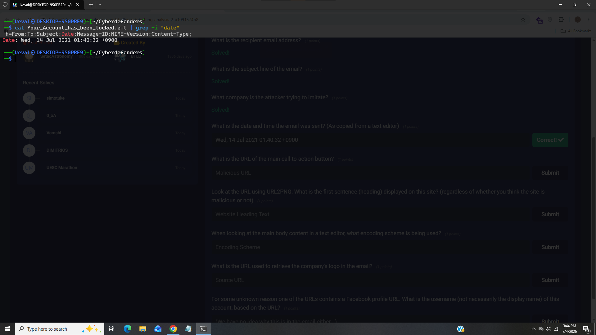
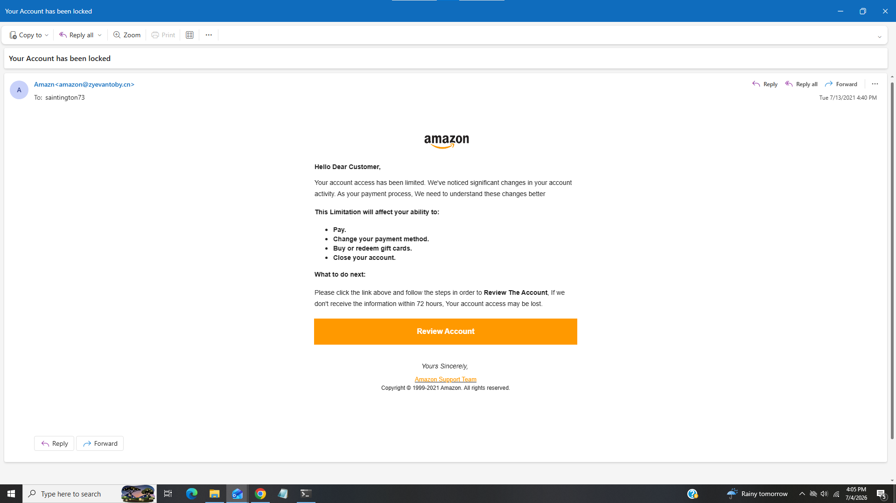
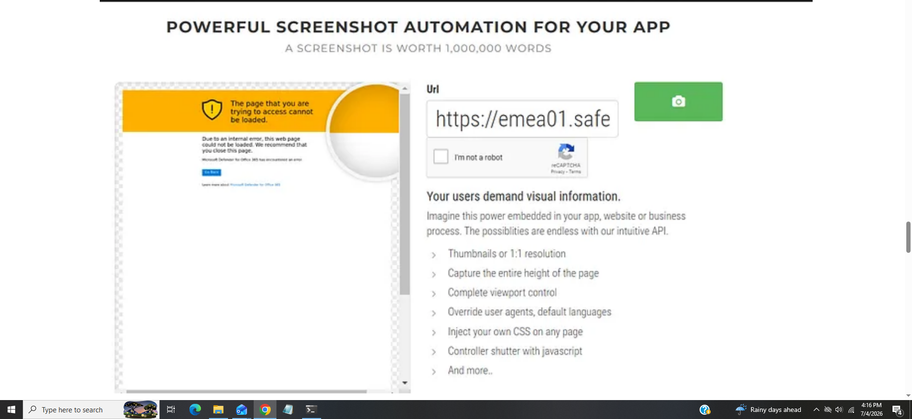
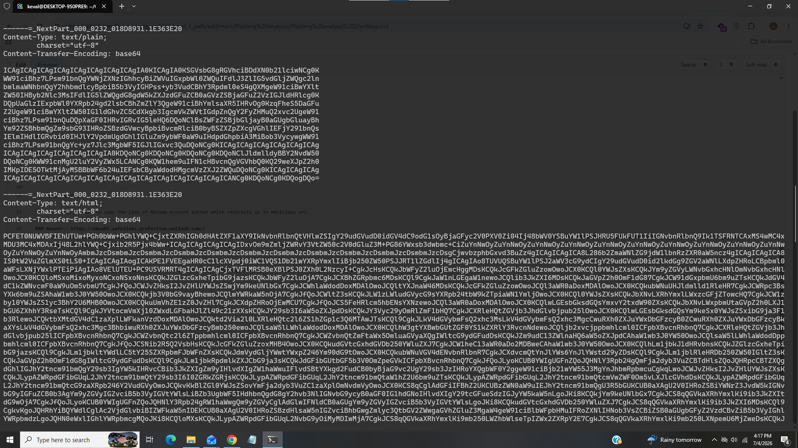
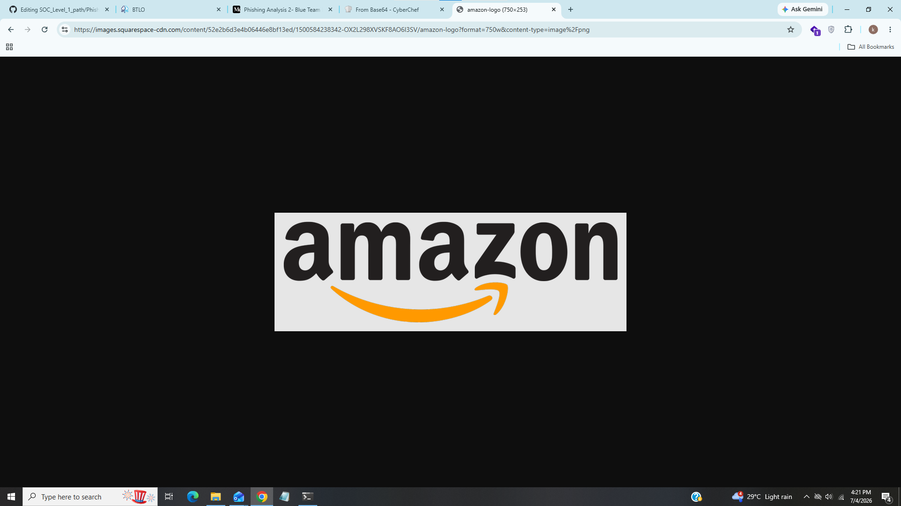
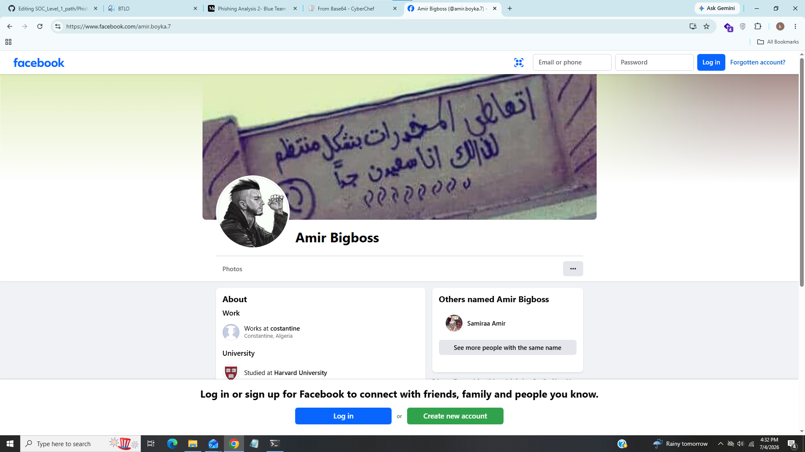

# Phishing Analysis 2

---------------------------------------------------------

### Title:- Put your phishing analysis skils to the test by triaging and collecting information about a recent phishing campaign.
### Category:- Phishing Analysis

-----------------------------------------------------------

### 1). What is the sending email address?

We can see sender's email address in from field.

### Answer:- amazon@zyevantoby.cn

### 2). What is the recipient email address?

From above screenshot we can see recipient's email address.

### Answer:- saintington73@outlook.com

### 3). What is the subject line of the email?

We can see subject of this email in subject field.

### Answer:- Your Account has been locked

### 4). What company is the attacker trying to imitate?

Open the email in any email client

After scrolling we can see there is written amazon support team it indicates that the attacker was trying to imitate amazon.

### Answer:- amazon

### 5). What is the date and time the email was sent?

For this task we will look for date field which shows exact time when email was sent.

As we can see exact time from above screenshot.

### Answer:- Wed, 14 Jul 2021 01:40:32 +0900

### 6). What is the URL of the main call-to-action button? 

For this task we have to copy the link of Review Account button which redirects us in malicious url.

### Answer:- https://emea01.safelinks.protection.outlook.com/?url=https%3A%2F%2Famaozn.zzyuchengzhika.cn%2F%3Fmailtoken%3Dsaintington73%40outlook.com&data=04%7C01%7C%7C70072381ba6e49d1d12d08d94632811e%7C84df9e7fe9f640afb435aaaaaaaaaaaa%7C1%7C0%7C637618004988892053%7CUnknown%7CTWFpbGZsb3d8eyJWIjoiMC4wLjAwMDAiLCJQIjoiV2luMzIiLCJBTiI6Ik1haWwiLCJXVCI6Mn0%3D%7C1000&sdata=oPvTW08ASiViZTLfMECsvwDvguT6ODYKPQZNK3203m0%3D&reserved=0

### 7). Look at the URL using URL2PNG. What is the first sentence (heading) displayed on this site? (regardless of whether you think the site is malicious or not)?

After opening the url on url2png i found this

### Answer:- This web page could not be loaded.

### 8). When looking at the main body content in a text editor, what encoding scheme is being used?

We can see from above screenshot the body content is encoded by base64.

### Answer:- base64

### 9). What is the URL used to retrieve the company's logo in the email?

Copy the link of image in email and paste it on browser

We can see full url on address bar and also logo is appeared.

### Answer:- https://images.squarespace-cdn.com/content/52e2b6d3e4b06446e8bf13ed/1500584238342-OX2L298XVSKF8AO6I3SV/amazon-logo?format=750w&content-type=image%2Fpng

### 10). For some unknown reason one of the URLs contains a Facebook profile URL. What is the username (not necessarily the display name) of this account, based on the URL?

In email there is another hyperlink inside the "amazon support team" just open it on browser it redirects on facebook page of user 

As we can see username in addressbar as well as on tab.

### Answer:- amir.boyka.7
