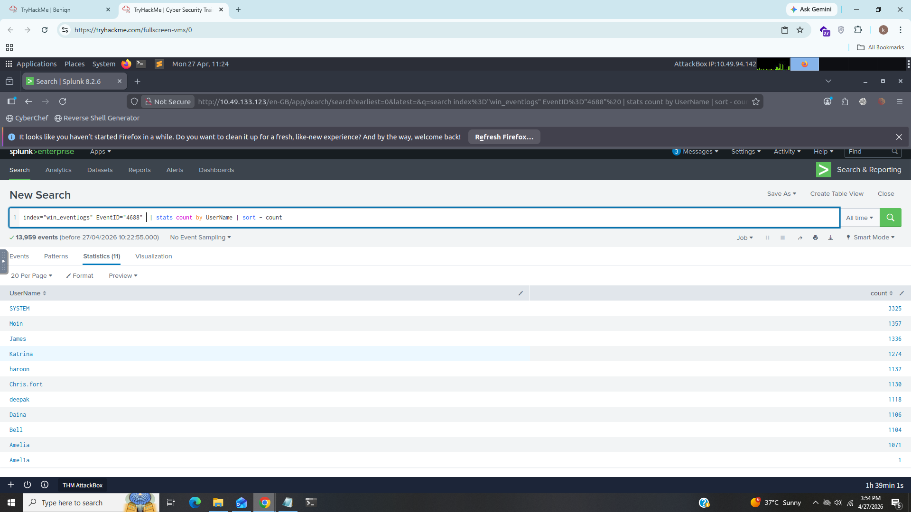
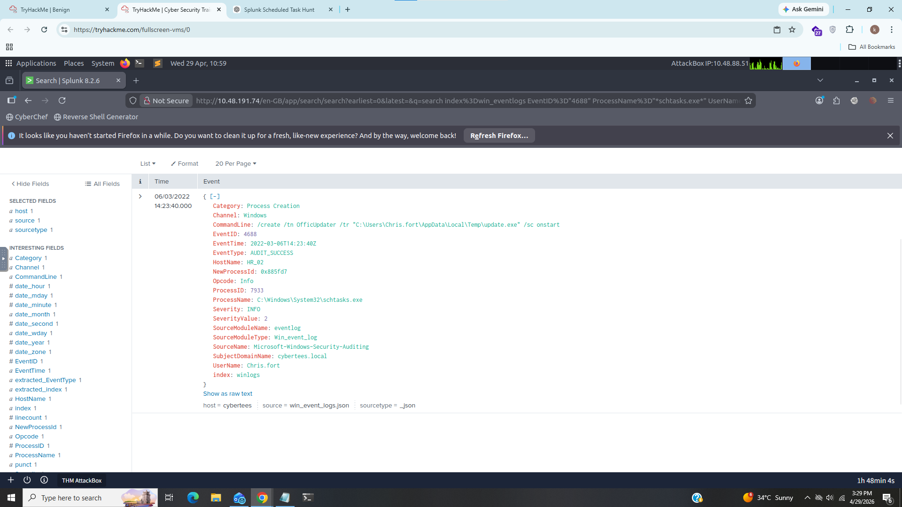
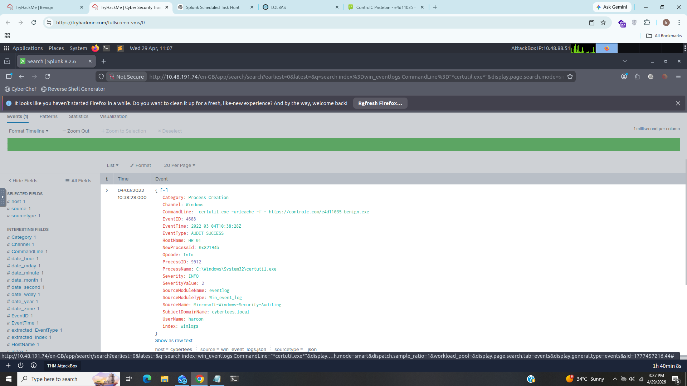

# Benign

---------------------------------------------------

### Title: In this challenge room, i investigated a compromised host.
### Category:- SOC
### Description:- i investigated host-centric logs in this challenge room to find suspicious process execution. To learn more about Splunk and how to investigate the logs.

----------------------------------------------------

### 1). How many logs are ingested from the month of March, 2022?

### Answer:- 13959

### 2). Imposter Alert: There seems to be an imposter account observed in the logs, what is the name of that user?

i applied this filter 

### index="win_eventlogs" EventID="4688" | stats count by Username | sort -count

we can see there is 2 users with name amelia but if we look closely in last one it looks suspicous

### Answer:- Amel1a

### 3). Which user from the HR department was observed to be running scheduled tasks?

i found this by runinng the following command:

### index=win_eventlogs schtasks

we can see user chris.fort executed the scheduled task.

### Answer:- chris.fort

### 4). Which user from the HR department executed a system process (LOLBIN) to download a payload from a file-sharing host.

we can see from above screenshot haroon executed command and used certutil.exe to download payload from file-sharing host.

This activity is suspicious because certutil.exe is a LOLBIN (Living Off The Land Binary) commonly abused by attackers to download payloads.

### Answer: haroon

### Answer:- haroon

### 5). To bypass the security controls, which system process (lolbin) was used to download a payload from the internet?

we saw in task 4 that attacker used certutil to download payload from the internet

### Answer:- certutil.exe

### 6). What was the date that this binary was executed by the infected host? format (YYYY-MM-DD)

look in  the EventTime field 

### Answer:- 2022–03–04

### 7). Which third-party site was accessed to download the malicious payload?

### Answer:- controlc.com

### 8). What is the name of the file that was saved on the host machine from the C2 server during the post-exploitation phase?

### Answer:- benign.exe

### 9). The suspicious file downloaded from the C2 server contained malicious content with the pattern THM{……….}; what is that pattern?

i just opened the site https://controlc.com/e4d11035 to see the flag. 

### Answer:- THM{KJ&*H^B0}

### 10). What is the URL that the infected host connected to?

### Answer:- https://controlc.com/e4d11035

--------------------------------------------------------------------------------------------

## IOC (Indicator of Compromise)

|     Type        |             Value                |
|-----------------|--------------------------------- |
|     User        |    haroon                        |
|     Domain      |    contolc.com                   |
|     File        |    bengin.exe                    |
|     LOLBIN      |    certutil.exe                  |
|     URL         |    https://contolc.com/e4d11035  |

-------------------------------------------------------------------------------------------

## what i learned?

- Splunk Investigation
- Windows Event Log Analysis
- Process Creation Monitoring
- LOLBIN Detection
- IOC Identification
- Threat Hunting
