# Boogeyman 2

### Title:- Phishing email and malicious document analysis.
### Category:- Phishing Email Analysis.
### Description:- Maxine, a Human Resource Specialist working for Quick Logistics LLC, received an application from one of the open positions in the company. Unbeknownst to her, the attached resume was malicious and compromised her workstation. The security team was able to flag some suspicious commands executed on the workstation of Maxine, which prompted the investigation. Given this, We are tasked to analyse and assess the impact of the compromise.

---------------------------------------------------------------------------------------------------------------------------------------------

### 1). What email was used to send the phishing email?

I easily did that by viewing content of file and the best way is to use grep command.

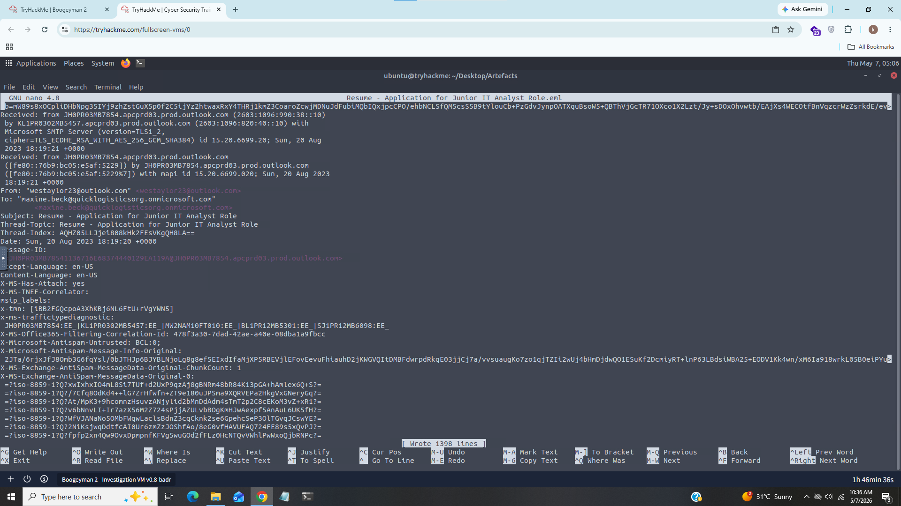

### Answer:- westaylor23@outlook.com

### 2). What is the email of the victim employee?

I repeated same thing from Q1.

### Answer:- maxine.beck@quicklogisticsorg.onmicrosoft.com

### 3). What is the name of the attached malicious document?

i did this by viewing Content-type field in file.

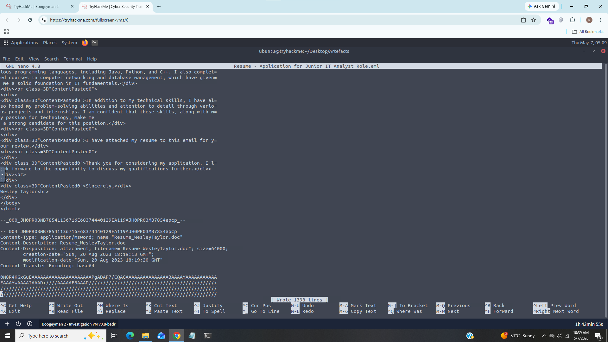

### Answer:- Resume_WesleyTaylor.doc

### 4). What is the MD5 hash of the malicious attachment?

For this task i used built-in utility of linux "md5sum" to get the md5 hash of maliciuos attachment.

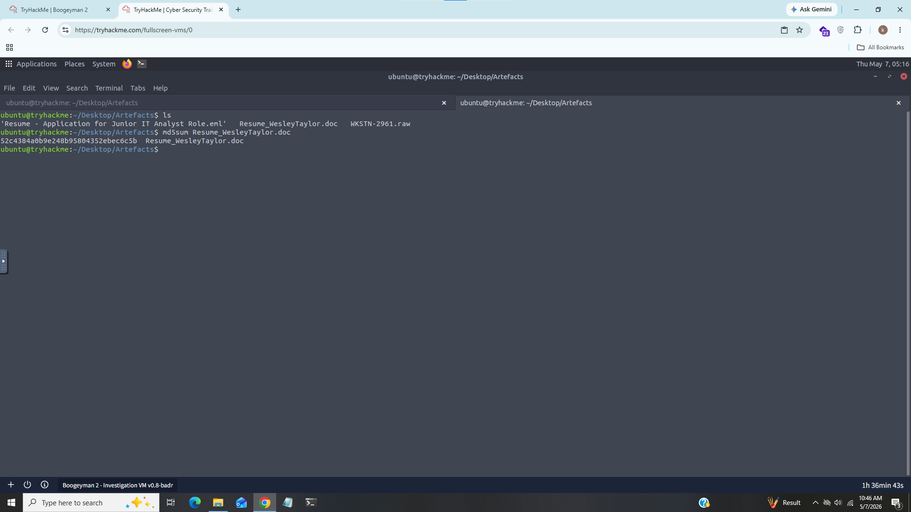

### Answer:- 52c4384a0b9e248b95804352ebec6c5b

### 5). What URL is used to download the stage 2 payload based on the document’s macro?

For this task i used OleVBA it parses OLE and OpenXML files (Word, Excel) and detects VBA macros and It extracts the commands and reports on its findings.

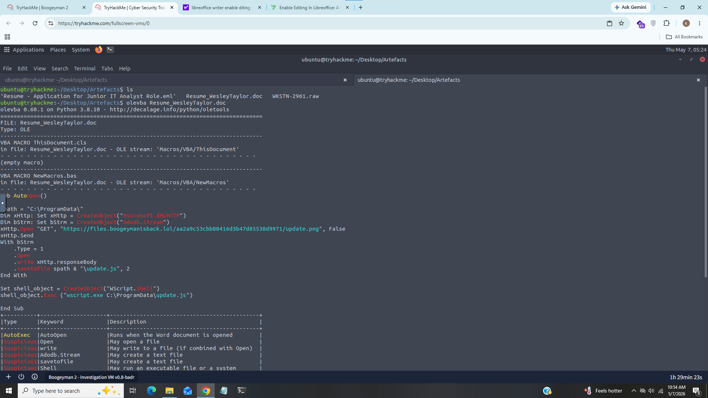

We can see OleVBA extracts information from macro 

### Answer:- hxxps[://]files[.]boogeymanisback[.]lol/aa2a9c53cbb80416d3b47d85538d9971/update[.]png

### 6). What is the name of the process that executed the newly downloaded stage 2 payload?

From above task we can see wscript.exe executed the update.js payload.

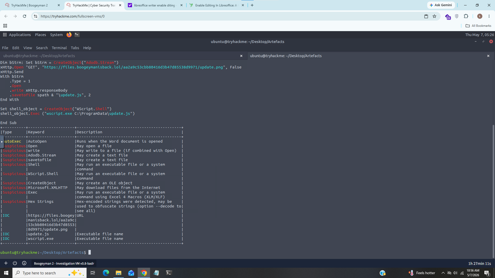

### 7). What is the full file path of the malicious stage 2 payload?

We can see from below screenshot update.js file is in Programdata folder of C drive.

### Answer:- C:\Programdata\update.js

### 8). What is the PID of the process that executed the stage 2 payload?

For this task we'll need to analyze memory capture with voltality,
I used "windows.pstree" plugin to list the all processes in tree view

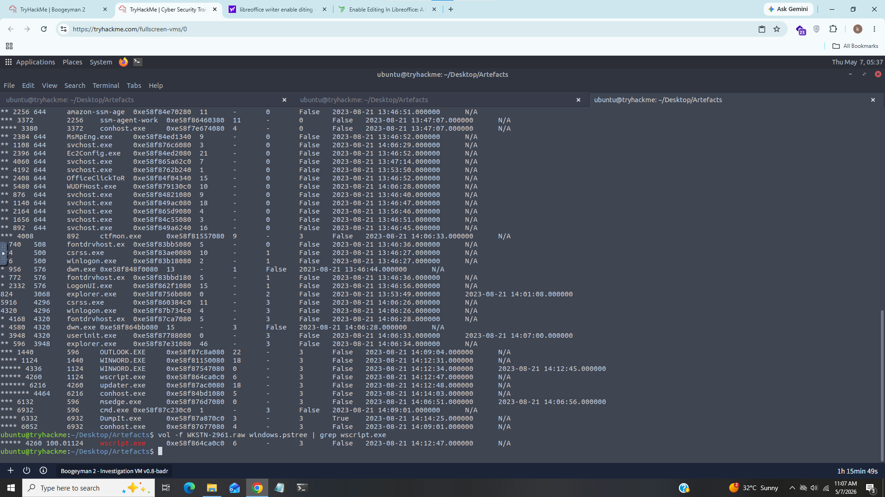

Since we know that wscript.exe executed stage 2 payload so we can grep it by using following command:

### vol -f [file] windows.pstree | grep wscript.exe

### Answer:- 4260

### 9). What is the parent PID of the process that executed the stage 2 payload?

We can see from above screenshot that WINWORD.exe executed wscript.exe with PID 1124

### Answer:- 1124

### 10). What URL is used to download the malicious binary executed by the stage 2 payload?

The answer of this question is same as question 5.

### Answer:- hxxps[://]files[.]boogeymanisback[.]lol/aa2a9c53cbb80416d3b47d85538d9971/update[.]png

### 11). What is the PID of the malicious process used to establish the C2 connection?

Knowing that updater.exe is the next stage of the malware, we’ll check for network connections used by this executable.

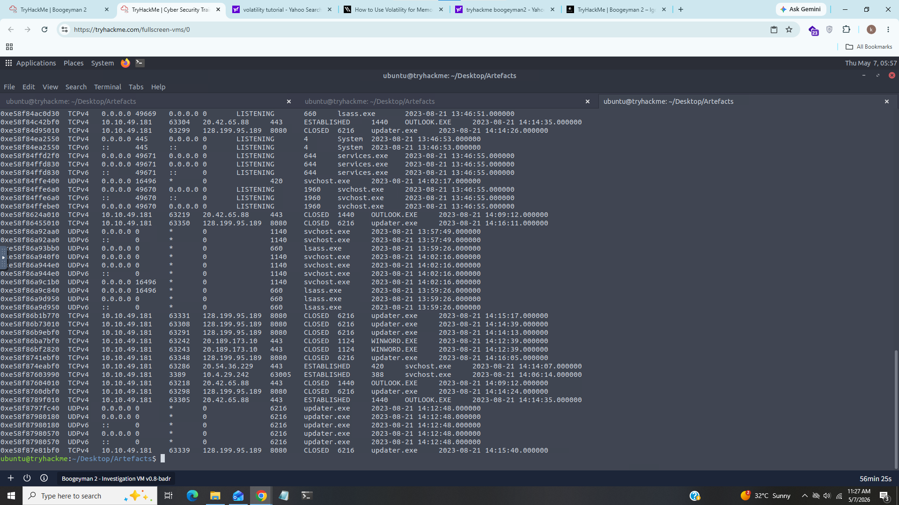

We can see multiple connections from updater.exe

### Answer:- 6216

### 12). What is the full file path of the malicious process used to establish the C2 connection?

For this task i used "windows.dlllist" plugin to list all file paths of binaries.

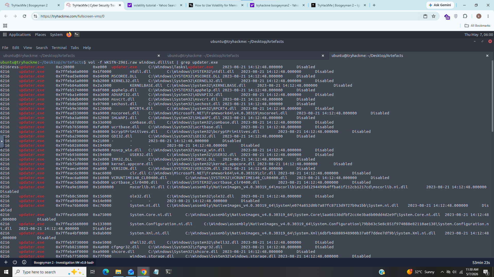

As we can see the file path from first line.

### Answer:- C:\Windows\Tasks\updater.exe

### 13). What is the IP address and port of the C2 connection initiated by the malicious binary? (Format: IP address:port)

For this task i used "windows.netscan" used to enumerate TCP/UDP socket objects from windows memory image.

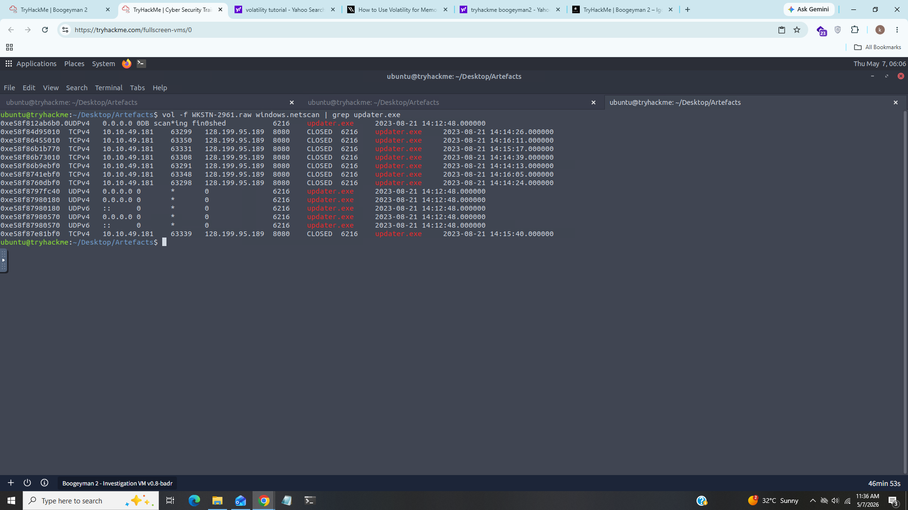

As we can see from above screenshot updater.exe used ip 128.199.95.189 and port 8080.

### Answer:- 128.199.95.189:8080

### 14). What is the full file path of the malicious email attachment based on the memory dump?

For this task i used "windows.cmdline" it is used to list all commandline arguments of processes.

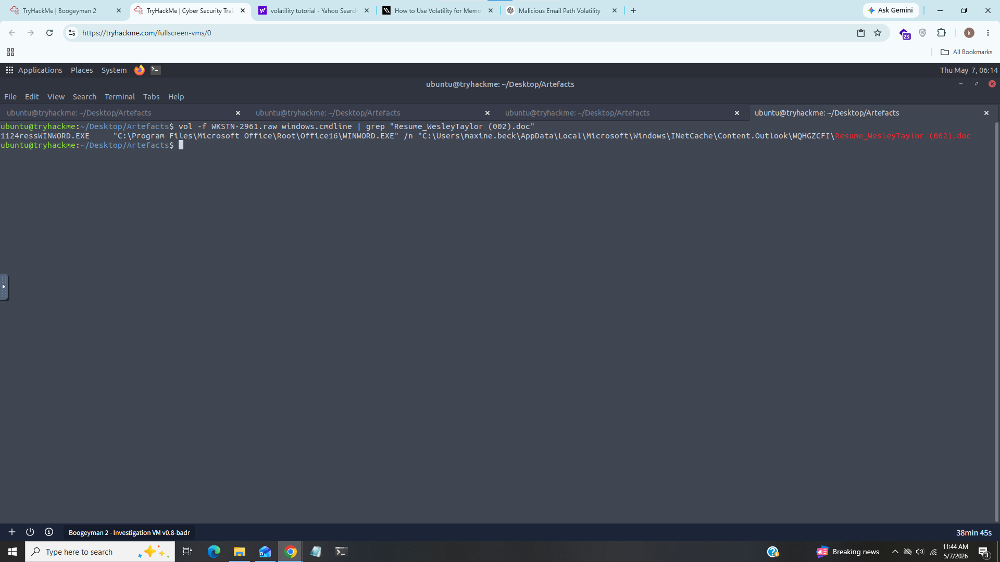

As we can see full path of email attachment from above screenshot for better reslut i used grep to list only attachment.

### Answer:- C:\Users\maxine.beck\AppData\Local\Microsoft\Windows\INetCache\Content.Outlook\WQHGZCFI\Resume_WesleyTaylor

### 15). The attacker implanted a scheduled task right after establishing the c2 callback. What is the full command used by the attacker to maintain persistent access?

After spending lot of time i just go for hint and it suggests me to use string command may it was helpfull for me.

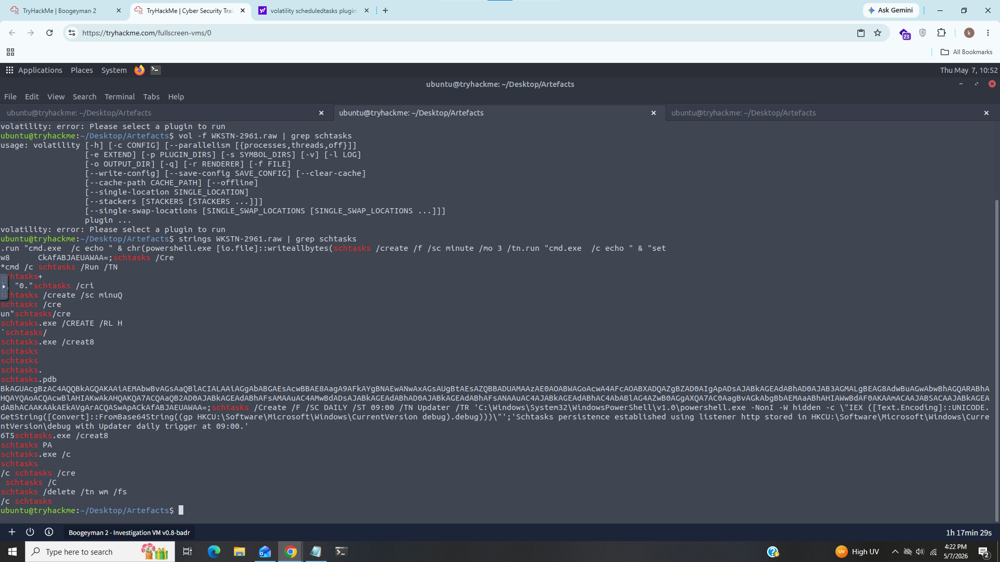

I used string command with grep to list scheduled task and i finally found it.

### Answer:- schtasks /Create /F /SC DAILY /ST 09:00 /TN Updater /TR ‘C:\Windows\System32\WindowsPowerShell\v1.0\powershell.exe -NonI -W hidden -c "IEX ([Text.Encoding]::UNICODE.GetString([Convert]::FromBase64String((gp HKCU:\Software\Microsoft\Windows\CurrentVersion debug).debug)))"’

-------------------------------------------------------------------------------------------------------------

## IOC (Indicator of Compromise)

|    Field             |      Value                                                                            |
|----------------------|---------------------------------------------------------------------------------------|
| Attacker's Email     | westaylor23@outlook.com                                                               |
| Victim's Email       | maxine.beck@quicklogisticsorg.onmicrosoft.com                                         |
| Maliciuos attachment | Resume_WesleyTaylor.doc                                                               |
| Hash                 | 52c4384a0b9e248b95804352ebec6c5b                                                      |
| Url                  | hxxps[://]files[.]boogeymanisback[.]lol/aa2a9c53cbb80416d3b47d85538d9971/update[.]png |
| File Path            | C:\Programdata\update.js                                                              |
| Process              | updater.exe                                                                           | 
| IP Address           | 128.199.95.189                                                                        |
| Port                 | 8080                                                                                  |

----------------------------------------------------------------------------------------------------------------

### What i Learned?

- Malicious Document and VBA macro analysis
- OleVBA
- Voltality & dumping data from memory
- C2 Detection

----------------------------------------------------------------------------------------------------------------

### Incident Summary

1. Phishing email delivered
2. User opened Resume_WesleyTaylor.doc
3. VBA macro executed
4. update.js downloaded
5. wscript.exe executed payload
6. updater.exe installed
7. C2 connection established to 128.199.95.189:8080
8. Scheduled task created for persistence

-----------------------------------------------------------------------------------------------------------------

## MITRE Mapping

|    Technique                                |     Id        |
|---------------------------------------------|---------------|
|   Phishing Email Attachment                 |    T1566.001  |
|   Malicious VBA Macro                       |    T1059.005  |
|   Application Layer Protocol: Web Protocols |    T1071.001  |
|   Scheduled Task                            |    T1053.005  |
|   Payload Download                          |    T1105      |

