# Boogeyman 3

----------------------------------------------------------------------------------------

### Title:- It is simple DFIR challange.
### Category:- DFIR
### Description:- ELK-fueled DFIR challenge: from spear‑phishing and HTA payloads to Sysmon logs, C2 discovery, UAC bypass, Mimikatz credential dumping, lateral movement, domain compromise, and ultimately ransomware.

--------------------------------------------------------------------------------------

### 1). What is the PID of the process that executed the initial stage 1 payload?

Since we know that file is PDF and HTML so i add filter in kibana search bar "html" i got only one event and it's process id is 6392

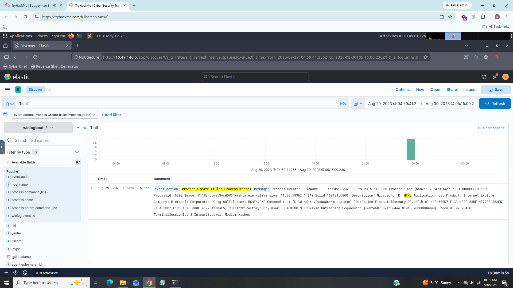

### Answer:- 6392

### 2). The stage 1 payload attempted to implant a file to another location. What is the full command-line value of this execution?

I just added process command-line field and filter some commands related to copy and move

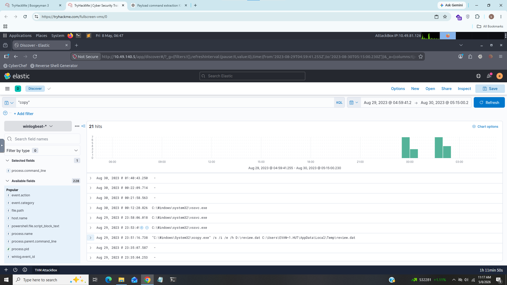

As we can see the attacker used xcopy utility which allows you to copy entire directories, including all subfolders and files to move review.dat file

### Answer:- “C:\Windows\System32\xcopy.exe” /s /i /e /h D:\review.dat C:\Users\EVAN~1.HUT\AppData\Local\Temp\review.dat

### 3). The implanted file was eventually used and executed by the stage 1 payload. What is the full command-line value of this execution?

For this task i filterd name of the payload "review.dat"

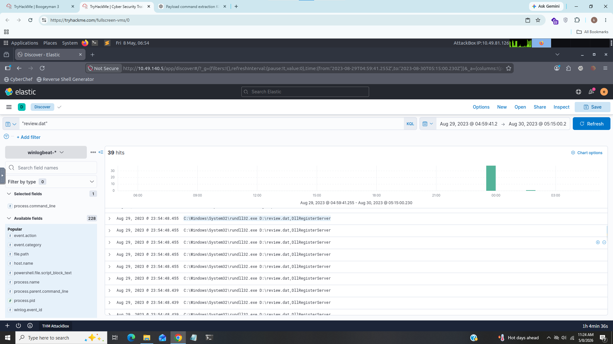

As we can see from above screenshot the attacker used "rundll32.exe" which is used to run dll files and attacker used specific function "DllRegisterServer" which is used to register any programs in windows registry.

### Answer:- “C:\Windows\System32\rundll32.exe” D:\review.dat,DllRegisterServer

### 4). The stage 1 payload established a persistence mechanism. What is the name of the scheduled task created by the malicious script?

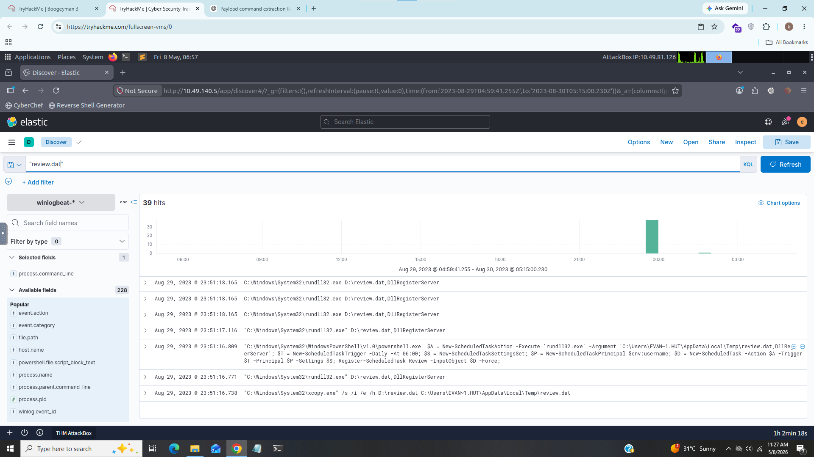

If we scroll down we can see attacker used powershell to created scheduled task with name "Review"

### Answer:- Review

### 5). The execution of the implanted file inside the machine has initiated a potential C2 connection. What is the IP and port used by this connection? (format: IP:port)

For this task i added "event.action" filed and set value "network connection detected" i gor too many results

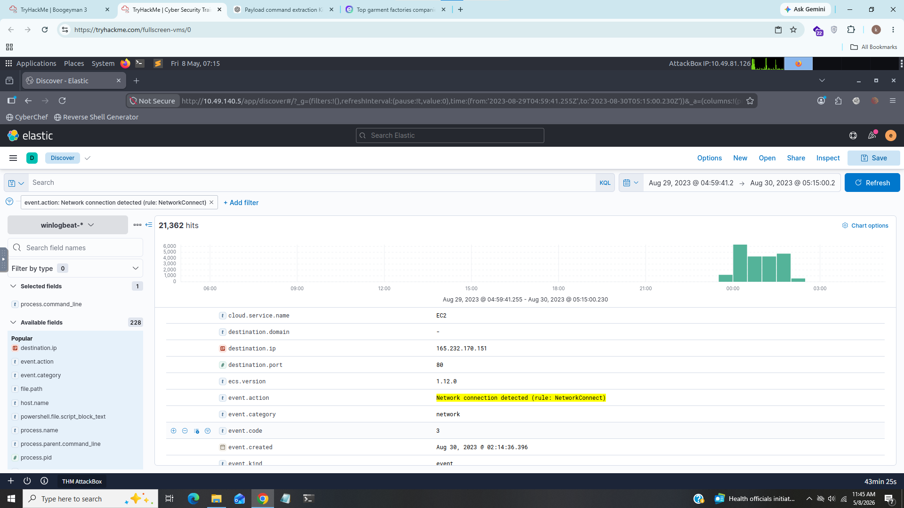

From above screenshot Expaned the log and we can see ip and port there

### Answer:- 165.232.170.151:80

### 6). The attacker has discovered that the current access is a local administrator. What is the name of the process used by the attacker to execute a UAC bypass?

For this task i did some external search on internet that which techniques and tools used to bypasss UAC and I searched some tools one by one

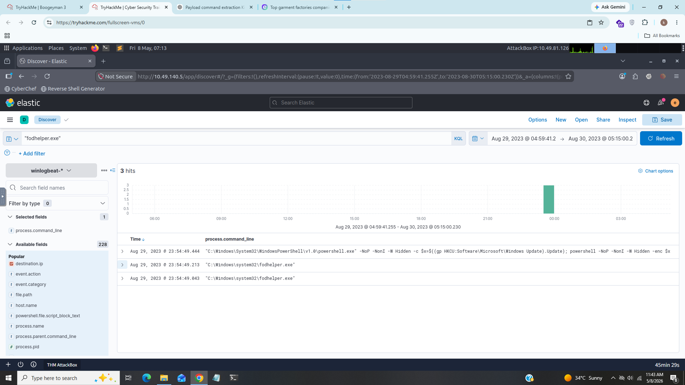

As we can see i found somne logs related "fodhelper.exe" which is a trusted binary in Windows that allows elevation without UAC prompt.

### Answer:- fodhelper.exe

### 7). Having a high privilege machine access, the attacker attempted to dump the credentials inside the machine. What is the GitHub link used by the attacker to download a tool for credential dumping?

I searched for commandline utilities to download a files and binaries but it didn't work after i searched iwr(Invoke-WebRequest) which is powershell cmdlet used to sends HTTP and HTTPS requests to a web page or web service. It parses the response and returns collections of links, images, and other significant HTML elements.

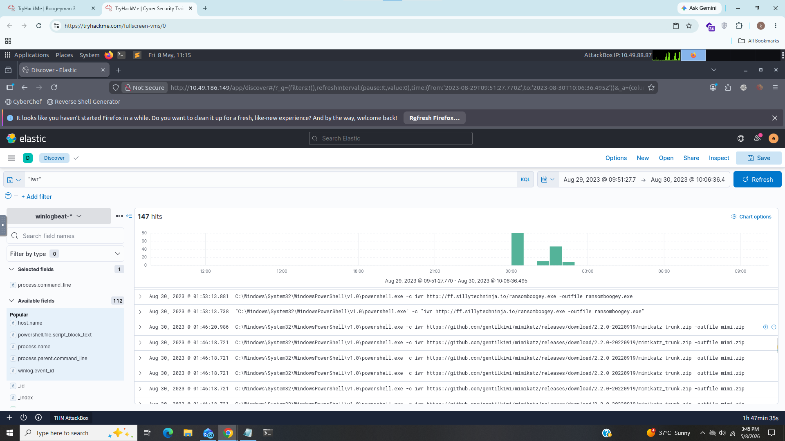

From above screenshot we can see attacker download Mimikatz which used to dump credentials from lsass.exe which is windows process that stores user credentials,pins,hashes.

### answer:- https://github.com/gentilkiwi/mimikatz/releases/download/2.2.0-20220919/mimikatz_trunk.zip

### 8). After successfully dumping the credentials inside the machine, the attacker used the credentials to gain access to another machine. What is the username and hash of the new credential pair? (format: username:hash)

We knows that attacker used Mimikatz i simple searched for "mimikatz" and found some intresting logs there.

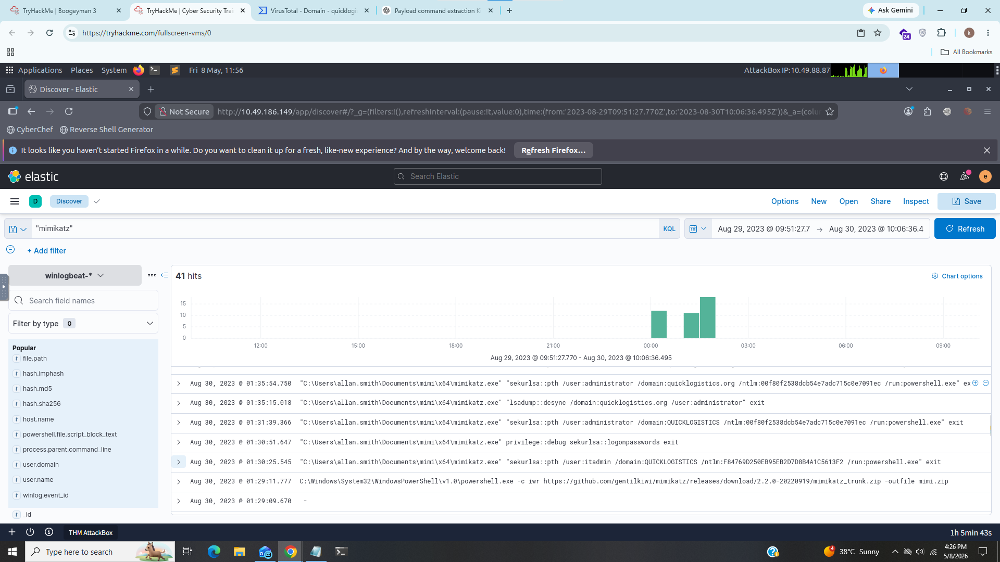

We cans ee that attacker gain access from user "itadmin"

### Answer:- itadmin:F84769D250EB95EB2D7D8B4A1C5613F2

### 9). Using the new credentials, the attacker attempted to enumerate accessible file shares. What is the name of the file accessed by the attacker from a remote share?

For this task i searched for "mimi" and filtered event code 1

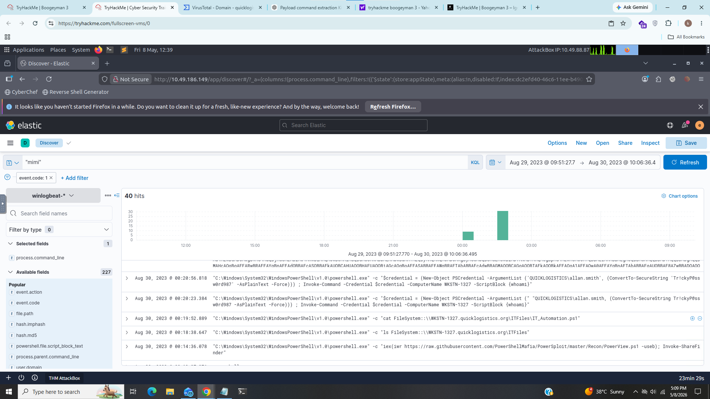

After scrolling down we can see one file "IT_Automation.ps1" was shared using powershell

### Answer:- IT_Automation.ps1

### 10). After getting the contents of the remote file, the attacker used the new credentials to move laterally. What is the new set of credentials discovered by the attacker? (format: username:password)

For this task i used this query "("*password*" or  "*credential*" or "*login*")

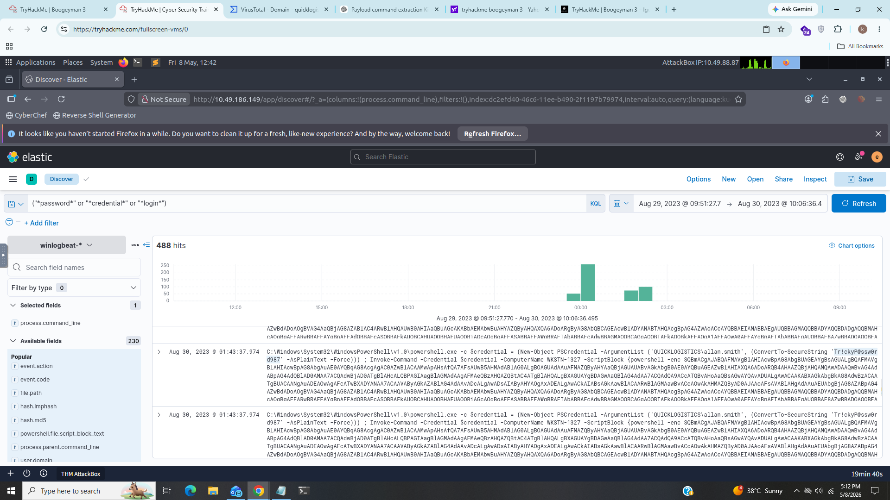

as we can see username and password from above screenshot that attacker used to move laterally.

### answer:- QUICKLOGISTICS\allan.smith:Tr!ckyP@ssw0rd987

### 11). What is the hostname of the attacker’s target machine for its lateral movement attempt?

From above task look in "ComputerName" field to get the hostname.

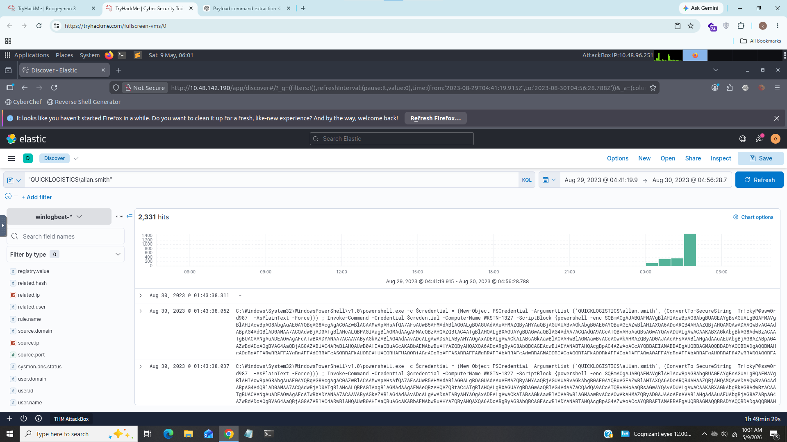

### Answer:- WKSTN-1327

### 12). Using the malicious command executed by the attacker from the first machine to move laterally, what is the parent process name of the malicious command executed on the second compromised machine?

I just Filtered events with Event ID of 1 and with the host name of “WKSTN-1327”.

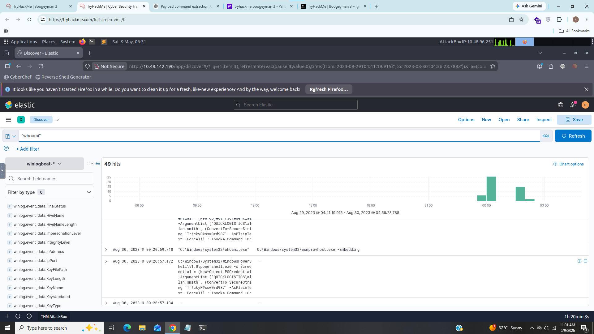

We can see the attacker executed "whoami" wth parent process "wsmprovhost.exe (Web Services Management Provider Host)" it is legitimate windows process used to manage computers remotly and it is part of Windows Remote Management (WinRM).

### Answer:- wsmprovhost.exe

### 13). The attacker then dumped the hashes in this second machine. What is the username and hash of the newly dumped credentials? (format: username:hash)

I searched for host "wkstn-1327" and "NTLM" and got some hits

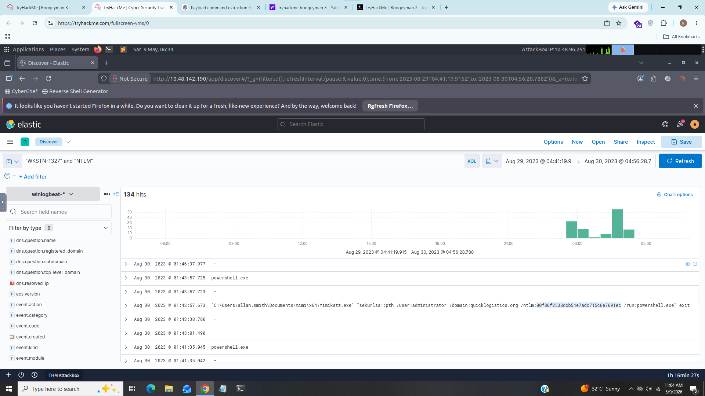

Here we can see that attacker dumped the hashes of administrator.

### Answer:- administrator:00f80f2538dcb54e7adc715c0e7091ec

### 14). After gaining access to the domain controller, the attacker attempted to dump the hashes via a DCSync attack. Aside from the administrator account, what account did the attacker dump?

For this task i searched for this "lsadump::dcsync" it is powerfull command of mimikatz used to steal all user credentials and hashes from Active Directory.

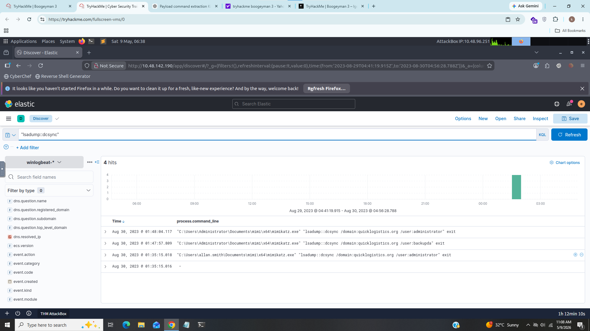

We can see that attacker dump the acconut "backupda" aside from the administrator

### Answer:- backupda

### 15). After dumping the hashes, the attacker attempted to download another remote file to execute ransomware. What is the link used by the attacker to download the ransomware binary?

For this task i searched for binaries such as curl, certutil that is used for downloading but it didn't worked for me then i searched some powershell cmdlets such as "Invoke-Webrequest" and i found some logs

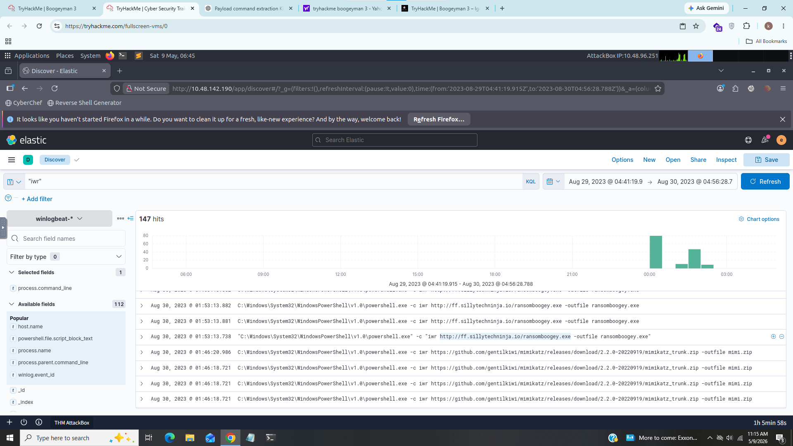

As we can see that attacker downloaded a binary "ransomboogey.exe" using powershell

### Answer:- ransomeboogey.exe

------------------------------------------------------------------------------------------------------------------------------------------------------------------------------------------

## IOC (Indicator of Compromise)

|        field               |       Value                                          |
|----------------------------|------------------------------------------------------|
|        PID                 |       6392                                           |
|        Payload             |       review.dat                                     |
|        Scheduled Task      |       Review                                         |
|        Ip Address          |       165.232.170.151                                |
|        Port                |       80                                             |
|        UAC Bypass          |       fodhelper.exe                                  |
|        Credential Dumping  |       Mimikatz                                       |
|        Username & Hahs     |       itadmin:F84769D250EB95EB2D7D8B4A1C5613F2       |
|        Shared File         |       It_Automation.ps1                              |
|        User and Hash       |       QUICKLOGISTICS\allan.smith:Tr!ckyP@ssw0rd987   |
|        Hostname            |       WKSTN-1327                                     |
|        Parent Process      |       wsmprvhost.exe                                 |
|        User and Hash       |       administrator:00f80f2538dcb54e7adc715c0e7091ec |
|        Dsync Attack        |       backupda                                       |
|        Ransomware          |       ransomeboogey.exe                              |

----------------------------------------------------------------------------------------------------------------------------------------------------------------------------------------

## What I Learned?

- Log Analysis
- C2 Detection
- Persistence and Lateral Movement Detection
- Malware Detection
- Threat Hunting

-----------------------------------------------------------------------------------------------------------------------------------------------------------------------------------------

## Incident Summary

In this investigation the attacker executed stage 1 payload "review.dat" and implanted it to another location and further investigation revealed that attacker created scheduled task "Review" to achieve persistence and used ip 165.232.170.151 and port 80 for c2 beaconing and after attacker discovered that the current access is a local administrator so he performed UAC bypass technique using "fodhelper.exe" which is legitimate windows binary used for elevation without UAC prompt further more the attacker downloaded "mimikatz" which is used to steal credentials from lsass's memory after successfully dumping the credentials, the attacker used username "itadmin" to gain access inside the machine and using this credentials the attacker enumerated file "It_Automation.ps1" form shares  and after getting the contents of the remote file, the attacker used the new credentials "QUICKLOGISTICS\allan.smith:Tr!ckyP@ssw0rd987" to move laterally and later the attacker executed malicious command with parent process "wsmprovhost.exe" on second machine form first machine to move laterally then The attacker dumped the hashes "administrator:00f80f2538dcb54e7adc715c0e7091ec" in second machine and after gaining access to the domain controller, the attacker attempted to dump the hashes via a DCSync attack and dumped the account "backupda" aside from the administrator account and in final stage the attacker attempted to download another remote file "ransomeboogey.exe" to execute ransomware.

-----------------------------------------------------------------------------------------------------------------------------------------------------------------------------------------

## MITRE Mapping
 
|      Technique                             |     Id      |
|--------------------------------------------|-------------|
|   Phishing Email Attachment                |  T1566.001  |
|   System Binary Proxy Execution: Rundll32  |  T1218.011  |
|   Scheduled Task                           |  T1053.005  |
|   C2 Connection                            |  T1071.001  |
|   UAC Bypass                               |  T1548.002  |
|   Credential Dumping                       |  T1550	.002 |
|   Share Enumeration                        |  T1135      |
|   Lateral Movement                         |  T1021.006  |
|   Hash Dumping via Dcsync Attack           |  T1550.003  |

