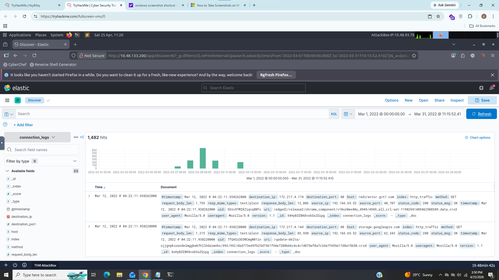
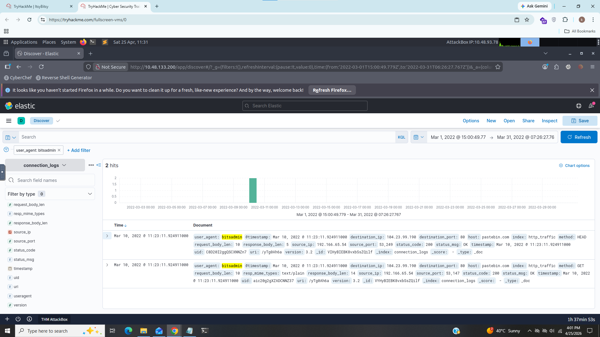
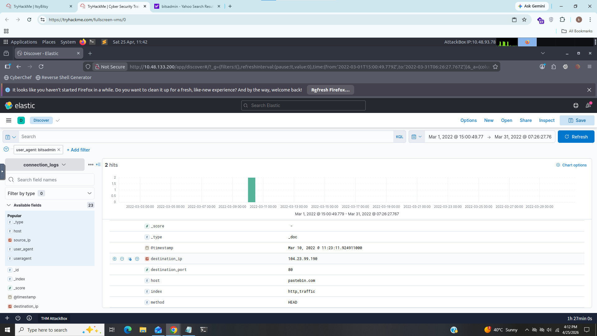
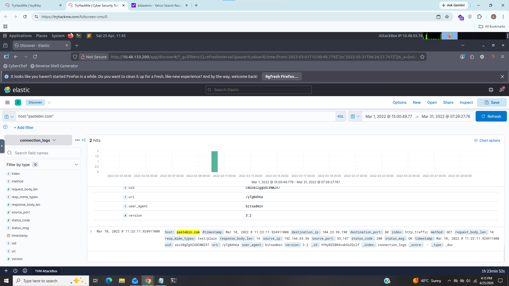

# ItsBitsy

### Title:- In this challenge room, we will take a simple challenge to investigate an alert by IDS regarding a potential C2 communication.
### Category:- SOC
### Description:- Analyst John observed an alert on an IDS solution indicating a potential C2 communication from a user Browne from the HR department. A suspicious file was accessed containing a malicious pattern THM:{ ________ } and we will have to investigate it.

---------------------------------------------------------------------------------------------------------

### 1). How many events were returned for the month of March 2022?

For this task i applied date filter in kibana and i got some hits

we can see there is 1482 events in the month of march 2022

### Answer:- 1482

### 2). What is the IP associated with the suspected user in the logs?

i filtered events by source ip and got only 2 ip's one of them has 90% ration of whole network traffic then i look for other fields when i saw user_agent it has two values Mozilla and Bitsadmin. Bitsadmin is used for microsoft windows update purposes also used by attackers to download and execute payloads. there is only 2 events with bitsadmin user_agent and it indicates something happend with this source ip.

### Answer:- 192.166.65.54

### 3). The user’s machine used a legit windows binary to download a file from the C2 server. What is the name of the binary?

for this task i researched about Bitsadmin and it is powerfull commandline tool used to download and upload jobs and also user_agent field indicates that attacker used bitsadmin binary to download file from c2 server.

### Answer:- bitsadmin

### 4). The infected machine connected with a famous filesharing site in this period, which also acts as a C2 server used by the malware authors to communicate. What is the name of the filesharing site?

i expand log and in host field shows that attacker connected at "pastebin.com" which is well known filesharing site

### Answer:- pastebin.com

### 5). What is the full URL of the C2 to which the infected host is connected?

since we knew that attacker used pastebin.com when we scroll down we can see url path so our full url looks like below

### Answer:- pastebin.com/yTg0Ah6a

### 6). A file was accessed on the filesharing site. What is the name of the file accessed?

i opend this url in browser and it redireted me on where our host was infected and also flag was mentioned there.

### Answer:- secret.txt

### 7). The file contains a secret code with the format THM{_____}.

the flag is inside the file secret.txt

### Answer:- THM{SECRET__CODE}

----------------------------------------------------------------------------------------------------------------------------------------------------

## IOC (Indicators of compromise)

|     Field       |          Value            |
|---------------- |---------------------------|
|    src_ip       |   192.166.65.54           |
|    user_agent   |   bitsadmin               |
|    domain       |   pastebin.com            |
|    url          |   pastebin.com/yTg0Ah6a   |

-----------------------------------------------------------------------------------------------------------------------------------------------------

## Inclident Summary

In this suspicious activity attacker used a well known binary called "bitsadmin" used for windows update purpose to download payload and during this activity host connected on filesharing site "pastebin.com" which was act as c2 server and file name called "secret.txt" was accessed there

## what i learned?

- some new kibina search filters
- how to find details through user agents
- detecting c2 connections

## MITRE ATT&CK mapping

|                                 Techniques                                             |     Id       |
|----------------------------------------------------------------------------------------|--------------|
|  Exfiltration Over Alternative Protocol: Exfiltration Over Unencrypted Non-C2 Protocol |  T1048.003   |
